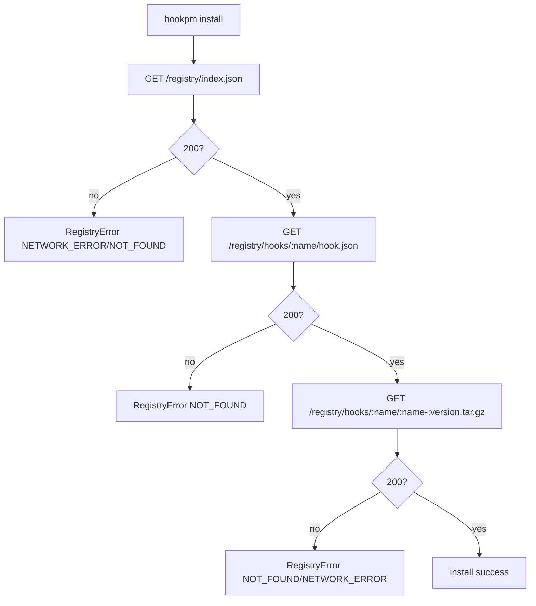
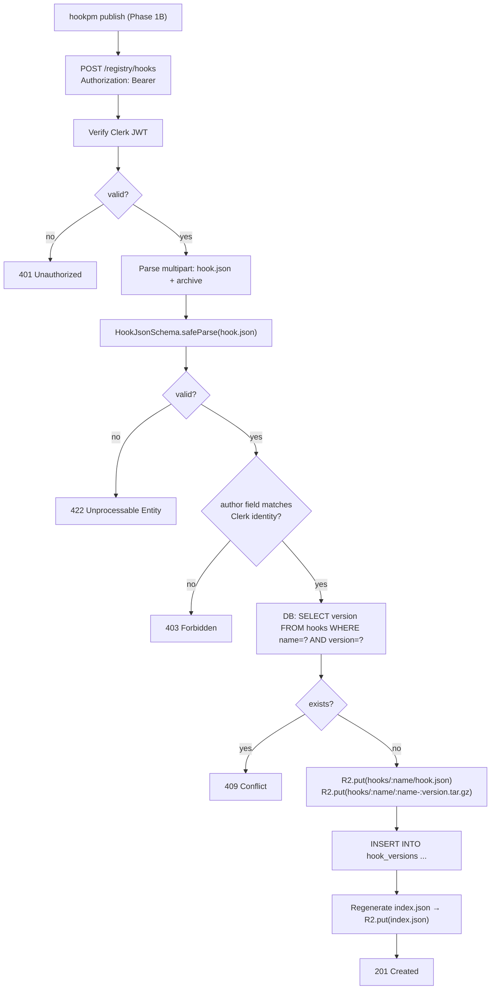
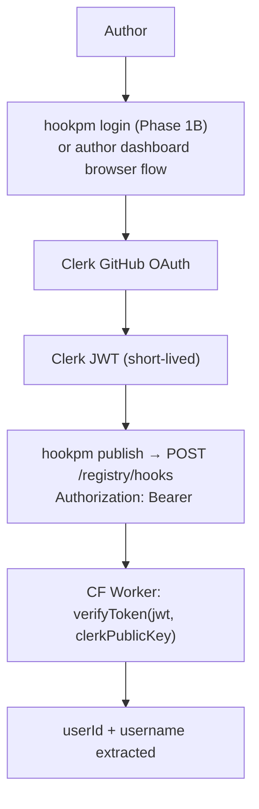

# hookpm API Routes Design

**Status:** Draft
**Date:** 2026-03-10
**Scope:** `api/` — Hono application deployed on Cloudflare Workers
**Phase:** Phase 1B (read routes + publish pipeline)
**Depends on:** `docs/design/2026-03-10-scaffold.md`, `docs/design/2026-03-10-schema.md`

---

## TL;DR

Defines the HTTP API that replaces the GitHub-raw registry backend in Phase 1B. Hono app on Cloudflare Workers, Cloudflare R2 for binary storage (archives), Supabase (Postgres) for metadata. Five route groups: health, registry reads, hook publish, author auth, and download tracking. No auth for reads; Clerk JWT for writes. Phase 1A CLI works unchanged — registry URL changes from GitHub raw to `https://api.hookpm.dev`.

---

## Table of Contents

1. [Architecture](#1-architecture)
2. [Route Inventory](#2-route-inventory)
3. [Data Flow: hookpm install](#3-data-flow-hookpm-install)
4. [Data Flow: hookpm publish](#4-data-flow-hookpm-publish)
5. [Data Flow: Auth (Clerk)](#5-data-flow-auth-clerk)
6. [Storage Layout](#6-storage-layout)
7. [Error Format](#7-error-format)
8. [Security Considerations](#8-security-considerations)
9. [Interface Contracts](#9-interface-contracts)
10. [Open Questions](#10-open-questions)

---

## 1. Architecture

```mermaid
flowchart TD
    CLI["hookpm CLI"]
    Browser["Author browser"]
    CF["Cloudflare Workers\n(Hono app)"]
    R2["Cloudflare R2\n(archives + manifests)"]
    DB["Supabase\n(Postgres)"]
    Clerk["Clerk\n(GitHub OAuth)"]

    CLI -->|GET /registry/index.json| CF
    CLI -->|GET /registry/hooks/:name/hook.json| CF
    CLI -->|GET /registry/hooks/:name/:archive.tar.gz| CF
    CLI -->|POST /registry/hooks (publish)| CF
    Browser -->|GitHub OAuth| Clerk
    Clerk -->|JWT| Browser
    Browser -->|POST /registry/hooks (Bearer JWT)| CF
    CF -->|R2.get / R2.put| R2
    CF -->|SQL queries| DB
```

**Deployment:** Single Cloudflare Worker (one Worker handles all routes). R2 bucket `hookpm-registry`. Supabase project `hookpm`.

---

## 2. Route Inventory

| Method | Path | Auth | Phase | Description |
|--------|------|------|-------|-------------|
| `GET` | `/health` | None | 1A | Liveness check |
| `GET` | `/registry/index.json` | None | 1B | Full hook index |
| `GET` | `/registry/hooks/:name/hook.json` | None | 1B | Hook manifest |
| `GET` | `/registry/hooks/:name/:filename` | None | 1B | Hook archive (.tar.gz) |
| `POST` | `/registry/hooks` | Clerk JWT | 1B | Publish new hook version |
| `GET` | `/authors/me` | Clerk JWT | 1B | Authenticated author profile |
| `GET` | `/authors/:username/hooks` | None | 1B | Author's published hooks |

---

## 3. Data Flow: hookpm install



**R2 read path:** All GET registry routes call `env.HOOKPM_BUCKET.get(key)` where key matches the R2 object key. On miss, returns `404 Not Found` with JSON error body. No database read needed for reads.

---

## 4. Data Flow: hookpm publish



**Idempotency:** Publish is not idempotent — publishing the same `name@version` twice returns `409 Conflict`. Authors must bump the version.

---

## 5. Data Flow: Auth (Clerk)



**Token storage:** JWT stored in `~/.hookpm/auth.json` (mode 600). Refreshed automatically on expiry. `hookpm login` opens browser to Clerk OAuth; `hookpm logout` deletes the file.

---

## 6. Storage Layout

### Cloudflare R2 — `hookpm-registry` bucket

```
index.json                              ← full hook index (regenerated on publish)
hooks/
  bash-danger-guard/
    hook.json                           ← latest manifest
    bash-danger-guard-1.0.0.tar.gz     ← versioned archive
    bash-danger-guard-1.0.1.tar.gz
  format-on-write/
    hook.json
    format-on-write-1.0.0.tar.gz
```

### Supabase — `hookpm` project

```sql
-- Authors (one row per GitHub user who has published)
CREATE TABLE authors (
  id          UUID PRIMARY KEY DEFAULT gen_random_uuid(),
  clerk_id    TEXT UNIQUE NOT NULL,
  username    TEXT UNIQUE NOT NULL,
  email       TEXT,
  created_at  TIMESTAMPTZ DEFAULT now()
);

-- Hook versions (immutable — one row per name@version)
CREATE TABLE hook_versions (
  id            UUID PRIMARY KEY DEFAULT gen_random_uuid(),
  name          TEXT NOT NULL,
  version       TEXT NOT NULL,
  author_id     UUID REFERENCES authors(id),
  published_at  TIMESTAMPTZ DEFAULT now(),
  UNIQUE(name, version)
);

-- Download events (append-only analytics)
CREATE TABLE downloads (
  id          UUID PRIMARY KEY DEFAULT gen_random_uuid(),
  hook_name   TEXT NOT NULL,
  version     TEXT NOT NULL,
  downloaded_at TIMESTAMPTZ DEFAULT now(),
  hookpm_version TEXT
);
```

---

## 7. Error Format

All error responses use a consistent JSON envelope:

```json
{ "error": { "code": "NOT_FOUND", "message": "Hook 'foo' not found" } }
```

| HTTP Status | `error.code` | When |
|-------------|--------------|------|
| 400 | `BAD_REQUEST` | Malformed request body |
| 401 | `UNAUTHORIZED` | Missing or invalid Bearer token |
| 403 | `FORBIDDEN` | Authenticated but not authorized (wrong author) |
| 404 | `NOT_FOUND` | Hook, version, or file not found |
| 409 | `CONFLICT` | Version already exists |
| 422 | `VALIDATION_ERROR` | hook.json fails HookJsonSchema |
| 500 | `INTERNAL_ERROR` | Unexpected server error |

---

## 8. Security Considerations

- **CVE-2025-59536:** `registryUrl` is sourced exclusively from `config.ts` (validated by Zod, must use `https://`). CLI never follows redirects from registry responses to a different URL.
- **CVE-2026-21852:** Publish endpoint reads only the multipart form body — no environment variables are included in any response.
- **Author impersonation:** `author` field in `hook.json` must exactly match the Clerk `username`. Enforced server-side before R2 write.
- **Archive size limit:** Archives > 10 MB rejected with `413 Payload Too Large`.
- **Content-Type:** Archive endpoint sets `Content-Type: application/gzip`. Manifest endpoints set `Content-Type: application/json`.
- **R2 public access:** R2 bucket is NOT public. All reads go through the Worker (enables rate limiting and download tracking).
- **CORS:** Only `hookpm` CLI User-Agent allowed for registry reads. Author dashboard origin allowed for publish.
- **Rate limiting:** Cloudflare's built-in rate limiting at the Workers tier — 100 req/min per IP for reads, 10 req/min per authenticated user for writes.

---

## 9. Interface Contracts

```typescript
// GET /registry/index.json → 200
// Body: HookIndex (from @hookpm/schema)

// GET /registry/hooks/:name/hook.json → 200 | 404
// Body: HookJsonRegistry (from @hookpm/schema) | ErrorBody

// GET /registry/hooks/:name/:filename → 200 | 404
// Body: binary (.tar.gz) | ErrorBody

// POST /registry/hooks → 201 | 400 | 401 | 403 | 409 | 422
// Request: multipart/form-data { manifest: File (hook.json), archive: File (.tar.gz) }
// Response 201: { name: string; version: string; url: string }
// Response error: ErrorBody

type ErrorBody = { error: { code: string; message: string } }

// GET /authors/me → 200 | 401
// Body: { id: string; username: string; hooks: string[] }

// GET /authors/:username/hooks → 200 | 404
// Body: { username: string; hooks: HookIndexEntry[] }
```

---

## 10. Open Questions

| # | Question | Must resolve before |
|---|----------|---------------------|
| 1 | Wrangler bindings for R2 + Supabase — use `@supabase/supabase-js` with env vars, or D1? | Phase 1B implementation |
| 2 | Index regeneration strategy: regenerate full index on every publish (simple, scales to ~1k hooks), or incremental patch? | Phase 1B implementation |
| 3 | `hookpm login` flow: CLI opens browser, polls a short-lived token endpoint, or uses device flow? | Phase 1B `login` command design |
| 4 | Archive integrity: should the server compute SHA-256 and return it in the 201 body, or should it be included in hook.json? | Phase 1B publish implementation |

---

## Revision History

| Date | Change | Reason |
|------|--------|--------|
| 2026-03-10 | Initial design | Phase 1B requires defined API contract before implementation |
