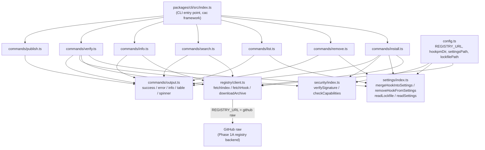
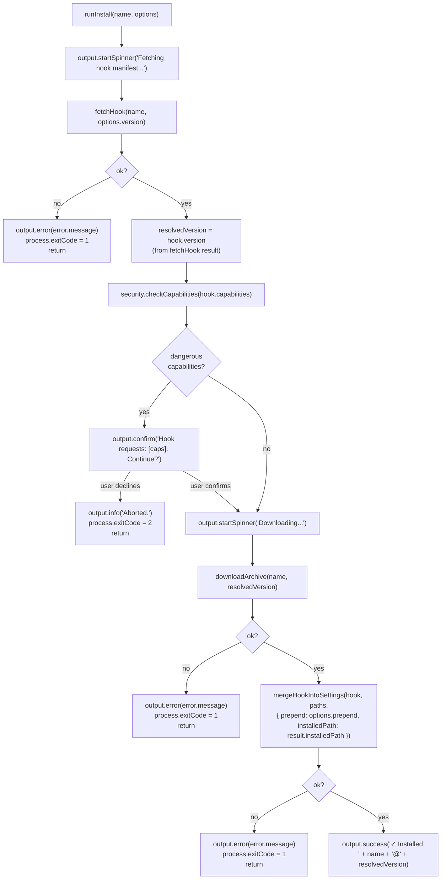
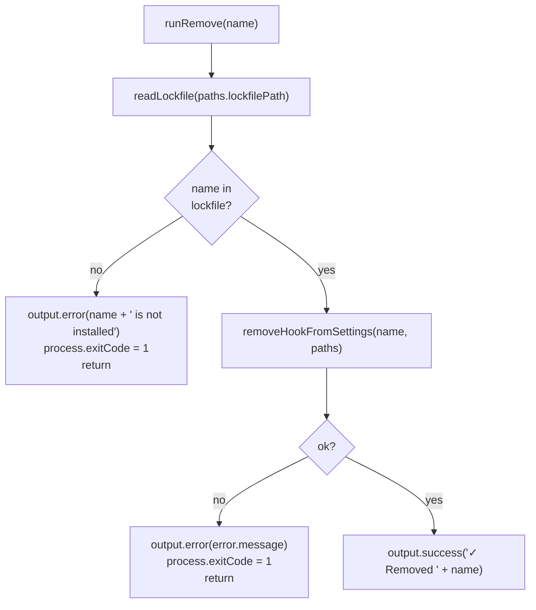
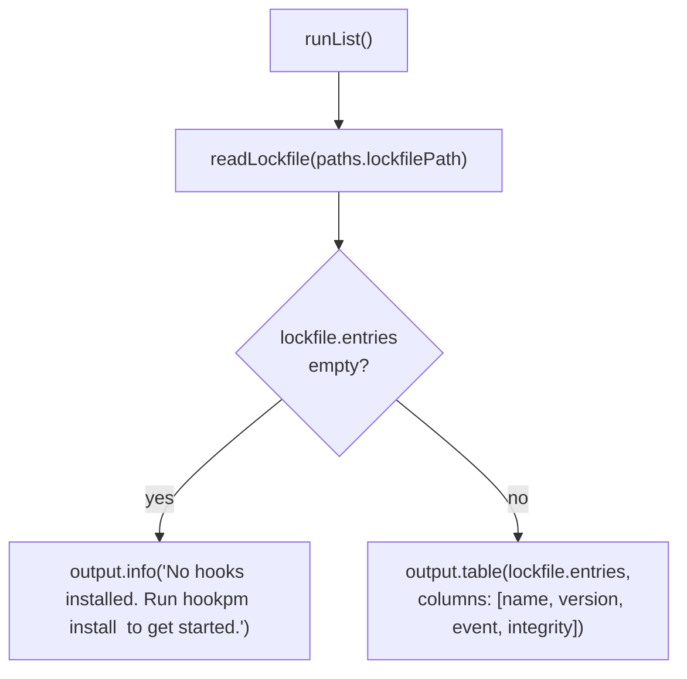
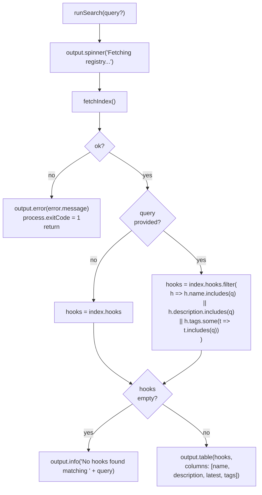
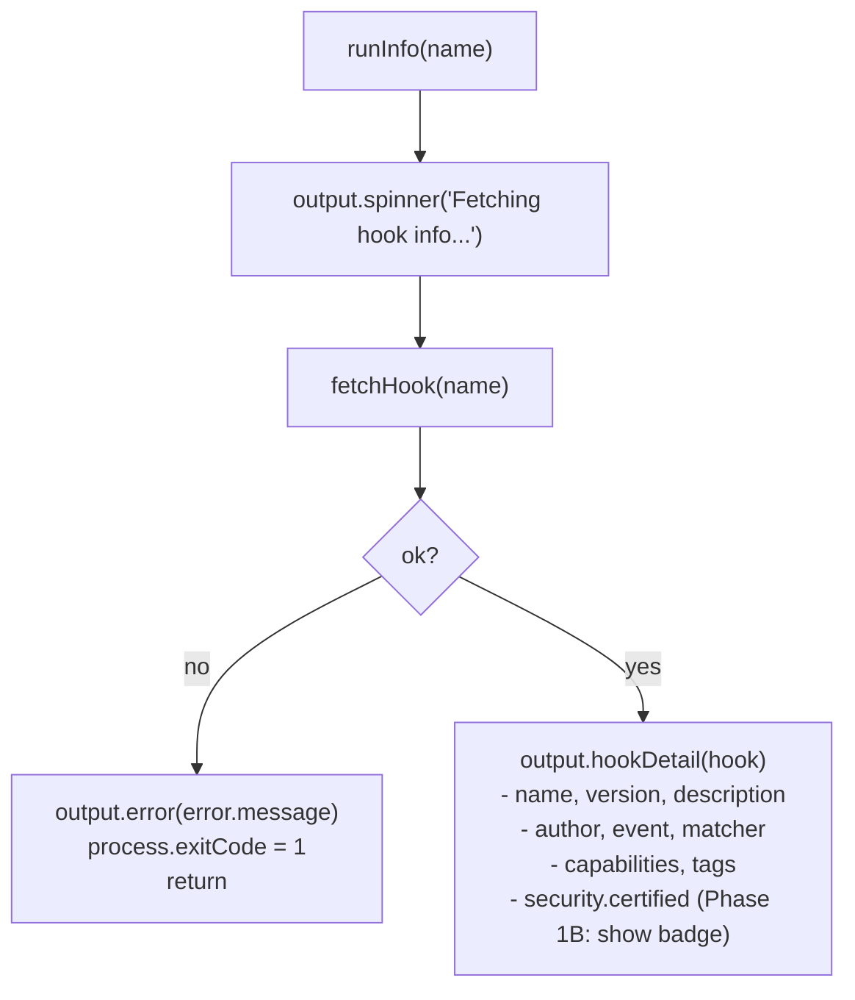
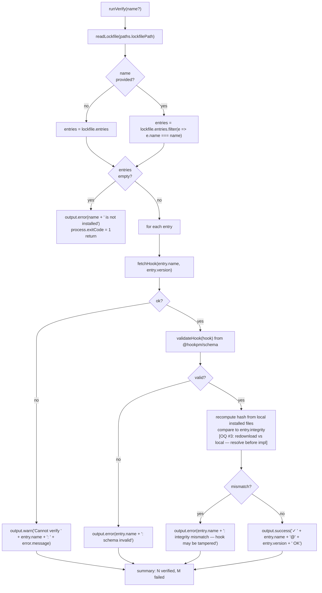
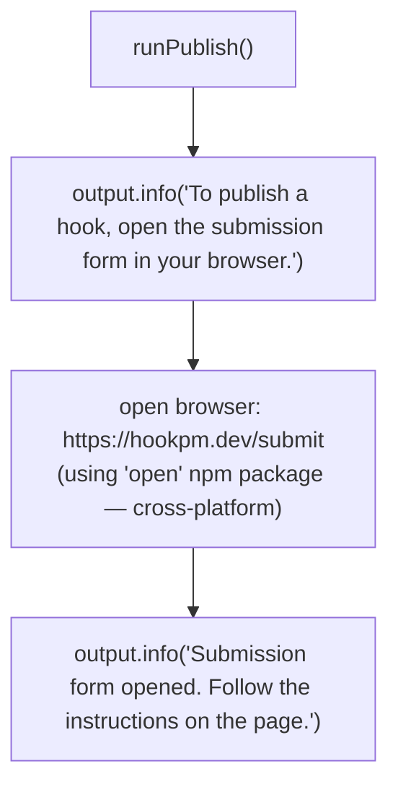

# CLI Commands Design — `packages/cli/src/commands/`

**Status:** Approved (after 2 Opus review passes)
**Date:** 2026-03-10
**Scope:** `packages/cli/src/commands/` — all CLI commands exposed by `hookpm`
**Phase:** Phase 1A (install, remove, list, search, info, verify, publish)
**Depends on:** `docs/design/2026-03-10-scaffold.md`, `docs/design/2026-03-10-schema.md`, `docs/design/2026-03-10-settings-merge.md`, `docs/design/2026-03-10-registry-client.md`

---

## TL;DR

`hookpm` exposes seven commands: `install`, `remove`, `list`, `search`, `info`, `verify`, and `publish`. Each command lives in its own file under `packages/cli/src/commands/`. Commands are thin orchestrators — they call `registry/client.ts`, `settings/index.ts`, and `security/index.ts`; they never contain business logic themselves. All user-facing output uses a shared `output.ts` module for consistent formatting. `publish` is implemented in Phase 1A as a browser-redirect only (no CLI upload — Phase 1B adds auth and direct upload). `verify` is a schema + integrity hash check in Phase 1A (no Ed25519 signature verification until Phase 1B).

---

## Table of Contents

1. [Command Registry](#1-command-registry)
2. [Architecture](#2-architecture)
3. [Entry Point and CLI Framework](#3-entry-point-and-cli-framework)
4. [Interface Contracts](#4-interface-contracts)
5. [Data Flow: `install`](#5-data-flow-install)
6. [Data Flow: `remove`](#6-data-flow-remove)
7. [Data Flow: `list`](#7-data-flow-list)
8. [Data Flow: `search`](#8-data-flow-search)
9. [Data Flow: `info`](#9-data-flow-info)
10. [Data Flow: `verify`](#10-data-flow-verify)
11. [Data Flow: `publish`](#11-data-flow-publish)
12. [Output Module](#12-output-module)
13. [Error Handling](#13-error-handling)
14. [Security Considerations](#14-security-considerations)
15. [Testing Strategy](#15-testing-strategy)
16. [Open Questions](#16-open-questions)
17. [Revision History](#17-revision-history)

---

## 1. Command Registry

| Command | Phase | Description |
|---------|-------|-------------|
| `hookpm install <name> [--version <v>] [--prepend]` | 1A | Download and merge hook into `settings.json` |
| `hookpm remove <name>` | 1A | Remove hook from `settings.json` and lockfile |
| `hookpm list` | 1A | List all installed hooks (from lockfile) |
| `hookpm search [<query>]` | 1A | Search registry index by name/tag/description |
| `hookpm info <name>` | 1A | Show hook manifest details |
| `hookpm verify [<name>]` | 1A | Validate installed hook(s) against schema |
| `hookpm publish` | 1A | Open browser to submission form (no CLI upload in Phase 1A) |

---

## 2. Architecture



**Rule:** Commands are orchestrators only. No business logic (no JSON parsing, no file writes, no network calls) lives in a command file. Commands call the layer below them (registry, settings, security) and translate results to output.

**Framework note:** `cac` is used instead of `commander` (supersedes `2026-03-10-scaffold.md §4.2`). Rationale: `cac` is TypeScript-first, zero-dependency (~3 kB vs commander's ~60 kB), and provides the same API surface needed here. The scaffold doc has been updated to reflect this change.

---

## 3. Entry Point and CLI Framework

**Framework:** [`cac`](https://github.com/cacjs/cac) — lightweight, zero-dependency CLI framework (correct for a CLI tool, not a web server).

```typescript
// packages/cli/src/index.ts
import { cac } from 'cac'
import { createRequire } from 'node:module'
// pkg.version — loaded via createRequire (avoids needing resolveJsonModule in tsconfig)
const require = createRequire(import.meta.url)
const pkg = require('../../package.json') as { version: string }
import { runInstall } from './commands/install.js'
import { runRemove } from './commands/remove.js'
import { runList } from './commands/list.js'
import { runSearch } from './commands/search.js'
import { runInfo } from './commands/info.js'
import { runVerify } from './commands/verify.js'
import { runPublish } from './commands/publish.js'

const cli = cac('hookpm')

cli
  .command('install <name>', 'Install a hook from the registry')
  .option('--version <version>', 'Install a specific version')
  .option('--prepend', 'Prepend hook (runs before others in the same event)')
  .action(async (name: string, options: { version?: string; prepend?: boolean }) => {
    await runInstall(name, options)
  })

cli
  .command('remove <name>', 'Remove an installed hook')
  .action(async (name: string) => {
    await runRemove(name)
  })

cli
  .command('list', 'List installed hooks')
  .action(async () => {
    await runList()
  })

cli
  .command('search [query]', 'Search the registry')
  .action(async (query?: string) => {
    await runSearch(query)
  })

cli
  .command('info <name>', 'Show hook details')
  .action(async (name: string) => {
    await runInfo(name)
  })

cli
  .command('verify [name]', 'Verify installed hook(s) against schema')
  .action(async (name?: string) => {
    await runVerify(name)
  })

cli
  .command('publish', 'Submit a hook to the registry')
  .action(async () => {
    await runPublish()
  })

cli.help()
cli.version(pkg.version)
cli.parse()
```

---

## 4. Interface Contracts

Each command exports a single `run*` async function. All return `void` — side effects are output and exit code. Non-zero exit codes are set via `process.exitCode = 1` before returning (not via `process.exit()`, to allow flush).

```typescript
// commands/install.ts
export interface InstallOptions {
  version?: string     // semver string, optional — defaults to latest
  prepend?: boolean    // if true, hook goes at front of event array
}
export async function runInstall(name: string, options: InstallOptions): Promise<void>

// commands/remove.ts
export async function runRemove(name: string): Promise<void>

// commands/list.ts
export async function runList(): Promise<void>

// commands/search.ts
export async function runSearch(query?: string): Promise<void>

// commands/info.ts
export async function runInfo(name: string): Promise<void>

// commands/verify.ts
// name: undefined → verify all installed hooks
// name: string → verify a single named hook
export async function runVerify(name?: string): Promise<void>

// commands/publish.ts
export async function runPublish(): Promise<void>
```

---

## 5. Data Flow: `install`



**Capability confirmation:** If `hook.capabilities` includes `network_access`, `file_write`, or `shell_exec`, the user sees a warning prompt before download begins. The list of dangerous capabilities is defined in `security/index.ts`.

**`resolvedVersion`:** Always sourced from `hook.version` in the `fetchHook` result — never from the user-provided `options.version` (which may be absent). The registry is the source of truth for the canonical version string.

**`installedPath`:** `mergeHookIntoSettings` requires `installedPath` (per settings-merge design §4 `MergeOptions`). It is sourced from `downloadArchive`'s `result.installedPath`, not constructed independently by the install command.

---

## 6. Data Flow: `remove`



---

## 7. Data Flow: `list`



---

## 8. Data Flow: `search`



---

## 9. Data Flow: `info`



---

## 10. Data Flow: `verify`



**Phase 1A verification:** Schema validation + integrity hash recomputation. Signature verification (`verifySignature`) is a no-op stub in Phase 1A (no Ed25519 signatures in GitHub registry). The stub returns `{ ok: true, reason: 'not-signed' }`.

---

## 11. Data Flow: `publish`



**Phase 1A publish:** `hookpm publish` is a browser-redirect helper only — no CLI upload, no API auth. The actual submission is a GitHub PR to the `hook-marketplace` repository, which CI validates. The browser URL is sourced from `config.ts` (not hardcoded).

---

## 12. Output Module

```typescript
// commands/output.ts

// Spinner — two forms, use the appropriate one:

// Form 1 (preferred): wrapping form for single-step async operations.
// Starts spinner, awaits fn(), stops spinner, returns result.
export function spinner<T>(label: string, fn: () => Promise<T>): Promise<T>

// Form 2: explicit start/stop for multi-phase flows where a user prompt
// or capability check occurs between async operations (e.g. install command:
// spinner for fetch → stop → capability prompt → spinner for download).
export function startSpinner(label: string): void
export function stopSpinner(): void

// Status lines
export function success(msg: string): void         // ✓ green
export function error(msg: string): void           // ✗ red, writes to stderr
export function warn(msg: string): void            // ⚠ yellow
export function info(msg: string): void            // · dim

// Structured output
export function table(
  rows: Record<string, unknown>[],
  options: { columns: string[] }
): void

// Hook detail view (multi-line)
export function hookDetail(hook: HookJsonRegistry): void

// Confirmation prompt — returns true if user confirms
export function confirm(msg: string): Promise<boolean>
```

**Non-TTY behavior:** If `!process.stdout.isTTY` (piped output), spinners are suppressed (`startSpinner`/`stopSpinner` are no-ops, `spinner()` calls `fn()` directly) and `confirm()` defaults to `false` (aborts). Table output falls back to newline-delimited JSON. This allows `hookpm search | jq` workflows.

**Flowchart notation:** Data flow diagrams in §5–§11 use `output.startSpinner(label)` nodes (fire-and-forget) for flows where a user prompt occurs between async operations (install, verify). They use the wrapping `output.spinner(label)` for single-step flows (search, info). Both map to the same underlying spinner mechanism.

---

## 13. Error Handling

**Exit codes:**

| Code | Meaning |
|------|---------|
| 0 | Success |
| 1 | General error (registry, schema, settings failure) |
| 2 | User abort (capability prompt declined) |

**Error flow:** Every `run*` function catches all errors from the layer below. Registry errors (`RegistryError`) have typed codes that map to user-facing messages (defined in `registry/client.ts` §8). Settings errors (`MergeError`, `RemovalError`, etc.) have typed codes mapped to messages in `settings/index.ts`. Unknown errors are caught at the top-level CAC handler, printed as "Internal error: <message>", and exit with code 1.

**Never swallow errors silently.** Every `{ ok: false }` result from registry or settings must either propagate to output or be logged as a warning if the operation continues (e.g. `verify` continues to next hook after a warning).

---

## 14. Security Considerations

- **Command injection:** No user-provided argument is ever passed to a shell. Hook name and version are validated by `@hookpm/schema` (name: `^[a-z0-9-]+$`, version: semver) before use. The `open` package for `publish` uses the OS `open`/`xdg-open` mechanism with an array argument, not a shell string.
- **Output injection:** User-supplied strings (hook names, descriptions from registry) are printed to the terminal, not injected into HTML or other interpreted contexts. No XSS risk in a CLI context.
- **Capability confirmation gate:** `install` requires user confirmation before downloading hooks with dangerous capabilities. This is the primary user-facing security gate in Phase 1A.
- **CVE-2025-59536:** No hook file or registry response can redirect the CLI to a different registry URL. Config is read from `config.ts` exclusively.
- **CVE-2026-21852:** No command reads or transmits environment variables. The `publish` browser-open does not include environment variables in the URL.
- **Abort on non-TTY capability prompts:** If output is not a TTY, `confirm()` returns `false`, aborting installs of hooks with dangerous capabilities. This prevents accidental scripted installs without explicit confirmation.

---

## 15. Testing Strategy

```
packages/cli/src/commands/__tests__/
    install.test.ts
    remove.test.ts
    list.test.ts
    search.test.ts
    info.test.ts
    verify.test.ts
    publish.test.ts
    output.test.ts
```

All command tests mock: `registry/client.ts`, `settings/index.ts`, `security/index.ts`, and `output.ts`. Commands contain no business logic so tests verify orchestration: correct module calls, correct exit codes, correct output calls.

**`install.test.ts`:**
- Success: fetchHook → downloadArchive → merge → output.success called
- FetchHook fails (NETWORK_ERROR) → output.error called, exitCode = 1
- Hook has dangerous capabilities → output.confirm called; user confirms → continues; user declines → exits with code 2
- downloadArchive fails (EXTRACT_ERROR) → output.error, exitCode = 1
- mergeHookIntoSettings fails (already installed) → output.error, exitCode = 1
- `--prepend` flag passed → merge called with `{ prepend: true }`
- `--version` flag passed → fetchHook called with that version

**`remove.test.ts`:**
- Success: readLockfile → remove → output.success
- Name not in lockfile → output.error, exitCode = 1
- removeHookFromSettings fails → output.error, exitCode = 1

**`list.test.ts`:**
- Empty lockfile → output.info with "no hooks" message
- Non-empty lockfile → output.table called with entries

**`search.test.ts`:**
- No query → output.table with all hooks
- Query match → output.table with filtered hooks
- No match → output.info with "no results" message
- fetchIndex fails → output.error, exitCode = 1

**`info.test.ts`:**
- Success → output.hookDetail called with hook data
- fetchHook fails (NOT_FOUND) → output.error, exitCode = 1

**`verify.test.ts`:**
- All hooks pass → success output for each
- One hook fails schema → error output, continues to next hook
- One hook fails integrity → error output, continues to next hook
- fetchHook fails for one entry → warn, continues
- `name` provided → only that hook verified
- `name` not in lockfile → output.error, exitCode = 1

**`publish.test.ts`:**
- output.info called with submission message
- Browser open called with config.submitUrl

**`output.test.ts`:**
- Non-TTY: spinner suppressed (fn() called directly, no spinner library)
- Non-TTY: confirm() returns false
- Non-TTY: table() produces newline-delimited JSON

**Integration test scope (qa-engineer GREEN phase):**
Unit tests above mock all lower-layer modules and verify orchestration only. The qa-engineer GREEN phase adds integration tests that exercise real file system writes:
- `install` + `list` round-trip: installs a hook against a mock HTTP registry fixture, verifies `settings.json` and `hookpm.lock` are correctly written
- `install` + `remove` round-trip: verifies settings.json is restored to pre-install state
- `install` idempotency: run twice, verify no duplicates in settings.json
These integration tests live in `packages/cli/src/commands/__tests__/integration/`.

---

## 16. Open Questions

| # | Question | Resolution needed before |
|---|----------|--------------------------|
| 1 | Which npm package to use for the interactive confirm prompt in TTY mode? (`@inquirer/prompts`, `enquirer`, or `read`?) | Before install implementation |
| 2 | Should `hookpm list` show hooks grouped by event type or flat alphabetical? | Before list implementation |
| 3 | Should `hookpm verify` redownload the archive to recheck integrity, or recompute from the already-installed directory? Redownload is more secure but slower. | Before verify implementation |
| 4 | Phase 1B: `hookpm publish` will need auth (Clerk). Design the auth flow in the Phase 1B design doc, not here. | Before Phase 1B |

---

## 17. Revision History

| Date | Change | Reason |
|------|--------|--------|
| 2026-03-10 | Initial design | CLI commands are the user-facing entry points — designed after registry client |
| 2026-03-10 | Fix Critical + 5 warnings from first Opus review | C-1: cac/commander contradiction resolved (cac chosen, scaffold updated); TL;DR publish wording fixed; install flowchart adds resolvedVersion node and installedPath to merge; verify IntegCheck marked OQ#3-pending; GitHub node added to architecture diagram; integration test scope added |
| 2026-03-10 | Fix 3 warnings from second Opus review | W-1: IntegFail polarity corrected (match→mismatch); W-2: output.ts spinner interface expanded with startSpinner/stopSpinner for multi-phase flows, flowchart nodes updated accordingly; W-3: pkg import added via createRequire (avoids resolveJsonModule) |
