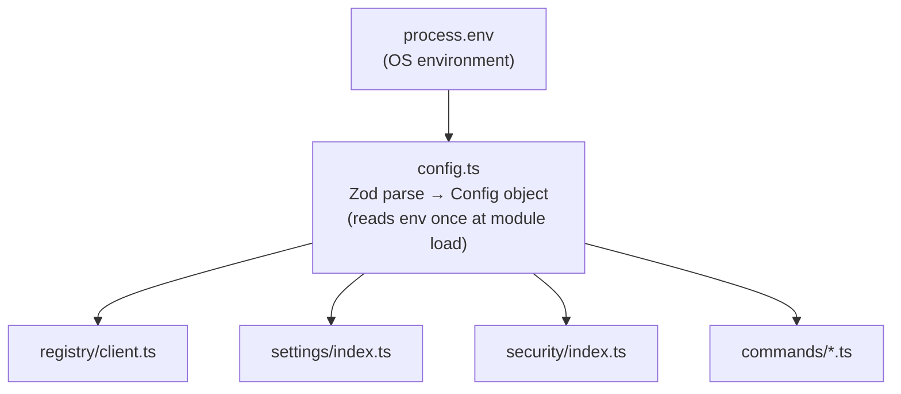
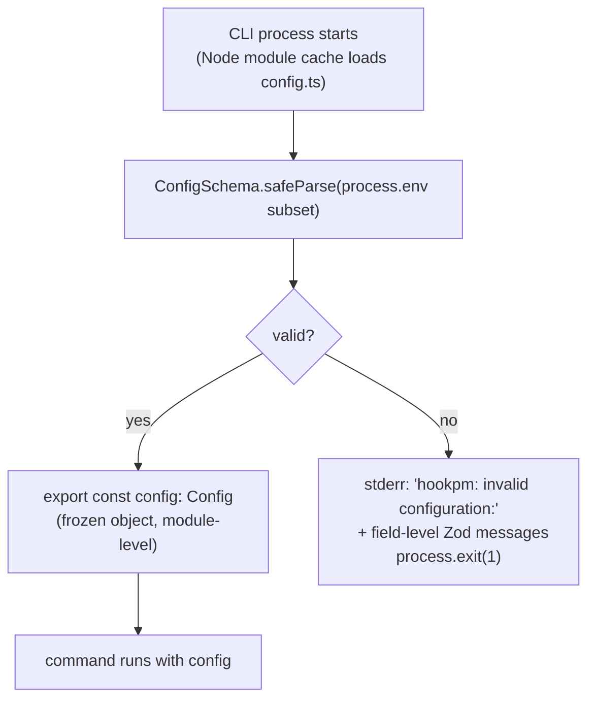
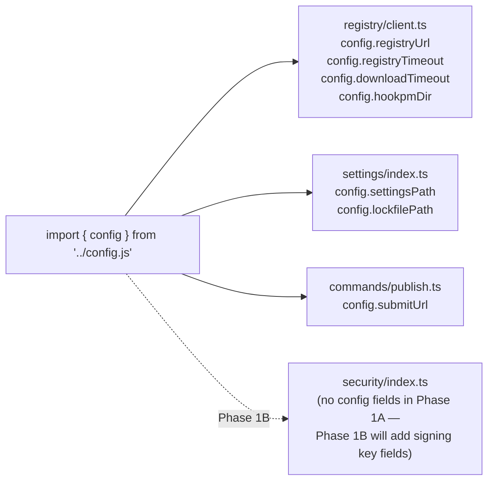

# Config Design — `packages/cli/src/config.ts`

**Status:** Approved
**Date:** 2026-03-10
**Scope:** `packages/cli/src/config.ts` — single source of truth for all environment-derived configuration in the CLI
**Phase:** Phase 1A (all fields used in Phase 1A; Phase 1B fields noted)
**Depends on:** `docs/design/2026-03-10-scaffold.md`, `docs/design/2026-03-10-registry-client.md`, `docs/design/2026-03-10-settings-merge.md`, `docs/design/2026-03-10-cli-commands.md`

---

## TL;DR

`config.ts` is the single file in the CLI that is allowed to read `process.env`. It uses Zod to validate every env var at startup, coercing and defaulting values. If validation fails, the CLI prints a clear error and exits before any command runs. All other modules receive config by importing the `config` object — never by reading `process.env` directly. This doc defines the complete set of config fields required across all Phase 1A modules.

---

## Table of Contents

1. [Purpose and Rules](#1-purpose-and-rules)
2. [Architecture](#2-architecture)
3. [Config Fields](#3-config-fields)
4. [Interface Contract](#4-interface-contract)
5. [Validation and Startup Behaviour](#5-validation-and-startup-behaviour)
6. [Data Flow](#6-data-flow)
7. [Security Considerations](#7-security-considerations)
8. [Testing Strategy](#8-testing-strategy)
9. [Open Questions](#9-open-questions)
10. [Revision History](#10-revision-history)

---

## 1. Purpose and Rules

`config.ts` enforces the rule stated in `CLAUDE.md`: **`process.env` is accessed only in `packages/cli/src/config.ts` and `api/src/config.ts` — never elsewhere.**

This is not a convention. It is a structural constraint enforced by:
- ESLint rule: `no-process-env` applied to all files except `**/config.ts`
- TypeScript: all modules import `config` from `./config.ts`, never from `process`

**One file. One responsibility. Always Zod-validated.**

---

## 2. Architecture



**Rule:** `config.ts` is loaded once when the CLI process starts (Node module cache). All consumers get the same validated object. No module ever calls `process.env` directly.

---

## 3. Config Fields

All fields, their env var names, types, defaults, and which module consumes them:

| Field | Env var | Type | Default | Used by |
|-------|---------|------|---------|---------|
| `registryUrl` | `HOOKPM_REGISTRY_URL` | `string` (URL, https only) | `https://raw.githubusercontent.com/nafistiham/hook-marketplace/main/registry` | `registry/client.ts` |
| `registryTimeout` | `HOOKPM_REGISTRY_TIMEOUT_MS` | `number` (positive int, ms) | `10000` | `registry/client.ts` |
| `downloadTimeout` | `HOOKPM_DOWNLOAD_TIMEOUT_MS` | `number` (positive int, ms) | `30000` | `registry/client.ts` |
| `hookpmDir` | `HOOKPM_DIR` | `string` (absolute path) | `~/.hookpm` (resolved via `os.homedir()`) | `registry/client.ts` |
| `settingsPath` | `HOOKPM_SETTINGS_PATH` | `string` (absolute path) | `~/.claude/settings.json` | `settings/index.ts` |
| `lockfilePath` | `HOOKPM_LOCKFILE_PATH` | `string` (absolute path) | `~/.hookpm/hookpm.lock` (global default; project-local = `path.join(path.dirname(settingsPath), 'hookpm.lock')` — see note below) | `settings/index.ts` |
| `submitUrl` | `HOOKPM_SUBMIT_URL` | `string` (URL, https only) | `https://hookpm.dev/submit` | `commands/publish.ts` |

**Lockfile path derivation (global vs project-local):**
`lockfilePath` defaults to the global location (`~/.hookpm/hookpm.lock`). When a project-local `settingsPath` is used (e.g. `.claude/settings.json` in a project root), the lockfile should live alongside it: `path.join(path.dirname(settingsPath), 'hookpm.lock')`. In Phase 1A, only global installs are supported and `settingsPath` defaults to `~/.claude/settings.json`, so this derivation always produces `~/.hookpm/hookpm.lock`. Phase 1B will add a `--local` flag to `hookpm install`; at that point `lockfilePath` must be derived from the resolved `settingsPath`. This derivation logic lives in the command layer (not in `config.ts`) so that `config.ts` remains a pure env-reader. See Open Question #1 in `settings-merge.md`.

**Phase 1B additions** (not in Phase 1A — listed here for forward reference):
- `apiUrl` — `HOOKPM_API_URL` — the hosted API base URL when Phase 1B goes live
- `clerkPublishableKey` — `HOOKPM_CLERK_KEY` — for author auth in Phase 1B

---

## 4. Interface Contract

```typescript
// packages/cli/src/config.ts

import { z } from 'zod'
import * as os from 'node:os'
import * as path from 'node:path'

const ConfigSchema = z.object({
  // Registry network
  registryUrl: z
    .string()
    .url()
    .startsWith('https://', { message: 'HOOKPM_REGISTRY_URL must use https' })
    .default('https://raw.githubusercontent.com/nafistiham/hook-marketplace/main/registry'),

  registryTimeout: z
    .coerce.number()
    .int()
    .positive()
    .default(10_000),

  downloadTimeout: z
    .coerce.number()
    .int()
    .positive()
    .default(30_000),

  // Local file paths
  hookpmDir: z
    .string()
    .default(path.join(os.homedir(), '.hookpm')),

  settingsPath: z
    .string()
    .default(path.join(os.homedir(), '.claude', 'settings.json')),

  lockfilePath: z
    .string()
    .default(path.join(os.homedir(), '.hookpm', 'hookpm.lock')),

  // Publish URL
  submitUrl: z
    .string()
    .url()
    .startsWith('https://', { message: 'HOOKPM_SUBMIT_URL must use https' })
    .default('https://hookpm.dev/submit'),
})

export type Config = z.infer<typeof ConfigSchema>

// Parsed and validated at module load — throws ConfigError on invalid env
export const config: Config = parseConfig()

function parseConfig(): Config {
  const result = ConfigSchema.safeParse({
    registryUrl:      process.env['HOOKPM_REGISTRY_URL'],
    registryTimeout:  process.env['HOOKPM_REGISTRY_TIMEOUT_MS'],
    downloadTimeout:  process.env['HOOKPM_DOWNLOAD_TIMEOUT_MS'],
    hookpmDir:        process.env['HOOKPM_DIR'],
    settingsPath:     process.env['HOOKPM_SETTINGS_PATH'],
    lockfilePath:     process.env['HOOKPM_LOCKFILE_PATH'],
    submitUrl:        process.env['HOOKPM_SUBMIT_URL'],
  })

  if (!result.success) {
    const messages = result.error.issues
      .map(i => `  ${i.path.join('.')}: ${i.message}`)
      .join('\n')
    // Use process.stderr directly here — output.ts is not available at config parse time
    process.stderr.write(`hookpm: invalid configuration:\n${messages}\n`)
    process.exit(1)
  }

  return result.data
}
```

**`Config` type** is exported and used by all consuming modules as their parameter type for config-dependent operations. No module receives raw env strings — only the typed `Config` object.

---

## 5. Validation and Startup Behaviour



**Fail-fast at startup:** If any required field fails validation (e.g. `HOOKPM_REGISTRY_URL=http://...` violates the `https://` constraint), the CLI exits immediately with a clear message before attempting any network call or file write. This prevents partial operations from leaving the system in an inconsistent state.

**All fields have defaults:** In normal usage (no env vars set), every field resolves to a sensible default. The user never needs to set env vars to use `hookpm` — they exist only for power users, CI environments, and testing.

**`z.coerce.number()`:** Timeout fields use `coerce` because env vars are always strings. `z.coerce.number()` converts `"10000"` → `10000` and rejects `"fast"` with a clear Zod error message.

**HTTPS enforcement:** Both URL fields (`registryUrl`, `submitUrl`) are validated with `.startsWith('https://')`. An HTTP registry URL is rejected at startup — the CLI never makes unencrypted requests to the registry.

---

## 6. Data Flow

The `config` object flows from `config.ts` to consuming modules as a direct import. Modules never receive config through function arguments unless needed for testability (test doubles).



**Testing override pattern:** Tests that need to exercise different config values should not set `process.env` directly (that bleeds between tests). Instead, modules that accept config-derived values should accept them as function parameters (e.g. `mergeHookIntoSettings(hook, paths, options)` where `paths` contains the resolved `settingsPath` and `lockfilePath`). The `config` object is the source at the command layer, but business logic functions accept typed values, not the whole `Config` object. This makes them independently testable without env manipulation.

---

## 7. Security Considerations

- **`process.env` isolation:** ESLint's `no-process-env` rule prevents any module outside `config.ts` from accessing env vars. This eliminates the CVE-2026-21852 pattern (hook-sourced code reading env vars containing API keys) from the entire application code path.
- **HTTPS-only registry:** The `startsWith('https://')` constraint on `registryUrl` is enforced at Zod parse time — before any network call is made. An `http://` registry is rejected at startup, not silently downgraded.
- **No secrets in config:** `config.ts` reads only non-sensitive operational parameters (URLs, timeouts, paths). No API keys, tokens, or credentials flow through `config.ts` in Phase 1A. Phase 1B's `clerkPublishableKey` is a publishable key (safe to log) — private keys never go in `config.ts`.
- **Path defaults via `os.homedir()`:** `hookpmDir`, `settingsPath`, and `lockfilePath` default to paths under `os.homedir()` — not relative paths that could resolve differently depending on CWD. This prevents path confusion attacks.
- **CVE-2025-59536:** Registry URL is defined in config.ts and cannot be overridden by hook content. Hook manifests do not contain URL fields that the CLI follows.

---

## 8. Testing Strategy

```
packages/cli/src/__tests__/
    config.test.ts
```

**Test approach:** `config.ts` reads `process.env` at module load time, so tests must control the environment before the module is required. Use `vi.stubEnv` (Vitest) to set env vars per test and `vi.resetModules()` to force a fresh module load.

**Required test cases:**

- Default values: no env vars set → all fields resolve to their documented defaults
- Valid overrides: `HOOKPM_REGISTRY_URL=https://custom.registry.dev` → `config.registryUrl === 'https://custom.registry.dev'`
- Timeout coercion: `HOOKPM_REGISTRY_TIMEOUT_MS='5000'` (string) → `config.registryTimeout === 5000` (number)
- HTTPS enforcement (registryUrl): `HOOKPM_REGISTRY_URL=http://...` → `process.exit(1)` called, error written to stderr
- HTTPS enforcement (submitUrl): `HOOKPM_SUBMIT_URL=http://insecure.example.com` → `process.exit(1)` called, error written to stderr
- Invalid timeout: `HOOKPM_REGISTRY_TIMEOUT_MS='fast'` → `process.exit(1)` called, Zod message in stderr
- `hookpmDir` default resolves to absolute path under `os.homedir()` (not a relative path)
- `lockfilePath` default is inside `hookpmDir` (consistent nesting)

**ESLint test:**
- CI must verify that no file in `packages/cli/src/` (except `config.ts`) contains `process.env`. This is a linting gate, not a unit test.

---

## 9. Open Questions

| # | Question | Resolution needed before |
|---|----------|--------------------------|
| 1 | Should `hookpmDir` be validated as an existing directory, or created on demand? Creating on demand (in `downloadArchive`) keeps config.ts pure, but fails silently if the path is unwritable. | Before `downloadArchive` implementation |
| 2 | Phase 1B: `clerkPublishableKey` is a publishable key — is it safe to default to empty string and only require it when `publish` command is used, rather than at startup? | Before Phase 1B auth design |

---

## 10. Revision History

| Date | Change | Reason |
|------|--------|--------|
| 2026-03-10 | Initial design | Formalises config fields required by registry-client and cli-commands design docs; closes W-1 from registry-client Opus review |
| 2026-03-10 | Fix 3 warnings from Opus review | W-1: lockfile global vs project-local derivation documented; W-2: submitUrl HTTPS test added; W-3: SecurityModule added to data flow diagram with Phase 1B note |
