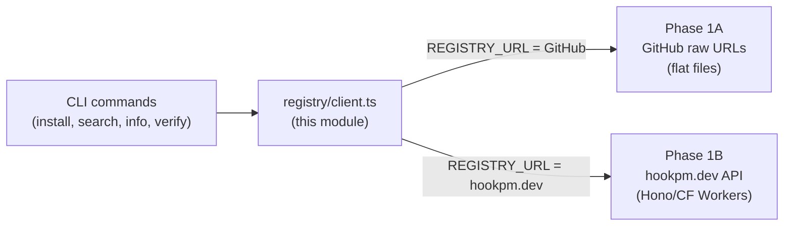
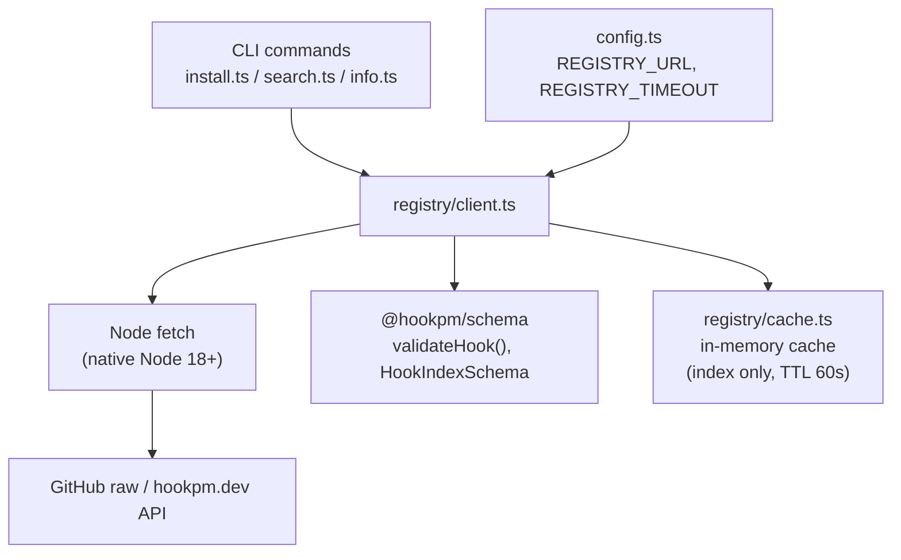
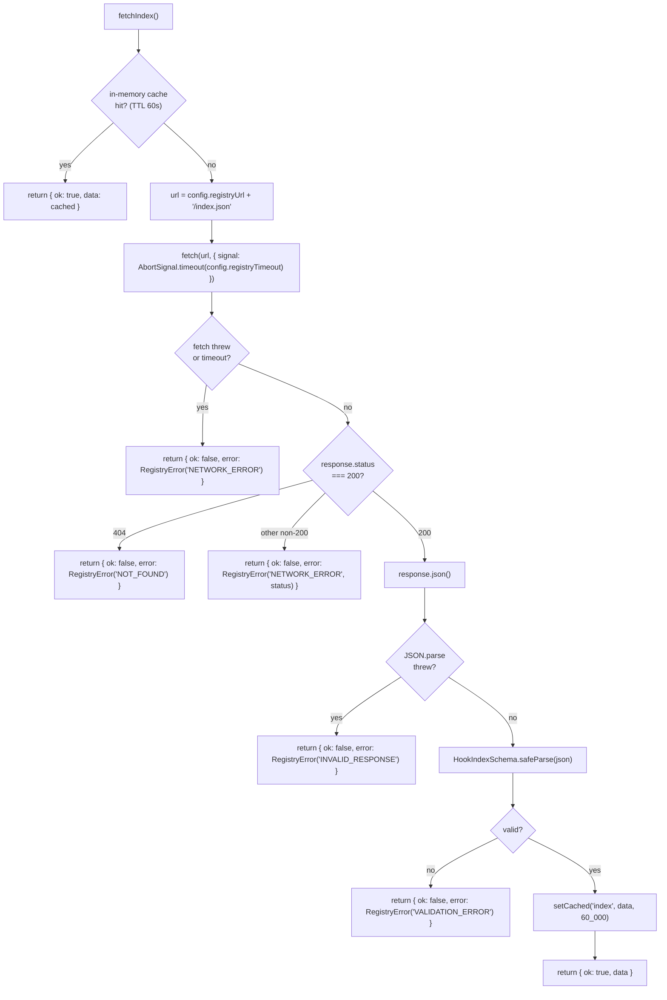
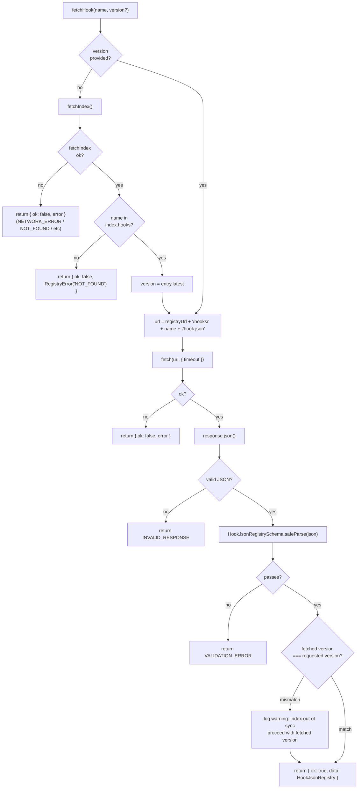
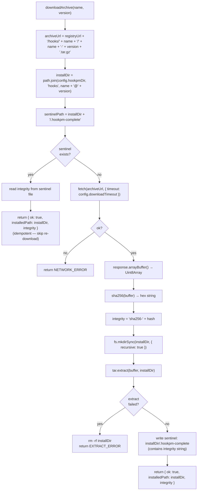

# Registry Client Design — `packages/cli/src/registry/client.ts`

**Status:** Revised (fixing Critical findings from first review)
**Date:** 2026-03-10
**Scope:** `packages/cli/src/registry/` — fetching `index.json`, hook manifests, and hook archives from the Phase 1A GitHub-backed registry
**Phase:** Phase 1A (GitHub raw URLs as registry) + Phase 1B stub (API URL switchover)
**Depends on:** `docs/design/2026-03-10-scaffold.md`, `docs/design/2026-03-10-schema.md`

---

## TL;DR

The registry client is the CLI's single interface to the hook registry. In Phase 1A it fetches flat files from GitHub raw URLs; in Phase 1B the same interface switches to the hosted API with no CLI code changes. It exports three functions: `fetchIndex()` (get the full hook list), `fetchHook(name, version?)` (get a single hook manifest), and `downloadArchive(name, version)` (download and verify the hook files). The registry URL is never hardcoded — it comes from `config.ts`. All network failures produce typed errors that the CLI commands translate into user-facing messages.

---

## Table of Contents

1. [Purpose and Phase Boundary](#1-purpose-and-phase-boundary)
2. [Architecture](#2-architecture)
3. [Phase 1A: GitHub Registry Layout](#3-phase-1a-github-registry-layout)
4. [Interface Contracts](#4-interface-contracts)
5. [Data Flow: fetchIndex](#5-data-flow-fetchindex)
6. [Data Flow: fetchHook](#6-data-flow-fetchhook)
7. [Data Flow: downloadArchive](#7-data-flow-downloadarchive)
8. [Error Handling](#8-error-handling)
9. [Security Considerations](#9-security-considerations)
10. [Testing Strategy](#10-testing-strategy)
11. [Open Questions](#11-open-questions)
12. [Revision History](#12-revision-history)

---

## 1. Purpose and Phase Boundary



**The contract:** CLI commands never know what backs the registry. They call `fetchIndex()`, `fetchHook()`, `downloadArchive()`. The URL in `config.ts` determines the backend. Switching from Phase 1A to Phase 1B is a config change, not a code change.

**Phase 1A URL structure:**
```
REGISTRY_BASE = https://raw.githubusercontent.com/<org>/hook-marketplace/main/registry
  index:   REGISTRY_BASE/index.json
  hook:    REGISTRY_BASE/hooks/<name>/hook.json
  archive: REGISTRY_BASE/hooks/<name>/<name>-<version>.tar.gz
```

**Phase 1B URL structure (future):**
```
REGISTRY_BASE = https://api.hookpm.dev/v1
  index:   REGISTRY_BASE/hooks           (GET, paginated)
  hook:    REGISTRY_BASE/hooks/<name>    (GET, latest or ?version=x.y.z)
  archive: REGISTRY_BASE/hooks/<name>/<version>/download
```

The client normalises both into the same return types. Phase 1B response shapes may differ slightly — the client will need an adapter layer (designed in Phase 1B design doc).

---

## 2. Architecture



**`registry/client.ts`** — public API, uses cache + fetch + schema validation

**`registry/cache.ts`** — simple in-memory index cache, TTL-based, prevents redundant fetches during a single CLI invocation (e.g. `hookpm search` + `hookpm install` in a script)

**`registry/types.ts`** — error types specific to the registry module

---

## 3. Phase 1A: GitHub Registry Layout

```
registry/
├── index.json                          ← HookIndex envelope
└── hooks/
    └── bash-danger-guard/
        ├── hook.json                   ← HookJsonRegistry (full manifest)
        └── bash-danger-guard-1.3.0.tar.gz  ← hook archive (files + hook.json)
```

**Archive contents (`.tar.gz`):**
```
bash-danger-guard-1.3.0/
├── hook.json
├── bash-danger-guard.py
└── README.md
```

The archive is the canonical source for the hook implementation files. `hook.json` in the archive must match `registry/hooks/<name>/hook.json` — the registry CI validates this on every PR.

**Archive naming convention:** `<name>-<version>.tar.gz` — always lowercase kebab-case name + semver, no spaces, no special chars. The `latest` field in `index.json` gives the current version; the archive URL is constructed deterministically.

---

## 4. Interface Contracts

```typescript
// registry/client.ts

import type { HookIndex, HookJsonRegistry } from '@hookpm/schema'
import type { RegistryError, NotFoundError, NetworkError, ValidationError } from './types.js'

export type FetchIndexResult =
  | { ok: true; data: HookIndex }
  | { ok: false; error: RegistryError }

export type FetchHookResult =
  | { ok: true; data: HookJsonRegistry }
  | { ok: false; error: RegistryError }

export type DownloadResult =
  | { ok: true; installedPath: string; integrity: string }
  | { ok: false; error: RegistryError }

// Fetch and validate the full hook index
// Uses in-memory cache (TTL 60s) — safe to call multiple times per CLI invocation
export async function fetchIndex(): Promise<FetchIndexResult>

// Fetch a single hook manifest by name
// version: optional — if omitted, fetches latest (from index.latest field)
// Always validates against HookJsonRegistrySchema before returning
export async function fetchHook(
  name: string,
  version?: string
): Promise<FetchHookResult>

// Download hook archive to ~/.hookpm/hooks/<name>@<version>/
// Verifies SHA-256 integrity against lockfile or manifest
// Extracts archive after verification
// Returns absolute installedPath and integrity hash
export async function downloadArchive(
  name: string,
  version: string
): Promise<DownloadResult>
```

### `registry/types.ts`

```typescript
export type RegistryErrorCode =
  | 'NETWORK_ERROR'      // fetch threw, DNS failure, timeout
  | 'NOT_FOUND'          // 404 from registry
  | 'INVALID_RESPONSE'   // response body is not valid JSON
  | 'VALIDATION_ERROR'   // JSON is valid but fails HookJsonRegistrySchema
  | 'INTEGRITY_ERROR'    // archive SHA-256 does not match expected
  | 'EXTRACT_ERROR'      // tar extraction failed

export class RegistryError extends Error {
  constructor(
    message: string,
    public readonly code: RegistryErrorCode,
    public readonly cause?: unknown
  ) { super(message) }
}
```

### `registry/cache.ts`

```typescript
import type { HookIndex } from '@hookpm/schema'

// Constrained key registry — only known cache keys are allowed.
// This prevents type-unsafe generic access where getCached<WrongType>('index')
// would compile but return a wrong type at runtime.
export type CacheKey = 'index'

// Map from cache key to its stored value type.
// Add entries here when new cacheable items are introduced.
export type CacheValueMap = {
  index: HookIndex
}

export type CacheEntry<K extends CacheKey> = {
  data: CacheValueMap[K]
  fetchedAt: number   // Date.now()
  ttlMs: number
}

// Returns cached value if within TTL, otherwise undefined.
// The key constrains both the return type and the stored type — no cast needed.
export function getCached<K extends CacheKey>(key: K): CacheValueMap[K] | undefined
export function setCached<K extends CacheKey>(key: K, data: CacheValueMap[K], ttlMs: number): void
export function clearCache(): void   // used in tests
```

**Rationale:** The previous `getCached<T>(key: string)` allowed callers to lie about `T` — e.g. `getCached<number>('index')` would compile and silently return a `HookIndex` typed as `number`. The typed key registry (`CacheKey` + `CacheValueMap`) makes the return type flow from the key, not from a caller-supplied generic. Adding a new cached item requires adding an entry to `CacheValueMap`, making the type system enforce completeness.

---

## 5. Data Flow: `fetchIndex`



---

## 6. Data Flow: `fetchHook`



**Error propagation note:** When `version` is omitted, `fetchHook` calls `fetchIndex()` to resolve the latest version. If `fetchIndex()` returns `{ ok: false }`, `fetchHook` propagates the error unchanged — callers see the original `RegistryError` (e.g. `NETWORK_ERROR`), not a generic fallback. This avoids silent failure and gives the user an accurate error message.

---

## 7. Data Flow: `downloadArchive`



**Sentinel file (`.hookpm-complete`):** The install directory is created before extraction begins, so a crashed or killed process leaves an incomplete directory behind. Checking only for `installDir` existence would treat this partial state as a successful install. The sentinel file `.hookpm-complete` is written only after successful extraction — its presence is the proof of completion. An `installDir` without a sentinel is treated as incomplete: the directory is deleted and re-downloaded from scratch.

The sentinel file contains the `sha256-<hex>` integrity string so that subsequent idempotent calls can return the stored integrity without recomputing.

**SHA-256 integrity — Phase 1A limitation:** SHA-256 is computed on the raw archive bytes before extraction. The hash is stored in the sentinel file and the lockfile. However, in Phase 1A there is no registry-provided expected hash to compare against — `INTEGRITY_ERROR` is unreachable in Phase 1A. This is a documented limitation:

> **Phase 1A:** `integrity` is computed and stored. It serves as a tamper-detection baseline for `hookpm verify` (which redownloads and recomputes). No comparison is made during `downloadArchive` itself because no expected hash is available from the registry.
>
> **Phase 1B:** The hook manifest (`hook.json`) will include an `archive_sha256` field. `downloadArchive` will compare `computedHash === manifest.archive_sha256` and return `INTEGRITY_ERROR` on mismatch. `INTEGRITY_ERROR` is dead code until Phase 1B manifest enrichment is implemented.

**Cleanup on failure:** If tar extraction fails after the directory was created, the partial directory is deleted. The sentinel is never written. The OS is left clean.

---

## 8. Error Handling

| Error code | Trigger | User-facing message |
|---|---|---|
| `NETWORK_ERROR` | fetch() throws, DNS failure, timeout | `✗ cannot reach registry — check your internet connection` |
| `NOT_FOUND` | 404 from registry, name not in index | `✗ hook '<name>' not found in registry` |
| `INVALID_RESPONSE` | Non-JSON response body | `✗ registry returned an unexpected response — try again` |
| `VALIDATION_ERROR` | hook.json fails schema | `✗ hook manifest is invalid — this may be a registry bug, please report it` |
| `INTEGRITY_ERROR` | SHA-256 mismatch | `✗ archive integrity check failed — download may be corrupt, try again` |
| `EXTRACT_ERROR` | tar extraction failed | `✗ failed to extract hook archive — disk full or permissions issue?` |

**Timeout values (from `config.ts`):**
- `REGISTRY_TIMEOUT`: default 10s — for index and manifest fetches
- `DOWNLOAD_TIMEOUT`: default 30s — for archive downloads (larger files)

Both are configurable via env vars `HOOKPM_REGISTRY_TIMEOUT_MS` and `HOOKPM_DOWNLOAD_TIMEOUT_MS`.

**Config fields required by this module** (must be added to `packages/cli/src/config.ts` before implementation — the scaffold doc's `config.ts` stub is not exhaustive):

```typescript
// Fields this module reads from config.ts:
registryUrl: string        // validated as https:// URL — existing field
registryTimeout: number    // ms, default 10_000 — existing field
downloadTimeout: number    // ms, default 30_000 — NEW: add to config.ts
hookpmDir: string          // absolute path to ~/.hookpm — NEW: add to config.ts
```

`hookpmDir` defaults to `path.join(os.homedir(), '.hookpm')` and is overridable via `HOOKPM_DIR` env var. `downloadTimeout` is overridable via `HOOKPM_DOWNLOAD_TIMEOUT_MS`. Both must be Zod-validated in `config.ts` per the project's no-direct-process-env rule.

---

## 9. Security Considerations

- **URL construction** — the registry base URL comes from `config.ts` (validated by Zod as a URL string). Hook names are validated by `@hookpm/schema` as `^[a-z0-9-]+$` before being interpolated into URLs. Version strings are validated as strict semver. No user-controlled input reaches URL construction without schema validation.
- **No eval / no script execution** — `downloadArchive` extracts a tar archive to a local directory. The extracted files are not executed by the client. Execution only happens when Claude Code reads `settings.json`.
- **Integrity check** — SHA-256 of the downloaded archive is computed before extraction. This detects MITM tampering or CDN corruption. It does NOT verify the signature of the hook itself (that is `security/index.ts` responsibility).
- **Archive extraction path traversal** — tar archives can contain `../` paths that escape the extraction directory. The tar extraction must use a safe library that enforces extraction into `installDir` only (e.g. Node `tar` package with `strip` option and path sanitisation). This is an implementation constraint, not a schema constraint.
- **CVE-2025-59536** — the registry URL is sourced from `config.ts`, not from any hook file or user input. A shared-repo hook cannot redirect the registry client.
- **CVE-2026-21852** — the client never reads or transmits environment variables. It fetches only from the configured registry URL.
- **HTTPS only** — `config.ts` must validate that `registryUrl` begins with `https://`. HTTP registry URLs are rejected at startup.

---

## 10. Testing Strategy

```
packages/cli/src/registry/__tests__/
    client.test.ts          # fetchIndex, fetchHook, downloadArchive
    cache.test.ts           # TTL logic, clearCache
    fixtures/
        index.json          # valid HookIndex envelope (3-4 hooks)
        bash-danger-guard/
            hook.json       # valid HookJsonRegistry
        index-invalid.json  # valid JSON but fails HookIndexSchema
        hook-invalid.json   # valid JSON but fails HookJsonRegistrySchema
```

**`client.test.ts` required cases:**

`fetchIndex()`:
- Success → returns `{ ok: true, data: HookIndex }` with validated data
- Cache hit → second call returns cached data without fetch
- Cache miss after TTL → refetches after 60s (mock `Date.now`)
- Network error (fetch throws) → `{ ok: false, code: 'NETWORK_ERROR' }`
- 404 response → `{ ok: false, code: 'NOT_FOUND' }`
- Non-JSON response body → `{ ok: false, code: 'INVALID_RESPONSE' }`
- Valid JSON but invalid schema → `{ ok: false, code: 'VALIDATION_ERROR' }`

`fetchHook(name, version?)`:
- Name + no version → fetches index to get latest, then fetches hook.json
- Name + version → skips index fetch, builds URL directly
- Name not in index → `NOT_FOUND`
- Hook.json fails `HookJsonRegistrySchema` → `VALIDATION_ERROR`
- Version mismatch between index and fetched hook.json → warning logged, returns data
- **Name + no version, `fetchIndex()` returns `{ ok: false, code: 'NETWORK_ERROR' }` → propagates `NETWORK_ERROR` without fetching hook.json** *(covers C-5: fetchIndex error branch)*

`downloadArchive(name, version)`:
- Success → `{ ok: true, installedPath, integrity }`, files exist at installedPath, sentinel `.hookpm-complete` exists
- Sentinel present (complete prior install) → idempotent return, no re-fetch, integrity read from sentinel
- **Install dir exists but sentinel absent (partial prior download) → deletes dir, re-downloads, re-extracts, writes sentinel** *(covers C-6: incomplete install dir)*
- 404 archive → `NOT_FOUND`
- Integrity computed and returned in `sha256-<hex>` format (stored in sentinel; Phase 1A does not compare against expected — see §7)
- Extract failure (mock tar to throw) → `EXTRACT_ERROR`, installDir cleaned up, sentinel never written
- **Phase 1B TODO:** Add test for `INTEGRITY_ERROR` when `manifest.archive_sha256` is present and mismatches computed hash — this test case is unreachable in Phase 1A and must be added when Phase 1B manifest enrichment is implemented
- Archive with path traversal entry → `EXTRACT_ERROR` (safe extraction enforced)

**`cache.test.ts`:**
- TTL not expired → getCached returns data
- TTL expired → getCached returns undefined
- clearCache → getCached returns undefined for all keys

---

## 11. Open Questions

| # | Question | Resolution needed before |
|---|----------|--------------------------|
| 1 | Which tar library to use for archive extraction with path traversal protection? (`node:tar`, `tar-stream`, `@andrewbranch/tar`?) | Before downloadArchive implementation |
| 2 | Should `downloadArchive` verify the hook.json inside the archive matches the registry's hook.json? (Defense in depth against compromised archives) | Before security design doc |
| 3 | Phase 1B adapter: when `REGISTRY_URL` points to `api.hookpm.dev`, the index response shape differs (paginated, different field names). Design the adapter layer here or in Phase 1B design doc? | Before Phase 1B |
| 4 | Should `fetchIndex` cache to disk (survive across CLI invocations) or only in-memory? Disk cache enables `hookpm search` to work offline with stale data. | Before Phase 1B |

---

## 12. Revision History

| Date | Change | Reason |
|------|--------|--------|
| 2026-03-10 | Initial design | Registry client is the network boundary — designed before CLI commands |
| 2026-03-10 | Fix 6 Critical findings from Opus review | C-1: type-safe cache keys via CacheValueMap; C-2: fetchHook propagates fetchIndex error; C-3: sentinel file replaces dir-exists idempotency; C-4: Phase 1A integrity limitation documented; C-5/C-6: missing test cases added |
| 2026-03-10 | Address warnings from second Opus review | W-1: config.ts contract fields (hookpmDir, downloadTimeout) explicitly listed; W-2: INTEGRITY_ERROR Phase 1B test-plan note added |
