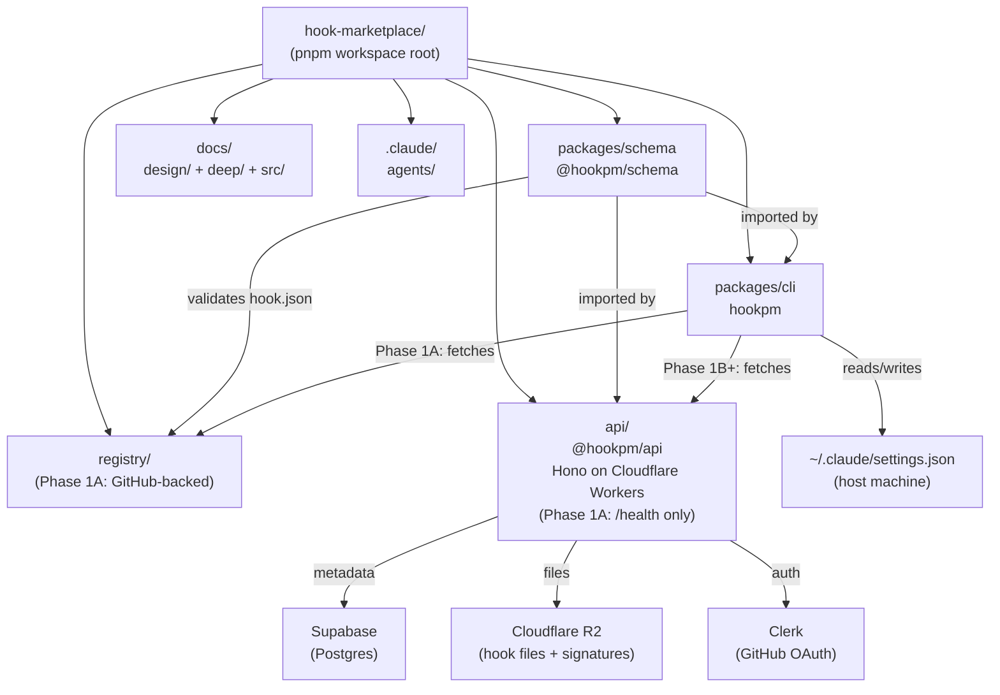
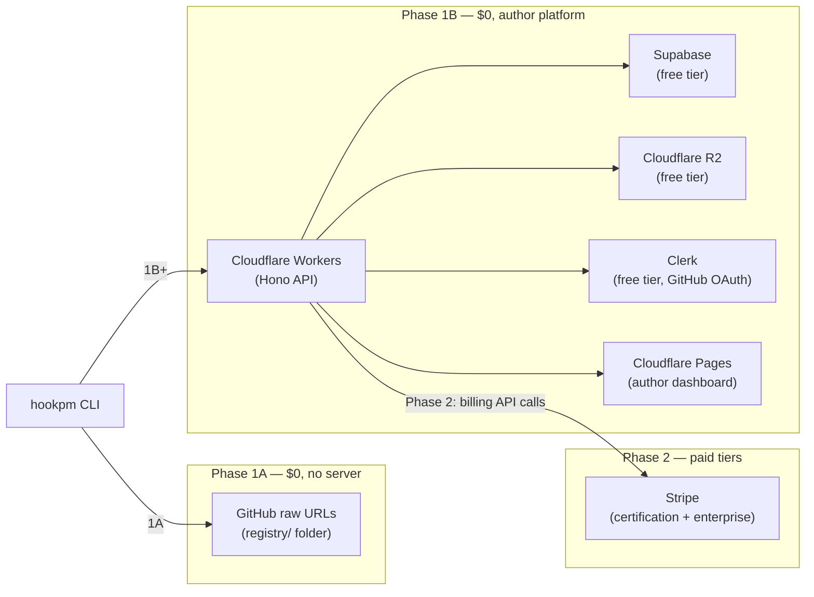
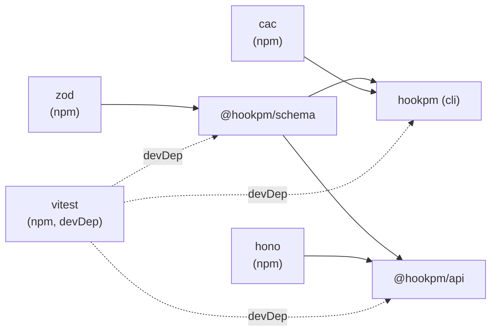
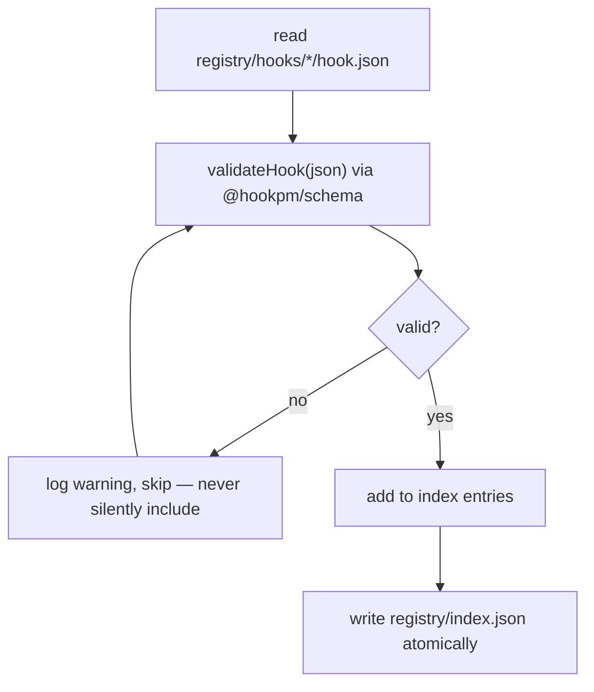
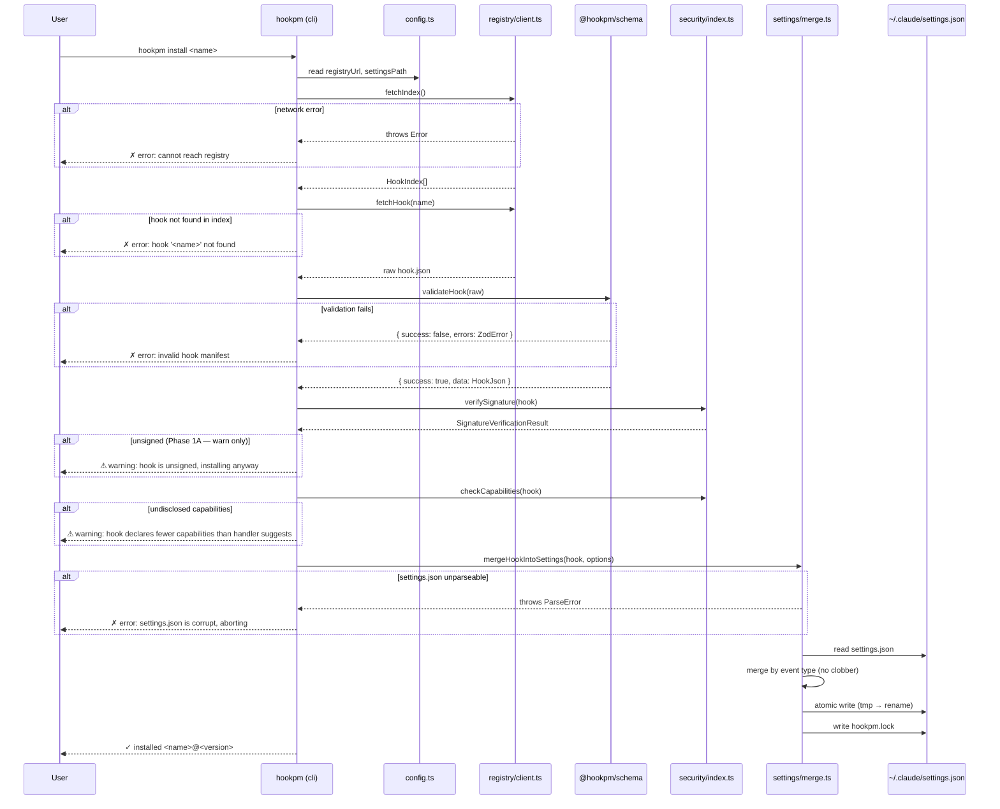
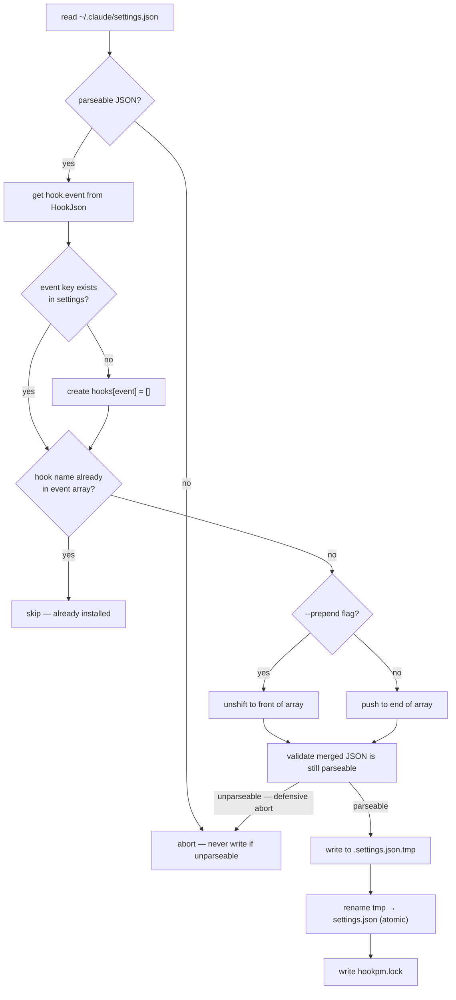
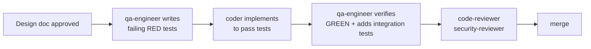
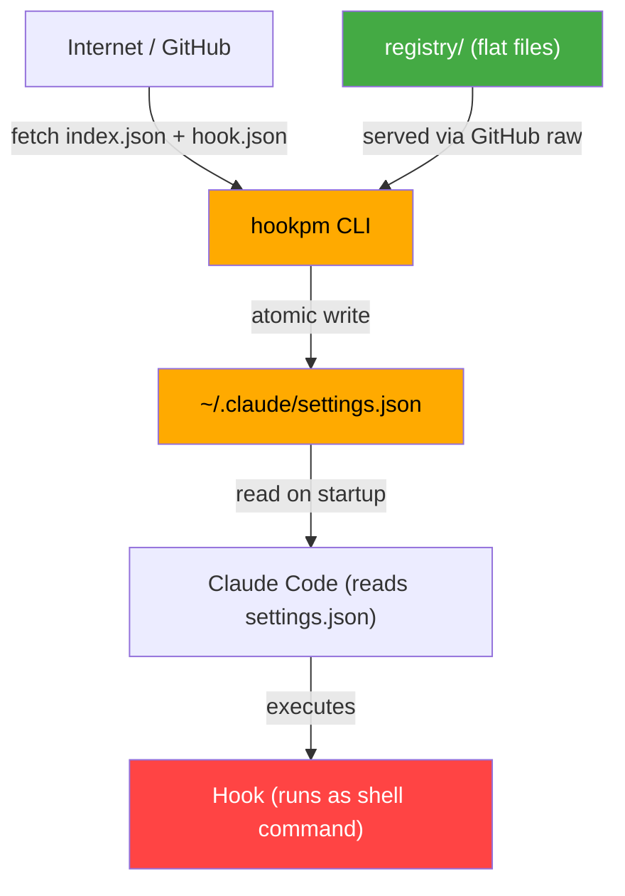

# Scaffold Design — hook-marketplace

**Status:** Approved (revised 2026-03-10)
**Date:** 2026-03-10
**Scope:** Initial monorepo scaffold — workspace wiring, package structure, boilerplate TypeScript setup
**Phases covered:** Phase 1A (GitHub-backed CLI) → Phase 1B (author platform, free) → Phase 2 (certification + paid)

---

## TL;DR

This document defines the foundational monorepo scaffold for hook-marketplace — the pnpm workspace wiring, shared TypeScript baseline, and per-package structure. It covers four packages: `@hookpm/schema` (Zod contract for `hook.json`, shared by all), `hookpm` CLI (install/remove/list/search/verify, stubs for now), the GitHub-backed `registry/` (flat files, no server, Phase 1A), and `@hookpm/api` (Hono on Cloudflare Workers, `/health` only for Phase 1A — author routes designed separately in Phase 1B). Everything is free at launch. This scaffold is the stable foundation every future design doc builds on — no implementation begins before this is approved and all Critical findings resolved.

---

## Table of Contents

1. [Purpose](#1-purpose)
2. [Workspace Architecture](#2-workspace-architecture)
3. [Package Dependency Graph](#3-package-dependency-graph)
4. [Package Designs](#4-package-designs)
   - 4.1 [packages/schema](#41-packagesschema)
   - 4.2 [packages/cli](#42-packagescli)
   - 4.3 [registry](#43-registry)
   - 4.4 [api](#44-api)
5. [Data Flow: hookpm install](#5-data-flow-hookpm-install)
6. [Data Flow: settings.json Merge](#6-data-flow-settingsjson-merge)
7. [TypeScript Configuration](#7-typescript-configuration)
8. [Testing Strategy](#8-testing-strategy)
9. [Security Boundaries](#9-security-boundaries)
10. [Open Questions](#10-open-questions)
11. [Revision History](#11-revision-history)

---

## 1. Purpose

This document defines the foundational scaffold for the `hook-marketplace` monorepo. It is the reference for all subsequent feature design docs — every future doc assumes this structure exists and is stable.

The scaffold establishes:
- pnpm workspace wiring
- TypeScript strict-mode baseline shared across all packages
- The `@hookpm/schema` package as the single source of truth for `hook.json`
- The `hookpm` CLI package with correct command structure (stubs)
- The Phase 1A GitHub-backed registry file layout
- The API package (Hono on Cloudflare Workers — `/health` only now, author platform in Phase 1B)
- The `docs/design/` folder as the mandatory home for all design decisions

### Strategy

Everything is free at launch. The business model is:
1. Build supply (authors) through engagement, activities, and great free tooling
2. Build demand (users) through a quality registry
3. Introduce paid tiers (certification, enterprise) only when the marketplace has enough critical mass that the badge has real value

**No paywalls at launch. Author platform (dashboard, stats, claiming, leaderboards) is free forever or until scale demands otherwise.**

---

## 2. Workspace Architecture



### Phase Architecture Overview



### Directory Map

```
hook-marketplace/
├── pnpm-workspace.yaml           # workspace: [packages/*, api]
├── package.json                  # root scripts only, no src
├── tsconfig.base.json            # shared TS config inherited by all packages
├── .gitignore
│
├── packages/
│   ├── schema/                   # @hookpm/schema — hook.json Zod schema + validator
│   └── cli/                      # hookpm — the CLI binary
│
├── registry/                     # Phase 1 registry (flat files, GitHub-backed)
│   ├── index.json                # generated — do not edit manually
│   ├── hooks/                    # hooks/<name>/hook.json + impl files
│   └── scripts/
│       └── build-index.ts        # regenerates index.json
│
├── api/                          # Phase 2 API (Hono, Supabase, Cloudflare R2)
│   └── src/
│       ├── index.ts              # Hono entry, /health only
│       ├── routes/               # empty — Phase 2
│       └── db/                   # empty — Phase 2
│
├── docs/
│   ├── design/                   # ALL design docs live here (this file + all future)
│   ├── deep/                     # existing research docs
│   └── src/                      # Starlight docs site (future)
│
└── .claude/
    └── agents/                   # custom agent definitions
```

---

## 3. Package Dependency Graph



**Rules:**
- `@hookpm/schema` has one runtime dep: `zod`. Nothing else.
- `hookpm` (cli) imports `@hookpm/schema` as a workspace dep (`workspace:*`).
- `@hookpm/api` imports `@hookpm/schema` as a workspace dep.
- No package imports from `cli` — dependency only flows downward through `schema`.
- `process.env` accessed only in `packages/cli/src/config.ts` and `api/src/config.ts` — never elsewhere.

---

## 4. Package Designs

### 4.1 `packages/schema`

**Purpose:** Single source of truth for the `hook.json` manifest contract. Used by the CLI for validation on install, by registry scripts for index generation, and by the API for submission validation.

#### File Structure

```
packages/schema/
├── package.json
├── tsconfig.json
└── src/
    ├── schema.ts       # Zod schema definition
    ├── validate.ts     # validateHook() function
    └── index.ts        # public exports
```

#### `schema.ts` — Key Types

```typescript
// Inferred from Zod — this is what consumers use
export type HookJson = z.infer<typeof HookJsonSchema>
export type HookEvent = z.infer<typeof HookEventSchema>
export type HookHandler = z.infer<typeof HookHandlerSchema>
export type HookSecurity = z.infer<typeof HookSecuritySchema>
```

#### `validate.ts` — Interface Contract

```typescript
export type ValidationResult =
  | { success: true; data: HookJson }
  | { success: false; errors: ZodError }

export function validateHook(json: unknown): ValidationResult
```

#### `package.json` shape

```json
{
  "name": "@hookpm/schema",
  "version": "0.1.0",
  "exports": {
    ".": "./src/index.ts"
  },
  "scripts": {
    "typecheck": "tsc --noEmit",
    "test": "vitest run",
    "lint": "eslint src"
  },
  "dependencies": {
    "zod": "^3.x"
  },
  "devDependencies": {
    "vitest": "^2.x",
    "typescript": "^5.x"
  }
}
```

---

### 4.2 `packages/cli`

**Purpose:** The `hookpm` binary. Thin command layer over focused internal modules.

#### File Structure

```
packages/cli/
├── package.json
├── tsconfig.json
└── src/
    ├── index.ts              # cac root — registers all subcommands
    ├── config.ts             # Zod-validated env config
    ├── commands/
    │   ├── install.ts
    │   ├── remove.ts
    │   ├── list.ts
    │   ├── search.ts
    │   ├── publish.ts
    │   ├── verify.ts
    │   └── info.ts
    ├── registry/
    │   └── client.ts         # fetch from GitHub registry (Phase 1)
    ├── settings/
    │   ├── index.ts          # read/write settings.json
    │   └── merge.ts          # merge-by-event + lockfile
    └── security/
        └── index.ts          # signature verify + capability check
```

#### Module Responsibilities

| Module | Responsibility | Imports |
|--------|---------------|---------|
| `index.ts` | Register commands, parse argv | `cac`, all commands |
| `config.ts` | Read + validate env vars | `zod` |
| `commands/*` | Parse flags, call modules, print output | `registry/client`, `settings/*`, `security/*` |
| `registry/client.ts` | Fetch `index.json` + `hook.json` from GitHub | `@hookpm/schema` |
| `settings/index.ts` | Atomic read/write of `settings.json` | nothing external |
| `settings/merge.ts` | Merge hook into settings by event type | `settings/index.ts` |
| `security/index.ts` | Verify Ed25519 signature + check capabilities | `@hookpm/schema` |

#### `config.ts` — Interface Contract

```typescript
// Only file that touches process.env
export const config = {
  registryUrl: string,       // HOOKPM_REGISTRY_URL || default GitHub URL
  settingsPath: string,      // HOOKPM_SETTINGS_PATH || ~/.claude/settings.json
  lockfilePath: string,      // derived from settingsPath
}
```

#### `registry/client.ts` — Interface Contract

```typescript
export const REGISTRY_URL = config.registryUrl  // never hardcoded

export async function fetchIndex(): Promise<HookIndex>
export async function fetchHook(name: string): Promise<HookJson>
```

#### `settings/merge.ts` — Interface Contract

```typescript
export type MergeOptions = {
  prepend?: boolean    // --prepend flag: insert at front of event array
}

export async function mergeHookIntoSettings(
  hook: HookJson,
  options?: MergeOptions
): Promise<void>
// Atomic: temp file → rename. Writes lockfile after success. Never clobbers.
```

#### `security/index.ts` — Interface Contract

```typescript
export type SignatureVerificationResult =
  | { verified: true }
  | { verified: false; reason: string }

export type CapabilityCheckResult =
  | { allowed: true }
  | { allowed: false; undisclosedCapabilities: string[] }

// Phase 1A: warns if unsigned (does not block). Phase 2: blocks if uncertified.
export async function verifySignature(hook: HookJson): Promise<SignatureVerificationResult>

// Cross-checks hook.json capabilities[] against actual handler content.
// Detects undisclosed network access, filesystem writes, env var reads.
export function checkCapabilities(hook: HookJson): CapabilityCheckResult
```

**Phase 1A behaviour:**
- `verifySignature` returns `{ verified: false, reason: "unsigned" }` for all hooks (no signing infrastructure yet) — CLI logs a warning, does not abort install
- `checkCapabilities` runs on every install — mismatches log a warning, do not abort

**Phase 2 behaviour (designed separately):**
- `verifySignature` returning `{ verified: false }` blocks install unless `--allow-unsigned` flag is passed
- Certified hooks carry a minisign Ed25519 signature in `hook.json security.signature`

#### `package.json` shape

```json
{
  "name": "hookpm",
  "version": "0.1.0",
  "bin": { "hookpm": "./dist/index.js" },
  "scripts": {
    "dev": "tsx src/index.ts",
    "build": "tsc",
    "typecheck": "tsc --noEmit",
    "test": "vitest run",
    "lint": "eslint src"
  },
  "dependencies": {
    "@hookpm/schema": "workspace:*",
    "cac": "^12.x"
  },
  "devDependencies": {
    "vitest": "^2.x",
    "typescript": "^5.x",
    "tsx": "^4.x"
  }
}
```

---

### 4.3 `registry/`

**Purpose:** Phase 1 hook registry — flat files hosted on GitHub. No server required. CI regenerates `index.json` on every PR merge.

#### File Structure

```
registry/
├── index.json                  # [{ name, version, description, author, event, tags, security }]
├── hooks/
│   └── .gitkeep                # empty — hooks added via PR
└── scripts/
    └── build-index.ts          # run via: pnpm run build-index (workspace root)
```

#### `index.json` Schema

> **Superseded:** The full `HookIndex` and `HookIndexEntry` types are defined in `docs/design/2026-03-10-schema.md §5`. That definition is authoritative. Summary below for reference only.

`index.json` is an envelope object (not a bare array):
```typescript
{ schema_version: '1', generated_at: string, hooks: HookIndexEntry[] }
```

Each `HookIndexEntry` contains: `name`, `description`, `author`, `event`, `tags`, `capabilities`, `security`, `latest` (version string), `versions[]`, `source?`, `submitted_by?`, `updated_at`. See schema design doc for the full Zod definition.

#### `build-index.ts` — Logic



---

### 4.4 `api/`

**Purpose:** Hono API running on **Cloudflare Workers** (not Fly.io — zero cost on free tier, edge-deployed, same Hono code if we ever migrate). Phase 1A scaffold has `/health` only. Phase 1B author routes are designed separately before implementation.

#### File Structure

```
api/
├── package.json
├── tsconfig.json
├── wrangler.toml             # Cloudflare Workers config, R2 binding, secrets refs
└── src/
    ├── index.ts              # Hono app, GET /health → { status: "ok" }
    ├── config.ts             # Zod-validated env/secrets from CF Worker env bindings
    ├── routes/
    │   └── .gitkeep          # Phase 1B: hooks.ts, authors.ts, search.ts
    └── db/
        └── .gitkeep          # Phase 1B: Supabase client
```

#### `package.json` shape

```json
{
  "name": "@hookpm/api",
  "version": "0.1.0",
  "scripts": {
    "dev": "wrangler dev",
    "deploy": "wrangler deploy",
    "typecheck": "tsc --noEmit",
    "test": "vitest run"
  },
  "dependencies": {
    "@hookpm/schema": "workspace:*",
    "hono": "^4.x"
  },
  "devDependencies": {
    "@cloudflare/workers-types": "^4.x",
    "wrangler": "^3.x",
    "vitest": "^2.x",
    "typescript": "^5.x"
  }
}
```

#### `wrangler.toml` shape

```toml
name = "hookpm-api"
main = "src/index.ts"
compatibility_date = "2024-01-01"

[[r2_buckets]]
binding = "HOOKS_BUCKET"
bucket_name = "hookpm-hooks"

[vars]
ENVIRONMENT = "development"

# secrets set via: wrangler secret put <KEY>
# SUPABASE_URL, SUPABASE_ANON_KEY, CLERK_SECRET_KEY
```

---

## 5. Data Flow: `hookpm install`



---

## 6. Data Flow: `settings.json` Merge



---

## 7. TypeScript Configuration

### `tsconfig.base.json` (root)

```json
{
  "compilerOptions": {
    "target": "ES2022",
    "module": "NodeNext",
    "moduleResolution": "NodeNext",
    "strict": true,
    "noUncheckedIndexedAccess": true,
    "noImplicitOverride": true,
    "exactOptionalPropertyTypes": true,
    "lib": ["ES2022"],
    "declaration": true,
    "declarationMap": true,
    "sourceMap": true,
    "skipLibCheck": true
  }
}
```

### Per-package `tsconfig.json`

```json
{
  "extends": "../../tsconfig.base.json",
  "compilerOptions": {
    "outDir": "./dist",
    "rootDir": "./src"
  },
  "include": ["src"]
}
```

**Rules:**
- `strict: true` is non-negotiable — no `any`, ever
- `noUncheckedIndexedAccess: true` — array/object access always returns `T | undefined`
- `module: NodeNext` + `moduleResolution: NodeNext` — correct ESM interop for Node

---

## 8. Testing Strategy

### Framework: Vitest

Each package has its own `vitest.config.ts`. Tests live next to the code they test in `__tests__/` directories.

```
packages/schema/src/__tests__/
    schema.test.ts          # valid/invalid hook.json fixtures
    validate.test.ts        # validateHook() edge cases

packages/cli/src/settings/__tests__/
    merge.test.ts           # merge-by-event, no-clobber, prepend, lockfile
    index.test.ts           # atomic write, parse-before-write, corrupt-file abort

packages/cli/src/registry/__tests__/
    client.test.ts          # fetch mocks, network error handling, hook-not-found

packages/cli/src/security/__tests__/
    index.test.ts           # verifySignature (unsigned → warn), checkCapabilities
                            # CLAUDE.md: "Signature verification must be tested on every CLI release"
```

### Test-Driven Flow (mandatory)



No implementation code is written before RED tests exist and are confirmed failing.

---

## 9. Security Boundaries



**Boundary rules:**
- CLI validates every `hook.json` via `@hookpm/schema` before touching `settings.json`
- CLI verifies signature before writing (Phase 1: warn if unsigned; Phase 2: block if uncertified)
- `settings.json` write is always atomic — partial writes are impossible
- No hook in the registry may contain credentials or access `process.env` directly
- `security-reviewer` agent is mandatory on every PR touching `registry/hooks/`

---

## 10. Open Questions

| # | Question | Resolution needed before |
|---|----------|--------------------------|
| 1 | ESLint config — flat config (v9) or legacy? | Before first lint run |
| 2 | What author engagement activities ship in Phase 1B? | Before Phase 1B design doc |
| 3 | Hook claiming flow UX — PR-based or dashboard button? | Before Phase 1B design doc |
| 4 | `source` + `submitted_by` fields in `hook.json` schema — add now or Phase 1B? | Before schema design doc |

**Closed questions:**
- ~~`hookpm.lock` format — JSON or YAML?~~ → **JSON** (per `docs/deep/technical-spec.md §5.2` which defines the lockfile schema in full)
- ~~`bin` field target — `./src/index.ts` or `./dist/index.js`?~~ → **`./dist/index.js`** (compiled output; `dev` script uses `tsx src/index.ts` for local development)
- ~~Signature verification Phase 1A — warn or block?~~ → **warn only** (no signing infrastructure in Phase 1A; block deferred to Phase 2)

---

## 11. Revision History

| Date | Change | Reason |
|------|--------|--------|
| 2026-03-10 | Initial design created | Scaffold brainstorm approved |
| 2026-03-10 | Replaced Fly.io with Cloudflare Workers; added Phase 1A/1B/2 model; added author platform layer; updated all diagrams | Strategy decision: free everything at launch, author engagement as growth lever, paid tiers only at scale |
| 2026-03-10 | Added TL;DR block; added security/index.ts interface contract; fixed bin field to dist/index.js; added error paths to install sequence; added merge flowchart failure edge; added security test path; closed 3 open questions; fixed Stripe edge explanation | Resolved all findings from design-reviewer (Opus) — 🔴 C-1, 🔴 C-2, and 🟡 W-1 through W-7 |
| 2026-03-10 | Replaced `commander` with `cac` as CLI framework throughout | CLI commands design doc (2026-03-10-cli-commands.md) formally supersedes this framework choice. `cac` is lighter (zero dependencies, ~3kB vs commander's ~60kB), TypeScript-first, and requires no extra `.d.ts`. Same API surface for our use case. |
