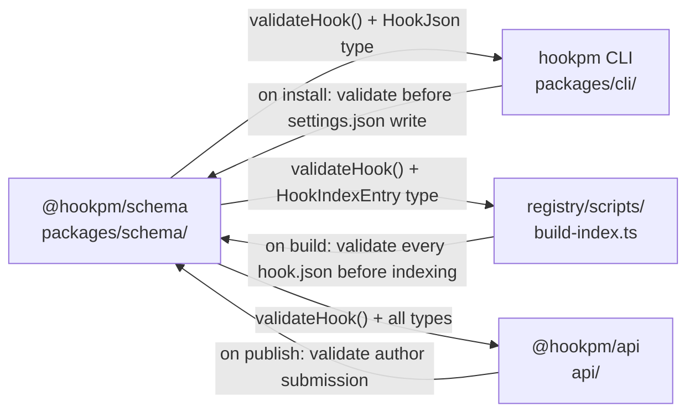
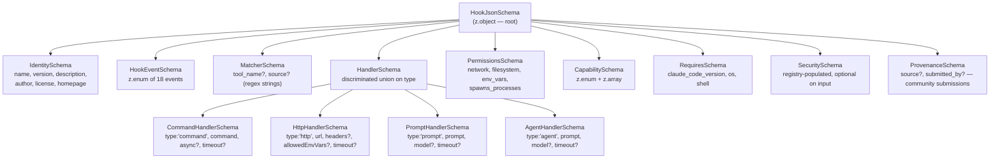
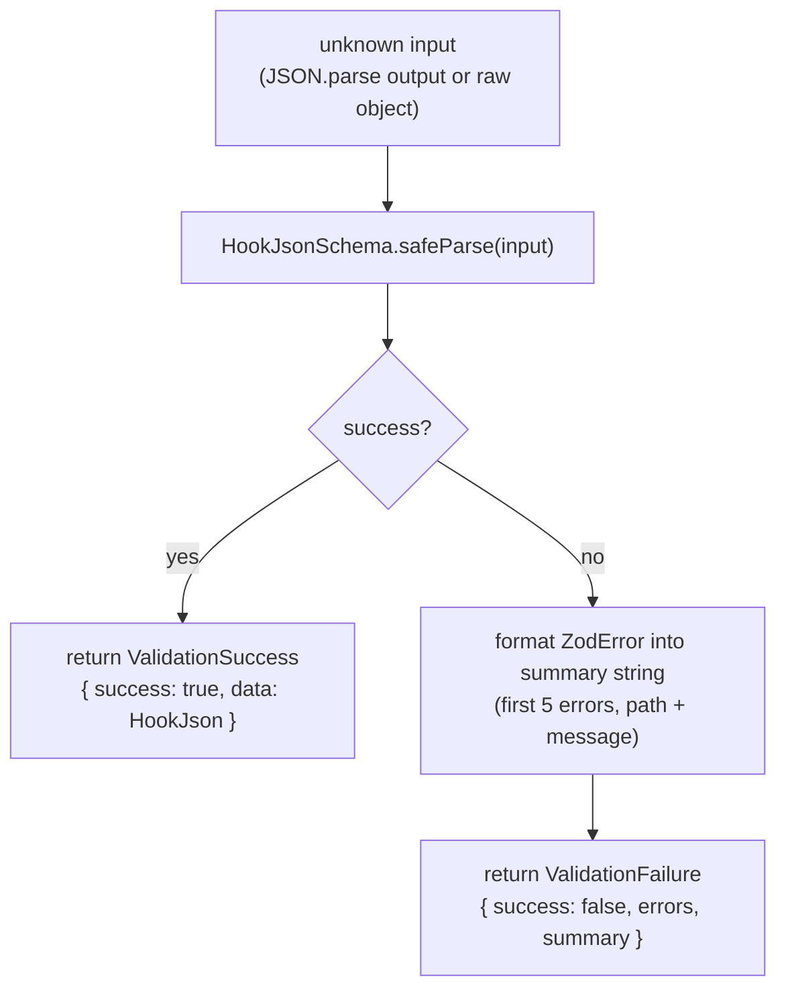
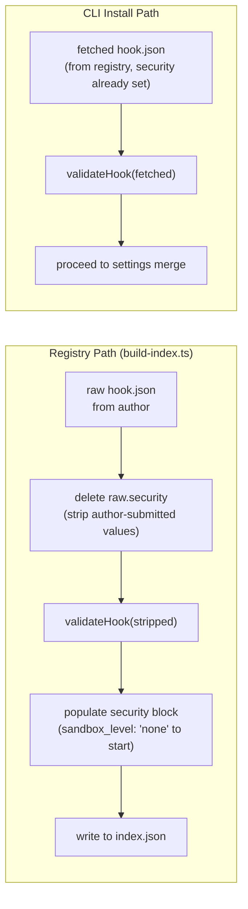

# Schema Design — `@hookpm/schema`

**Status:** Draft
**Date:** 2026-03-10
**Scope:** `packages/schema/` — Zod schema for `hook.json`, validation function, all exported types
**Phase:** Phase 1A (foundational — imported by CLI, registry scripts, and future API)
**Depends on:** `docs/design/2026-03-10-scaffold.md`

---

## TL;DR

`@hookpm/schema` is the single source of truth for the `hook.json` contract. It exports a Zod schema, all derived TypeScript types, and a `validateHook()` function used by every consumer (CLI, registry build-index script, Phase 1B API). The schema uses discriminated unions to enforce handler type safety — a `command` handler cannot accidentally carry `url` fields. The `security` block is always optional on input (authors don't set it) and always present on output after registry population. This package has zero runtime deps except `zod`.

---

## Table of Contents

1. [Purpose and Consumers](#1-purpose-and-consumers)
2. [Schema Architecture](#2-schema-architecture)
3. [Full Zod Schema Design](#3-full-zod-schema-design)
   - 3.1 [Identity Fields](#31-identity-fields)
   - 3.2 [Event](#32-event)
   - 3.3 [Matcher](#33-matcher)
   - 3.4 [Handler — Discriminated Union](#34-handler--discriminated-union)
   - 3.5 [Permissions](#35-permissions)
   - 3.6 [Capabilities](#36-capabilities)
   - 3.7 [Tags and Requires](#37-tags-and-requires)
   - 3.8 [Security](#38-security)
   - 3.9 [Provenance Fields](#39-provenance-fields)
4. [Validation Function](#4-validation-function)
5. [Index Entry Schema](#5-index-entry-schema)
6. [Exported Public API](#6-exported-public-api)
7. [Validation Flow](#7-validation-flow)
8. [Security Considerations](#8-security-considerations)
9. [Testing Strategy](#9-testing-strategy)
10. [Open Questions](#10-open-questions)
11. [Revision History](#11-revision-history)

---

## 1. Purpose and Consumers



**Rules:**
- No consumer duplicates schema logic — all validation goes through this package
- No other package defines `HookJson` or its sub-types — only `@hookpm/schema` exports them
- Schema changes are always their own commit (`schema(schema):` prefix)
- Any breaking schema change requires a version bump and migration path

---

## 2. Schema Architecture



---

## 3. Full Zod Schema Design

### 3.1 Identity Fields

```typescript
const IdentitySchema = z.object({
  $schema: z.string().url().optional(),
  name: z
    .string()
    .min(1)
    .max(64)
    .regex(/^[a-z0-9-]+$/, 'name must be lowercase kebab-case'),
  version: z
    .string()
    .regex(/^\d+\.\d+\.\d+$/, 'version must be semver (MAJOR.MINOR.PATCH)'),
  description: z.string().min(1).max(280),
  author: z.string().min(1).max(64),
  license: z.string().min(1),               // SPDX identifier, e.g. "MIT"
  homepage: z.string().url().optional(),
})
```

**Constraints:**
- `name`: globally unique in registry (enforced at registry level, not schema level — schema only enforces format)
- `version`: strict semver triple only — no `^`, no `~`, no pre-release labels at submission time
- `description`: max 280 chars (search result card limit)
- `license`: required — hooks without a license are not acceptable in a public registry
- `homepage`: optional but strongly recommended for community trust

---

### 3.2 Event

```typescript
export const HOOK_EVENTS = [
  'PreToolUse',
  'PostToolUse',
  'PostToolUseFailure',
  'PermissionRequest',
  'SessionStart',
  'SessionEnd',
  'UserPromptSubmit',
  'Stop',
  'SubagentStart',
  'SubagentStop',
  'TeammateIdle',
  'TaskCompleted',
  'Notification',
  'InstructionsLoaded',
  'ConfigChange',
  'WorktreeCreate',
  'WorktreeRemove',
  'PreCompact',
] as const

export const HookEventSchema = z.enum(HOOK_EVENTS)
export type HookEvent = z.infer<typeof HookEventSchema>
```

**Rule:** One hook, one event. Multiple events require multiple published packages. This keeps manifests auditable.

---

### 3.3 Matcher

```typescript
const MatcherSchema = z
  .object({
    tool_name: z.string().optional(), // regex string, applied to tool_name in hook payload
    source: z.string().optional(),    // regex string, applied to source field (SessionStart, ConfigChange)
  })
  .optional()
```

**Validation note:** The matcher values are regex strings — we validate they are valid regex at schema validation time:

```typescript
const regexString = z.string().superRefine((val, ctx) => {
  try {
    new RegExp(val)
  } catch {
    ctx.addIssue({ code: z.ZodIssueCode.custom, message: `Invalid regex: ${val}` })
  }
})

const MatcherSchema = z
  .object({
    tool_name: regexString.optional(),        // PreToolUse, PostToolUse, PermissionRequest
    source: regexString.optional(),           // SessionStart, ConfigChange
    agent_type: regexString.optional(),       // SubagentStart, SubagentStop
    notification_type: regexString.optional(),// Notification
  })
  .optional()
```

**Matcher field applicability by event:**

| Matcher field | Applicable events |
|---|---|
| `tool_name` | `PreToolUse`, `PostToolUse`, `PostToolUseFailure`, `PermissionRequest` |
| `source` | `SessionStart`, `ConfigChange` |
| `agent_type` | `SubagentStart`, `SubagentStop` |
| `notification_type` | `Notification` |

Unused matcher fields on a given event are silently ignored at Claude Code runtime. The schema does not enforce cross-field consistency (e.g. rejecting `tool_name` on a `SessionStart` hook) — that is a linting concern, not a schema concern.


---

### 3.4 Handler — Discriminated Union

The handler is a discriminated union on `type`. Each branch carries only the fields valid for that type — no cross-contamination.

```typescript
const BaseHandlerSchema = z.object({
  timeout: z.number().int().positive().optional(),
})

const CommandHandlerSchema = BaseHandlerSchema.extend({
  type: z.literal('command'),
  command: z.string().min(1),           // shell command, relative to hook dir
  async: z.boolean().default(false),
})

const HttpHandlerSchema = BaseHandlerSchema.extend({
  type: z.literal('http'),
  url: z.string().url(),
  // Known simplification: header values are string-only (not string | string[]).
  // HTTP spec allows multi-value headers; this is deferred to a future schema version.
  headers: z.record(z.string(), z.string()).optional(),
  allowedEnvVars: z.array(z.string()).optional(),
})

const PromptHandlerSchema = BaseHandlerSchema.extend({
  type: z.literal('prompt'),
  prompt: z.string().min(1),           // use $ARGUMENTS as placeholder for hook JSON
  model: z.string().optional(),
})

const AgentHandlerSchema = BaseHandlerSchema.extend({
  type: z.literal('agent'),
  prompt: z.string().min(1),
  model: z.string().optional(),
})

export const HandlerSchema = z.discriminatedUnion('type', [
  CommandHandlerSchema,
  HttpHandlerSchema,
  PromptHandlerSchema,
  AgentHandlerSchema,
])

export type HookHandler = z.infer<typeof HandlerSchema>
export type CommandHandler = z.infer<typeof CommandHandlerSchema>
export type HttpHandler = z.infer<typeof HttpHandlerSchema>
export type PromptHandler = z.infer<typeof PromptHandlerSchema>
export type AgentHandler = z.infer<typeof AgentHandlerSchema>
```

**Default timeouts (applied at CLI install time, not schema level):**

| Handler type | Default timeout |
|---|---|
| `command` | 600s |
| `http` | 30s |
| `prompt` | 30s |
| `agent` | 60s |

---

### 3.5 Permissions

```typescript
const NetworkPermissionsSchema = z.object({
  allowed: z.boolean(),
  domains: z.array(z.string()).default([]),
})

const FilesystemPermissionsSchema = z.object({
  read: z.array(z.string()).default([]),   // glob patterns
  write: z.array(z.string()).default([]),  // glob patterns
})

const PermissionsSchema = z.object({
  network: NetworkPermissionsSchema.default({ allowed: false, domains: [] }),
  filesystem: FilesystemPermissionsSchema.default({ read: [], write: [] }),
  env_vars: z.array(z.string()).default([]),
  spawns_processes: z.boolean().default(false),
})
```

**Constraint:** If `network.allowed` is `true`, `network.domains` must be non-empty:

```typescript
const PermissionsSchema = z
  .object({ ... })
  .superRefine((val, ctx) => {
    if (val.network.allowed && val.network.domains.length === 0) {
      ctx.addIssue({
        code: z.ZodIssueCode.custom,
        message: 'network.domains must list specific domains when network.allowed is true',
        path: ['network', 'domains'],
      })
    }
  })
```

---

### 3.6 Capabilities

```typescript
export const CAPABILITIES = [
  'block',
  'modify-input',
  'inject-context',
  'read-stdin',
  'write-stdout',
  'side-effects-only',
  'approve',
] as const

export const CapabilitySchema = z.enum(CAPABILITIES)
export type HookCapability = z.infer<typeof CapabilitySchema>

const CapabilitiesArraySchema = z.array(CapabilitySchema).min(1)
```

**Constraint:** `capabilities` must have at least one entry — a hook with no declared capabilities is ambiguous and unauditable.

---

### 3.7 Tags and Requires

```typescript
const TagsSchema = z.array(z.string().min(1).max(32)).default([])

const RequiresSchema = z
  .object({
    claude_code_version: z.string().optional(), // npm semver range, e.g. ">=2.0.0"
    os: z
      .array(z.enum(['darwin', 'linux', 'windows']))
      .default(['darwin', 'linux', 'windows']),
    shell: z
      .array(z.enum(['bash', 'zsh', 'sh', 'fish', 'pwsh']))
      .default(['bash', 'zsh', 'sh']),
  })
  .default({})
```

---

### 3.8 Security

The `security` block is **registry-populated only**. Authors must not submit it. Any author-submitted `security` block is stripped by the registry indexing script before storage.

```typescript
export const SandboxLevelSchema = z.enum([
  'none',            // unreviewed — just passed schema validation
  'static-analysis', // passed automated security scan
  'verified',        // human-reviewed
  'certified',       // signed + verified + enterprise-eligible
])

export type SandboxLevel = z.infer<typeof SandboxLevelSchema>

export const SecuritySchema = z.object({
  sandbox_level: SandboxLevelSchema.default('none'),
  reviewed: z.boolean().default(false),
  review_date: z.string().nullable().default(null),  // ISO 8601
  signed: z.boolean().default(false),
  signed_by: z.string().nullable().default(null),    // key ID
  signature: z.string().nullable().default(null),    // detached Ed25519 sig
})

export type HookSecurity = z.infer<typeof SecuritySchema>
```

**Two schema variants — both fully defined:**

```typescript
// Variant 1: Author submission — security is optional (authors don't set it)
export const HookJsonSchema = z.object({
  ...IdentitySchema.shape,
  event: HookEventSchema,
  matcher: MatcherSchema,
  handler: HandlerSchema,
  permissions: PermissionsSchema.default({}),
  capabilities: CapabilitiesArraySchema,
  tags: TagsSchema,
  requires: RequiresSchema,
  security: SecuritySchema.optional(),   // optional: authors may omit entirely
  provenance: ProvenanceSchema,
})

export type HookJson = z.infer<typeof HookJsonSchema>

// Variant 2: Registry output — security is always present after indexing
// Used by: registry/scripts/build-index.ts output, CLI when reading fetched hooks
export const HookJsonRegistrySchema = HookJsonSchema.extend({
  security: SecuritySchema,              // required: registry always populates this
})

export type HookJsonRegistry = z.infer<typeof HookJsonRegistrySchema>
```

**Which variant to use where:**

| Consumer | Schema | Reason |
|---|---|---|
| `registry/build-index.ts` input | `HookJsonSchema` | Author submissions may lack security block |
| `registry/build-index.ts` output | `HookJsonRegistrySchema` | Registry populates security before writing index |
| `hookpm install` (fetching from registry) | `HookJsonRegistrySchema` | Fetched hooks always have security populated |
| `hookpm publish` (author upload) | `HookJsonSchema` | Author submits without security |
| `@hookpm/api` submission endpoint | `HookJsonSchema` | Same as publish |

---

### 3.9 Provenance Fields

Added to address community seeding (hooks submitted on behalf of original authors):

```typescript
const ProvenanceSchema = z
  .object({
    source: z.string().url().optional(),        // URL to original repo/gist
    submitted_by: z.string().optional(),        // GitHub handle of submitter (not author)
  })
  .optional()
```

**Semantics:**
- `author` = who wrote the hook (original creator)
- `submitted_by` = who submitted it to the registry (may differ for community-seeded hooks)
- `source` = canonical upstream URL
- If `submitted_by` is absent, the submitter is assumed to be the author

---

## 4. Validation Function

```typescript
// packages/schema/src/validate.ts

import { ZodError } from 'zod'
import { HookJsonSchema } from './schema.js'
import type { HookJson } from './schema.js'

export type ValidationSuccess = {
  success: true
  data: HookJson
}

export type ValidationFailure = {
  success: false
  errors: ZodError
  /** Human-readable summary of first N errors, useful for CLI output */
  summary: string
}

export type ValidationResult = ValidationSuccess | ValidationFailure

export function validateHook(json: unknown): ValidationResult {
  const result = HookJsonSchema.safeParse(json)
  if (result.success) {
    return { success: true, data: result.data }
  }
  return {
    success: false,
    errors: result.error,
    summary: result.error.errors
      .slice(0, 5)
      .map(e => `${e.path.join('.')}: ${e.message}`)
      .join('\n'),
  }
}
```

**`summary` field rationale:** CLI consumers need human-readable error output without importing Zod. The `summary` field provides formatted errors without exposing Zod internals.

---

## 5. Index Entry Schema

The registry `index.json` contains a flattened subset of each hook for fast search. Built by `build-index.ts` from full `hook.json` files.

```typescript
export const HookIndexEntrySchema = z.object({
  name: z.string(),
  description: z.string(),
  author: z.string(),
  event: HookEventSchema,
  tags: z.array(z.string()),
  capabilities: z.array(CapabilitySchema),
  security: SecuritySchema,
  latest: z.string(),            // latest semver — the version hookpm install resolves to
  versions: z.array(z.string()), // all published versions, ascending semver order
  source: z.string().url().optional(),
  submitted_by: z.string().optional(),
  updated_at: z.string(),        // ISO 8601 — last update timestamp
  // Not in index: version (use latest), handler, permissions, requires, matcher
  // handler + permissions are fetched from the full hook.json on demand
})

export type HookIndexEntry = z.infer<typeof HookIndexEntrySchema>

// The index.json file envelope — written by build-index.ts, read by registry/client.ts
export const HookIndexSchema = z.object({
  schema_version: z.literal('1'),          // index format version, not hook version
  generated_at: z.string(),                // ISO 8601
  hooks: z.array(HookIndexEntrySchema),
})

export type HookIndex = z.infer<typeof HookIndexSchema>
```

**Why not full hook.json in index?** `handler` (contains commands) and `permissions` (large) are fetched lazily when a user does `hookpm info <name>` or `hookpm install <name>`. The index is optimised for `hookpm search` — fast scan, small payload.

**Breaking change from scaffold doc:** The scaffold doc typed `HookIndex` as `HookIndexEntry[]` (bare array). This doc supersedes that definition. `HookIndex` is now the envelope object `{ schema_version, generated_at, hooks: HookIndexEntry[] }`. The scaffold doc's §4.3 `index.json` schema section is outdated — it will be updated when the registry design doc is written. All consumers must access `index.hooks` to iterate entries, not the index object directly.

**No `version` field in `HookIndexEntry`:** The `version` field is removed in favour of `latest` to eliminate the sync hazard. `build-index.ts` populates `latest` from the hook's most recent `hook.json` version. The `versions` array is the full history. There is no redundancy.

---

## 6. Exported Public API

```typescript
// packages/schema/src/index.ts

// Schemas (for advanced consumers who need to compose)
export { HookJsonSchema, HookJsonRegistrySchema } from './schema.js'
export { HookEventSchema, HandlerSchema, SecuritySchema, SandboxLevelSchema } from './schema.js'
export { HookIndexEntrySchema, HookIndexSchema } from './schema.js'

// Constants
export { HOOK_EVENTS, CAPABILITIES } from './schema.js'

// Types (inferred from Zod — single source of truth)
export type {
  HookJson,          // author submission (security optional)
  HookJsonRegistry,  // registry output (security required)
  HookEvent,
  HookHandler,
  CommandHandler,
  HttpHandler,
  PromptHandler,
  AgentHandler,
  HookCapability,
  HookSecurity,
  SandboxLevel,
  HookIndexEntry,
  HookIndex,         // envelope: { schema_version, generated_at, hooks[] }
} from './schema.js'

// Validation
export { validateHook } from './validate.js'
export type { ValidationResult, ValidationSuccess, ValidationFailure } from './validate.js'
```

**Rule:** Consumers import from `@hookpm/schema` only. Never from `@hookpm/schema/src/schema` directly — that is an internal path.

---

## 7. Validation Flow



**`validateHook()` is pure — no side effects, no stripping.** It accepts `unknown`, runs `safeParse`, and returns a typed result. Security stripping is NOT done here — it is the registry's responsibility, done before calling `validateHook()`. See the two-path diagram below.



---

## 8. Security Considerations

- **No code execution in schema** — Zod validation is pure data transformation. No eval, no shell calls, no filesystem access.
- **Regex validation** — matcher fields are validated as compilable regexes at parse time. A malformed regex in `matcher.tool_name` that reaches Claude Code could silently match nothing or cause runtime errors.
- **`security` block authority** — only the registry populates `security`. The schema enforces this socially (field is optional on input), but the registry's `build-index.ts` enforces it mechanically by stripping before validation. Any hook that ships with a self-signed `security.certified` is lying — the CLI must display the registry's security value, not the hook's self-reported value.
- **CVE-2025-59536 relevance** — the `source` field is a URL stored as a string. It is never fetched or executed by the schema package. Consumers must not auto-fetch `source` URLs without user intent.
- **CVE-2026-21852 relevance** — `handler.headers` and `handler.allowedEnvVars` are declared intent, not enforced constraints. The schema validates their presence and type but cannot prevent a hook from exfiltrating tokens at runtime. This is why `security-reviewer` must audit every hook submission.
- **No `any`** — all schema inference is fully typed. `unknown` is used at the `validateHook` input boundary, narrowed by Zod.

---

## 9. Testing Strategy

```
packages/schema/src/__tests__/
    schema.test.ts       # field-level unit tests
    validate.test.ts     # validateHook() integration tests
    fixtures/
        valid/           # valid hook.json examples (one per handler type)
        invalid/         # invalid examples (one per constraint)
```

### Unit test coverage required

**schema.test.ts:**
- `name` validation: valid kebab-case, rejects uppercase, rejects spaces, rejects >64 chars
- `version` validation: accepts `1.0.0`, rejects `^1.0.0`, rejects `1.0`, rejects pre-release
- Handler discriminated union: `command` schema rejects `url` field, `http` schema rejects `command` field
- `network.allowed: true` with empty `domains` → validation error
- `capabilities` empty array → validation error
- Matcher regex: invalid regex string → validation error
- Security block: present in author submission → NOT a validation error (schema accepts it); registry strips it separately
- Provenance: `submitted_by` without `source` → valid; `source` non-URL → invalid

**validate.test.ts:**
- Valid full hook.json → `{ success: true, data }` with correct types
- Missing required field → `{ success: false, summary }` with path in summary
- Wrong type → `{ success: false }` with human-readable message
- `summary` contains max 5 errors for a hook with 10 invalid fields
- `data` from success result is fully typed (TypeScript compile-time test)
- `HookJsonRegistrySchema`: hook with fully-populated `security` block → valid
- `HookJsonRegistrySchema`: hook missing `security` block → invalid (security required)
- `HookJsonSchema`: hook with `security` block present → valid (optional, accepted)
- `HookJsonSchema`: hook without `security` block → valid (optional, absent is fine)

### Fixtures

```
fixtures/valid/
    command-hook.json          # PreToolUse, command handler, full fields
    http-hook.json             # PostToolUse, http handler
    prompt-hook.json           # UserPromptSubmit, prompt handler
    agent-hook.json            # SessionStart, agent handler
    minimal-hook.json          # only required fields, no optional blocks
    community-hook.json        # with provenance: source + submitted_by
    registry-hook.json         # full HookJsonRegistrySchema — security block populated

fixtures/invalid/
    bad-name.json              # uppercase in name
    bad-version.json           # ^1.0.0 (range, not plain semver)
    empty-capabilities.json    # capabilities: []
    network-no-domains.json    # network.allowed: true with domains: []
    bad-matcher-regex.json     # tool_name: "[invalid regex"
    wrong-handler-fields.json  # command handler with url field present
    bad-provenance.json        # source: "not-a-url" (invalid URL format)
```

---

## 10. Open Questions

| # | Question | Resolution needed before |
|---|----------|--------------------------|
| 1 | Should `version` allow pre-release labels (e.g. `1.0.0-beta.1`) at submission time? | Before first `hookpm publish` |
| 2 | Should `license` be validated against a list of known SPDX identifiers, or just a non-empty string? | Before registry launch |
| 3 | `model` field in prompt/agent handlers — validate against known Claude model IDs, or free string? | Before Phase 1B publish command |
| 4 | Should `capabilities` enforce semantic consistency (e.g. `block` requires `write-stdout`)? | Before security design doc |

---

## 11. Revision History

| Date | Change | Reason |
|------|--------|--------|
| 2026-03-10 | Initial design | Schema is the foundational package — designed first |
| 2026-03-10 | Fixed validateHook() flowchart (removed SecurityStrip — function is pure); added HookJsonRegistrySchema definition; added agent_type + notification_type matcher fields; added latest/versions/updated_at/envelope to HookIndexSchema; documented headers multi-value limitation; added registry fixture + bad-provenance fixture; updated exports | Resolved design-reviewer (Opus) pass-1 findings: C-1, C-2, W-1–W-5 |
| 2026-03-10 | Removed redundant `version` field from HookIndexEntry (superseded by `latest`); added breaking-change note re scaffold doc HookIndex type; scaffold doc §4.3 updated to point to this doc as authoritative | Resolved design-reviewer (Opus) pass-2 findings: W-6, W-7 |
