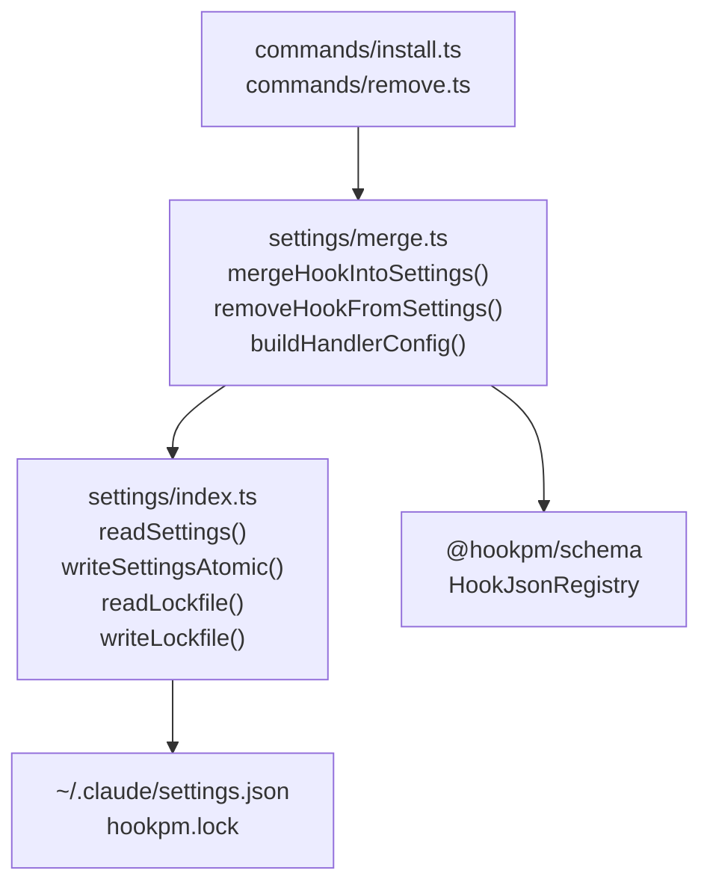
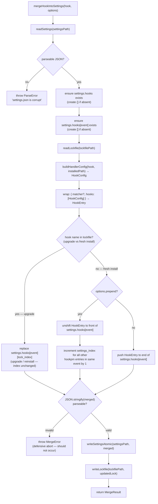
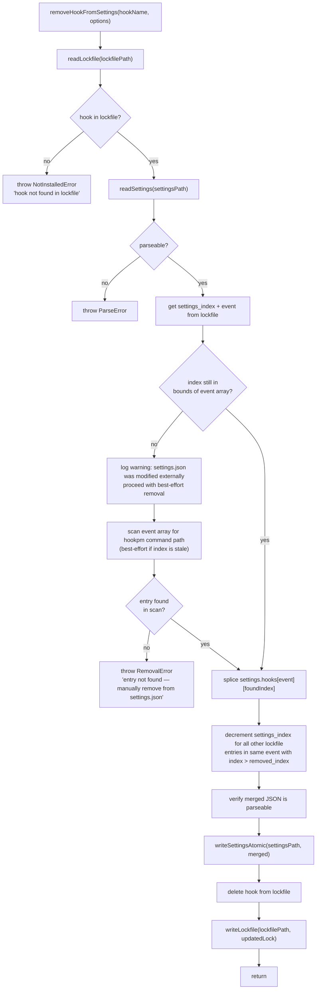
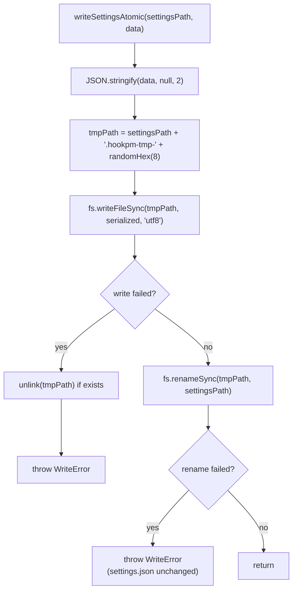

# Settings Merge Design — `packages/cli/src/settings/`

**Status:** Draft
**Date:** 2026-03-10
**Scope:** `packages/cli/src/settings/` — atomic read/write of `~/.claude/settings.json`, merge-by-event algorithm, lockfile management
**Phase:** Phase 1A (core CLI, required for `hookpm install` and `hookpm remove`)
**Depends on:** `docs/design/2026-03-10-scaffold.md`, `docs/design/2026-03-10-schema.md`

---

## TL;DR

This module handles the single most dangerous CLI operation: modifying `~/.claude/settings.json`, which directly controls what code runs in every Claude session. Two files implement it — `index.ts` (atomic read/write, file-level ops) and `merge.ts` (merge algorithm, lockfile management). The merge algorithm appends to event arrays and never clobbers existing entries. Writes are always atomic (temp file → rename). The lockfile tracks array positions so `remove` and `update` can find entries without parsing the entire settings file. All command handler paths written to `settings.json` are fully resolved to absolute paths at install time — the `command` field in `hook.json` must use the explicit `$HOOK_DIR` placeholder or a simple two-token format to make resolution unambiguous.

---

## Table of Contents

1. [Purpose and Threat Model](#1-purpose-and-threat-model)
2. [The `settings.json` Structure](#2-the-settingsjson-structure)
3. [Module Design](#3-module-design)
4. [The Lockfile](#4-the-lockfile)
5. [Data Flow: Install (merge)](#5-data-flow-install-merge)
6. [Data Flow: Remove](#6-data-flow-remove)
7. [Data Flow: Atomic Write](#7-data-flow-atomic-write)
8. [Interface Contracts](#8-interface-contracts)
9. [Handler Config Builder](#9-handler-config-builder)
10. [Error Handling](#10-error-handling)
11. [Security Considerations](#11-security-considerations)
12. [Testing Strategy](#12-testing-strategy)
13. [Open Questions](#13-open-questions)
14. [Revision History](#14-revision-history)

---

## 1. Purpose and Threat Model

`~/.claude/settings.json` is the file Claude Code reads on startup to load hooks. Any corruption, accidental clobber, or malformed write can silently disable all user hooks or, worse, cause Claude Code to fail to start.

**What can go wrong:**
- Process crash mid-write → partial file → Claude Code fails to parse → all hooks disabled
- Clobber of existing hooks in same event array → user-configured hooks silently removed
- Invalid JSON written → Claude Code ignores the file or errors on startup
- Race condition between two simultaneous `hookpm install` calls → one install lost

**The module's contract:**
- Every write is atomic — the old file is intact until the new one is complete
- The existing hooks in any event array are never removed by an install
- The file is validated as parseable JSON before AND after any write
- The lockfile is the source of truth for what hookpm manages — user-added entries are never touched

---

## 2. The `settings.json` Structure

```typescript
// The structure hookpm reads and writes
// Claude Code owns this format — we never change keys outside of hooks[]
type ClaudeSettings = {
  // All non-hooks keys are preserved verbatim (model, permissions, etc.)
  hooks?: {
    [event: string]: HookEntry[]   // event name → array of hook entries
  }
  [key: string]: unknown           // all other Claude settings keys
}

type HookEntry = {
  matcher?: {
    tool_name?: string
    source?: string
    agent_type?: string
    notification_type?: string
  }
  hooks: HookConfig[]
}

type HookConfig = {
  type: 'command' | 'http' | 'prompt' | 'agent'
  // command handler
  command?: string
  async?: boolean
  timeout?: number
  // http handler
  url?: string
  headers?: Record<string, string>
  allowedEnvVars?: string[]
  // prompt/agent handler
  prompt?: string
  model?: string
}
```

**Key structural insight:** Each element of the event array is a `HookEntry` — a matcher + an array of `HookConfig` objects. `hookpm` installs one `HookEntry` per hook (one matcher + one `HookConfig`). User-created entries may have multiple `HookConfig` objects in their `hooks` array — we never touch those.

---

## 3. Module Design



**`settings/index.ts`** — file-level operations only:
- Read `settings.json` and parse JSON
- Write `settings.json` atomically
- Read and write `hookpm.lock`
- No knowledge of hook merging logic

**`settings/merge.ts`** — merge algorithm:
- Merge a hook into `settings.json` (install)
- Remove a hook from `settings.json` (remove/uninstall)
- Build the `HookConfig` object from a `HookJsonRegistry`
- All file ops delegated to `settings/index.ts`

---

## 4. The Lockfile

The lockfile records every hookpm-managed entry in `settings.json`. It is the only way `remove` and `update` can find and modify the correct array position without risking touching user-added entries.

```typescript
// Lockfile structure — hookpm.lock (JSON)
type Lockfile = {
  version: '1'
  generated: string              // ISO 8601
  registry: string               // registry URL used at install time
  hooks: {
    [hookName: string]: LockEntry
  }
}

type LockEntry = {
  version: string                // installed semver e.g. "1.3.0"
  resolved: string               // URL where the hook was fetched from
  integrity: string              // sha256-<hex> of the downloaded archive
  event: string                  // event name (e.g. "PreToolUse")
  settings_index: number         // array index in settings.hooks[event][]
  installed: string              // ISO 8601 timestamp
  range: string                  // semver range for hookpm update (e.g. "^1.3.0")
}
```

**Lockfile location:**
- Project install: `.hookpm.lock` in the project root (next to `.claude/settings.json`)
- Global install: `~/.hookpm/global.lock`
- The path is derived from `settingsPath` in `config.ts`

**Lockfile is committed to git** for project installs — ensures team members get identical hook versions.

---

## 5. Data Flow: Install (merge)



**Critical rules:**
- `BuildEntry` and `WrapEntry` happen BEFORE the upgrade-vs-fresh check — the entry is built once, then either replaces or appends
- The lockfile is read before deciding append vs replace — never scan `settings.json` to find existing entries
- `settings_index` in the lockfile points to the hookpm-managed entry; user entries at other positions are untouched
- After a prepend, **all existing lockfile `settings_index` values for the same event are incremented by 1** — this is the `IncrementIndices` step
- After a replace (upgrade), the `settings_index` remains the same

---

## 6. Data Flow: Remove



**Index drift handling:** If the user manually edits `settings.json`, the lockfile's `settings_index` may be stale. The module detects this (bounds check or entry mismatch) and falls back to scanning the event array for the hookpm-managed command path. This is best-effort — if the command path was also modified, removal fails with an informative error asking the user to manually remove the entry.

---

## 7. Data Flow: Atomic Write



**Why `renameSync` is atomic:** On POSIX systems (macOS, Linux), `rename()` is an atomic syscall — the old file is replaced in a single operation. If the process dies between `writeFileSync` and `renameSync`, the original `settings.json` is intact; the tmp file is an orphan that can be cleaned up.

**On Windows:** `fs.renameSync` is NOT atomic when crossing drive boundaries. Since `settings.json` is always in `~/.claude/`, the tmp file is written to the same directory, ensuring same-filesystem semantics. Windows atomic rename via `MoveFileExW(MOVEFILE_REPLACE_EXISTING)` is equivalent.

**Tmp filename:** `randomHex(8)` prevents collisions if two hookpm processes run simultaneously (unlikely but possible). Both processes would write separate tmp files and the last `rename` wins — this is safe because rename is atomic.

**Symlink handling:** If `settingsPath` is a symlink (common in dotfile setups using `stow`, `chezmoi`, etc.), `renameSync(tmpPath, settingsPath)` replaces the symlink itself rather than the symlink's target. `readSettings` must detect symlinks via `fs.lstatSync` before writing:
- If `settingsPath` is a symlink, resolve it to the real path via `fs.realpathSync` and write to the real path instead
- Log a warning: "settings.json is a symlink — writing to real path: <resolved>"
- The symlink remains intact; the target file is updated correctly

---

## 8. Interface Contracts

### `settings/index.ts`

```typescript
import type { ClaudeSettings } from './types.js'
import type { Lockfile } from './types.js'

// Paths resolved from config.ts
export type SettingsPaths = {
  settingsPath: string    // ~/.claude/settings.json or .claude/settings.json
  lockfilePath: string    // hookpm.lock (same dir as settingsPath)
}

// Read settings.json — throws ParseError if file exists but is invalid JSON
// Returns empty ClaudeSettings if file does not exist (first-time install)
export function readSettings(settingsPath: string): ClaudeSettings

// Write settings atomically — temp file → rename
// Throws WriteError if write or rename fails
// settings.json is UNCHANGED if this throws
export function writeSettingsAtomic(settingsPath: string, data: ClaudeSettings): void

// Read lockfile:
//   - File does not exist → return empty Lockfile { version: '1', hooks: {}, ... }
//   - File exists but is invalid JSON → log warning "lockfile corrupt, treating as empty"
//     and return empty Lockfile. Do NOT throw — corrupt lockfile is recoverable.
//   - File exists and is valid → return parsed Lockfile
export function readLockfile(lockfilePath: string): Lockfile

// Write lockfile — not atomic (lockfile corruption is recoverable via empty fallback above)
// If write fails, throws WriteError. Callers log the error; settings.json is already written.
export function writeLockfile(lockfilePath: string, data: Lockfile): void
```

### `settings/merge.ts`

```typescript
import type { HookJsonRegistry } from '@hookpm/schema'
import type { SettingsPaths } from './index.js'

export type MergeOptions = {
  prepend?: boolean           // insert at front of event array (for security hooks)
  dryRun?: boolean            // return diff without writing
  installedPath: string       // absolute path to installed hook directory
}

export type MergeResult = {
  added: boolean              // false if hook was upgraded (replaced existing entry)
  settingsIndex: number       // final position in event array
  event: string
}

// Install: merge hook into settings.json, write lockfile
// async: reserved for future registry integrity check before write (Phase 1B)
// Currently uses sync file ops internally; outer async is intentional for future-proofing
// Throws: ParseError, WriteError, MergeError
export async function mergeHookIntoSettings(
  hook: HookJsonRegistry,
  paths: SettingsPaths,
  options: MergeOptions
): Promise<MergeResult>

// Remove: splice hook entry from settings.json, update lockfile
// Throws: NotInstalledError, ParseError, WriteError
export async function removeHookFromSettings(
  hookName: string,
  paths: SettingsPaths,
  options?: { dryRun?: boolean }
): Promise<void>
```

### `settings/types.ts`

```typescript
// Shared types for settings module — not exported from @hookpm/schema
// (Claude Code settings format, not hookpm's hook.json format)

export type HookConfig = {
  type: 'command' | 'http' | 'prompt' | 'agent'
  command?: string
  async?: boolean
  timeout?: number
  url?: string
  headers?: Record<string, string>
  allowedEnvVars?: string[]
  prompt?: string
  model?: string
}

export type HookEntry = {
  matcher?: {
    tool_name?: string
    source?: string
    agent_type?: string
    notification_type?: string
  }
  hooks: HookConfig[]
}

export type ClaudeSettings = {
  hooks?: { [event: string]: HookEntry[] }
  [key: string]: unknown
}

export type LockEntry = {
  version: string
  resolved: string
  integrity: string
  event: string
  settings_index: number
  installed: string
  range: string
}

export type Lockfile = {
  version: '1'
  generated: string
  registry: string
  hooks: { [hookName: string]: LockEntry }
}

// Error types
export class ParseError extends Error { readonly type = 'ParseError' as const }
export class WriteError extends Error { readonly type = 'WriteError' as const }
export class MergeError extends Error { readonly type = 'MergeError' as const }
export class NotInstalledError extends Error { readonly type = 'NotInstalledError' as const }
```

---

## 9. Handler Config Builder

Transforms a `HookJsonRegistry.handler` into the `HookConfig` shape Claude Code expects in `settings.json`. The installed hook files live at `installedPath` — command paths are resolved to absolute paths at install time.

### `command` field contract in `hook.json`

Hook authors must write the `command` field in one of two forms:

**Form 1 — `$HOOK_DIR` placeholder (recommended for complex commands):**
```
"command": "python3 -u $HOOK_DIR/script.py --config $HOOK_DIR/config.json"
```
`$HOOK_DIR` is replaced verbatim with the absolute install path, properly quoted if it contains spaces. Supports interpreter flags, multiple script args, and any shell-compatible invocation.

**Form 2 — simple two-token format (for common cases):**
```
"command": "python3 script.py"
"command": "./script.sh"
"command": "node dist/index.js"
```
Exactly: `<interpreter> <relative-script-path>`. No interpreter flags between interpreter and script. For complex invocations, use `$HOOK_DIR` or wrap in a shell script.

**Schema enforcement:** `CommandHandlerSchema` validates the `command` field matches one of these forms — it must either contain `$HOOK_DIR` or have at most two space-separated tokens. No `..` path segments. No absolute paths in the relative form (only `$HOOK_DIR` may produce absolute paths). This is enforced in the schema design doc.

### `resolveCommandPath` — the correct algorithm

```typescript
// Resolves a hook.json command string to a settings.json-ready absolute command
// Handles both Form 1 ($HOOK_DIR) and Form 2 (two-token simple)
export function resolveCommandPath(command: string, installedPath: string): string {
  // Form 1: $HOOK_DIR placeholder
  // Tokenize by whitespace, replace $HOOK_DIR within each token, quote the WHOLE token
  // (not just installedPath) if the resolved token contains spaces.
  // e.g. "python3 -u $HOOK_DIR/script.py" + "/Users/jane doe/foo" →
  //       tokens: ["python3", "-u", "$HOOK_DIR/script.py"]
  //       resolved: ["python3", "-u", '"/Users/jane doe/foo/script.py"'] ← whole token quoted
  //       result: 'python3 -u "/Users/jane doe/foo/script.py"'  ✓
  if (command.includes('$HOOK_DIR')) {
    const tokens = command.trim().split(/\s+/)
    const resolved = tokens.map(token => {
      if (!token.includes('$HOOK_DIR')) return token
      const resolvedToken = token.replaceAll('$HOOK_DIR', installedPath)
      return resolvedToken.includes(' ') ? `"${resolvedToken}"` : resolvedToken
    })
    return resolved.join(' ')
  }

  // Form 2: simple two-token format — <interpreter> <relative-script>
  const trimmed = command.trim()
  const spaceIndex = trimmed.indexOf(' ')

  if (spaceIndex === -1) {
    // Single token — the entire command is the script (e.g. "./script.sh")
    const resolved = path.join(installedPath, trimmed)
    return resolved.includes(' ') ? `"${resolved}"` : resolved
  }

  const interpreter = trimmed.slice(0, spaceIndex)          // e.g. "python3"
  const relativeScript = trimmed.slice(spaceIndex + 1)      // e.g. "script.py"
  const resolvedScript = path.join(installedPath, relativeScript)
  const quotedScript = resolvedScript.includes(' ')
    ? `"${resolvedScript}"`
    : resolvedScript

  return `${interpreter} ${quotedScript}`
}
```

**Why `$HOOK_DIR` is the right design:**
- Eliminates ambiguity about which token is the "script" — the author is explicit
- Handles interpreter flags naturally: `"python3 -u $HOOK_DIR/script.py"` works
- Handles multiple args: `"node $HOOK_DIR/dist/index.js --config $HOOK_DIR/config.json"` works
- Makes the schema constraint simple: if no `$HOOK_DIR`, must be exactly two tokens

### `buildHandlerConfig` implementation

```typescript
// settings/merge.ts

export function buildHandlerConfig(
  handler: HookJsonRegistry['handler'],
  installedPath: string
): HookConfig {
  const base: HookConfig = { type: handler.type }

  if (handler.timeout !== undefined) base.timeout = handler.timeout

  switch (handler.type) {
    case 'command':
      base.command = resolveCommandPath(handler.command, installedPath)
      if (handler.async !== undefined) base.async = handler.async
      break
    case 'http':
      base.url = handler.url
      if (handler.headers) base.headers = handler.headers
      if (handler.allowedEnvVars) base.allowedEnvVars = handler.allowedEnvVars
      break
    case 'prompt':
    case 'agent':
      base.prompt = handler.prompt
      if (handler.model) base.model = handler.model
      break
  }

  return base
}
```

**Schema note:** The `command` field format constraint (Form 1 or Form 2 only, no `..`, no interpreter flags in Form 2) must be added to `CommandHandlerSchema` in the schema design doc. Added as Open Question #5 below — this requires updating `docs/design/2026-03-10-schema.md`.

---

## 10. Error Handling

| Error | When | Recovery |
|---|---|---|
| `ParseError` | `settings.json` is not valid JSON | Abort entire operation. Never write. User must fix manually or run `hookpm repair`. |
| `WriteError` (tmp write) | Disk full, permissions | Abort. `settings.json` unchanged. Tmp file cleaned up. |
| `WriteError` (rename) | Very rare OS-level failure | Abort. `settings.json` unchanged (tmp file may remain as orphan). |
| `MergeError` | Post-merge JSON is invalid (should be impossible with correct code) | Abort. `settings.json` unchanged. Log internal error for bug report. |
| `NotInstalledError` | `hookpm remove` for hook not in lockfile | Inform user. No file changes. |
| Index drift | Lockfile `settings_index` doesn't match `settings.json` state | Warn user. Attempt best-effort scan. If scan fails, error with manual removal instructions. |

---

## 11. Security Considerations

- **No shell interpolation** — `settings.json` values are written as JSON strings. They are never interpolated into shell commands by hookpm. Claude Code reads them as configuration, not as shell code.
- **`resolveCommandPath` does not execute** — it performs string manipulation and `path.join` only. No `exec`, no `spawn`, no eval.
- **Absolute path injection** — a malicious hook could have `command: "../../../../../../bin/sh -c 'evil'"`. The `resolveCommandPath` function resolves this relative to `installedPath`, producing an absolute path inside the hook directory. However, `path.join` does NOT prevent path traversal (it collapses `..` segments). The command field in `hook.json` must be validated at schema level to reject path traversal patterns.
  - **Required addition:** `CommandHandlerSchema` must validate `command` does not contain `..` or absolute paths (relative only, no traversal). Add to schema design doc. See Open Question #1.
- **Atomic write** — partial writes are impossible. An interrupted process leaves `settings.json` intact.
- **CVE-2025-59536** — the `resolveCommandPath` function derives the installed path from the hookpm-controlled install directory, not from any content in the hook.json. A shared-repo hook that modifies `hook.json.handler.command` post-install cannot redirect execution because the command is frozen in `settings.json` at install time.
- **CVE-2026-21852** — the merge module never reads or writes environment variables. The `allowedEnvVars` field from `HttpHandlerSchema` is written verbatim to `settings.json` — this is a declaration for Claude Code to enforce, not hookpm.

---

## 12. Testing Strategy

```
packages/cli/src/settings/__tests__/
    index.test.ts          # file-level operations
    merge.test.ts          # merge algorithm
    remove.test.ts         # remove algorithm
    atomic.test.ts         # atomic write correctness
    lockfile.test.ts       # lockfile read/write/update
    resolve-command.test.ts # resolveCommandPath edge cases
    fixtures/
        settings/
            empty.json           # {}
            no-hooks-key.json    # { "model": "claude-opus" }
            with-existing.json   # has PreToolUse with existing hook
            multi-event.json     # has PreToolUse + PostToolUse entries
            corrupt.json         # invalid JSON
        lockfiles/
            empty.lock           # { version: "1", hooks: {} }
            one-hook.lock        # bash-danger-guard installed
            two-hooks.lock       # two hooks in different events
```

### Required test cases

**`merge.test.ts`:**
- Fresh install into empty settings → `hooks.PreToolUse` created, single entry appended
- Fresh install into settings with existing `PostToolUse` → `PostToolUse` untouched, `PreToolUse` created
- Fresh install into settings with existing `PreToolUse` user entry → user entry preserved, hookpm entry appended at end
- `--prepend` flag → hookpm entry at index 0; existing user entries shifted; other lockfile indices for same event incremented
- Upgrade (hook already in lockfile) → existing entry replaced at same index; other entries untouched
- Post-merge validation failure → MergeError thrown; settings.json unchanged (requires injecting a corrupt-producing scenario)
- `dryRun: true` → returns MergeResult with no file writes

**`remove.test.ts`:**
- Remove known hook → entry spliced; other entries at higher indices shift; their lockfile `settings_index` values decremented
- Remove hook not in lockfile → NotInstalledError; no file changes
- Remove with stale lockfile index (index drift) → warning logged; best-effort scan; correct entry removed if found
- Remove last hook in event → event array becomes empty `[]` (NOT deleted — preserve the key for user visibility)

**`atomic.test.ts`:**
- Successful write → settings.json updated; tmp file gone
- Write failure (mock fs.writeFileSync to throw) → settings.json unchanged; tmp file absent
- Rename failure (mock fs.renameSync to throw) → settings.json unchanged; tmp file may remain (orphan)
- Concurrent writes (two simultaneous calls) → last write wins; file is always valid JSON

**`resolve-command.test.ts`:**

Form 2 (simple two-token):
- `"python3 script.py"` + `/hooks/foo@1.0/` → `"python3 /hooks/foo@1.0/script.py"`
- `"./script.sh"` + `/hooks/foo@1.0/` → `"/hooks/foo@1.0/script.sh"` (single-token)
- `"node dist/index.js"` → `"node /hooks/foo@1.0/dist/index.js"`
- Path with spaces in installedPath: `"/Users/jane doe/.hookpm/hooks/foo@1.0/"` → script path quoted: `python3 "/Users/jane doe/.hookpm/hooks/foo@1.0/script.py"`

Form 1 (`$HOOK_DIR`):
- `"python3 -u $HOOK_DIR/script.py"` + `/hooks/foo@1.0/` → `"python3 -u /hooks/foo@1.0/script.py"`
- `"node $HOOK_DIR/dist/index.js --config $HOOK_DIR/config.json"` → both `$HOOK_DIR` replaced
- `$HOOK_DIR` in path with spaces: `"python3 -u $HOOK_DIR/script.py"` + `/Users/jane doe/foo/` → `python3 -u "/Users/jane doe/foo/script.py"` (whole token quoted, not just installedPath)
- `"python3 -u $HOOK_DIR/script.py"` (interpreter flag before script) — correctly handled by Form 1

**`remove.test.ts`** (add):
- Remove with stale lockfile index AND modified command path → `RemovalError` thrown; `settings.json` unchanged; error message instructs manual removal

**`lockfile.test.ts`** (add):
- `readLockfile` where file is corrupt (invalid JSON) → returns empty Lockfile with warning logged
- `readLockfile` where file does not exist → returns empty Lockfile (no warning)

---

## 13. Open Questions

| # | Question | Resolution needed before |
|---|----------|--------------------------|
| 1 | `hookpm.lock` location for global installs — `~/.hookpm/global.lock` (as in technical-spec) or `~/.claude/hookpm.lock` (next to settings.json)? | Before first `hookpm install --global` |
| 2 | Should `remove` delete the event key when its array becomes empty, or leave `"PreToolUse": []`? Empty array is safer (explicit, visible). | Before `remove` implementation |
| 3 | Should `writeSettingsAtomic` preserve JSON key ordering from the original file? `JSON.stringify` with 2-space indent does not preserve order; this may surprise users who hand-format their settings. | Before first write implementation |
| 4 | `hookpm repair` command — what does it do? Referenced in error handling (§10) but not designed. At minimum: detect and report lockfile/settings.json divergence. | Before Phase 1B |
| 5 | **Schema update required:** `CommandHandlerSchema` must validate `command` field format — either contains `$HOOK_DIR` or is exactly two space-separated tokens with no `..` segments. Update `docs/design/2026-03-10-schema.md`. | Before first `hookpm install` implementation |

**Supersession note:** This doc supersedes the `mergeHookIntoSettings` interface contract defined in `docs/design/2026-03-10-scaffold.md §4.2`. The scaffold defines `(hook: HookJson, options?: MergeOptions): Promise<void>`; this doc defines `(hook: HookJsonRegistry, paths: SettingsPaths, options: MergeOptions): Promise<MergeResult>`. The richer signature is authoritative.

**`ClaudeSettings` index signature note:** The `[key: string]: unknown` index signature means that accessing `settings['hooks']` through dynamic key access returns `unknown`, not the typed `hooks` value. Implementors must always access the `hooks` field through the named property (`settings.hooks`), never through dynamic key access, to preserve TypeScript type narrowing.

---

## 14. Revision History

| Date | Change | Reason |
|------|--------|--------|
| 2026-03-10 | Initial design | settings/merge is the most critical CLI module — designed before implementation |
| 2026-03-10 | Fixed install flowchart topology (C-1); redesigned resolveCommandPath with $HOOK_DIR + two-token contract (C-2, C-3); fixed remove flowchart scan-failure branch (W-5); added lockfile corruption recovery to readLockfile (W-2, W-3); added symlink handling to atomic write (W-8); added missing test cases (W-9, W-10); added async rationale comment (W-7); added supersession and ClaudeSettings type notes (W-1, W-6) | Resolved design-reviewer (Opus) pass-1 findings: C-1–C-3, W-1–W-10 |
| 2026-03-10 | Fixed resolveCommandPath Form 1 quoting: tokenize first, replace $HOOK_DIR within each token, then quote the whole resolved token if it contains spaces (not just installedPath) | Resolved design-reviewer (Opus) pass-2 finding: W-11 |
