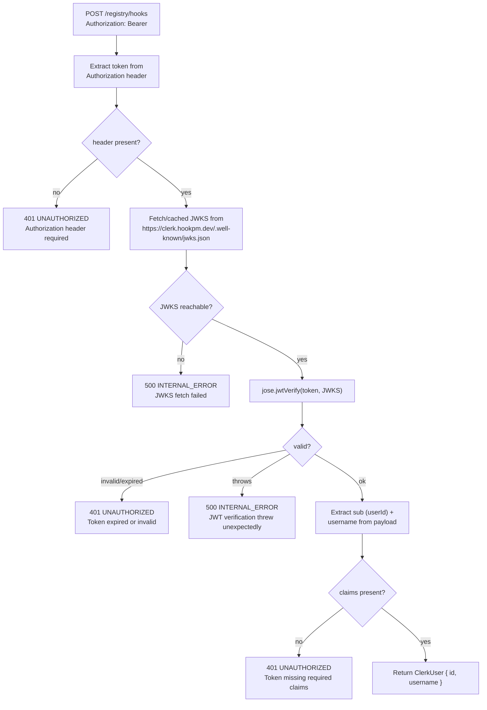

# Clerk JWT Verification Design

**Status:** Draft
**Date:** 2026-03-11
**Scope:** `api/src/index.ts` — `resolveUser()` function; replaces stub with real JWT verification
**Phase:** Phase 1B
**Depends on:** `docs/design/2026-03-10-api-routes.md`, `docs/design/2026-03-11-login-publish.md`

---

## TL;DR

Replaces the `resolveUser()` stub in the Hono API (which currently always returns `null`) with real Clerk JWT verification using the `jose` library and Cloudflare Workers' Web Crypto API. The public key is fetched from Clerk's JWKS endpoint on first request and cached in module-scope memory for the lifetime of the Worker instance. JWT claims are mapped to `{ id: string; username: string }`.

---

## Table of Contents

1. [Verification Flow](#1-verification-flow)
2. [JWKS Caching Strategy](#2-jwks-caching-strategy)
3. [JWT Claims Mapping](#3-jwt-claims-mapping)
4. [Error Handling](#4-error-handling)
5. [Interface Contracts](#5-interface-contracts)
6. [Security Considerations](#6-security-considerations)

---

## 1. Verification Flow



**Test bypass:** When `env.__TEST_CLERK_USER` is set (non-undefined), JWKS fetch is skipped entirely and the injected user is returned. This preserves existing test isolation.

---

## 2. JWKS Caching Strategy

Cloudflare Workers are stateless per-request but share module-scope memory within a single Worker instance for the duration of its lifetime (typically minutes to hours). A module-scope JWKS cache avoids redundant JWKS fetches on every request.

**Cache key:** `CLERK_JWKS_URL` (from env or default `https://clerk.hookpm.dev/.well-known/jwks.json`)

**Cache invalidation:** Module-scope `let jwksCache: RemoteJWKSet | null = null`. Reset to `null` on process restart. No explicit TTL — Cloudflare Workers restart frequently enough that stale keys are not a concern. If a key rotation occurs mid-instance, the next JWKS fetch (on next Worker restart) picks it up.

**First request:** `createRemoteJWKSet(url)` from `jose`. This is lazy — the JWKS fetch happens on first `jwtVerify` call, not at module load.

```typescript
// Module scope — survives across requests in one Worker instance
let jwksSet: ReturnType<typeof createRemoteJWKSet> | null = null

function getJWKS(url: string): ReturnType<typeof createRemoteJWKSet> {
  if (!jwksSet) jwksSet = createRemoteJWKSet(new URL(url))
  return jwksSet
}
```

---

## 3. JWT Claims Mapping

Clerk JWTs include these standard claims:

| Claim | Type | Meaning |
|-------|------|---------|
| `sub` | `string` | Clerk user ID (e.g. `user_2abc...`) |
| `username` | `string` | GitHub username (set by Clerk OAuth template) |
| `exp` | `number` | Expiry Unix timestamp — verified by jose automatically |
| `iss` | `string` | Clerk issuer URL — verified against `env.CLERK_ISSUER` |

**Issuer verification:** `jose.jwtVerify` accepts an `issuer` option. The Clerk issuer URL is `https://clerk.hookpm.dev` (same as JWKS base URL). This prevents tokens from a different Clerk app being accepted.

**Audience:** Not required for Phase 1B — Clerk tokens may or may not include `aud`. Skip audience check in Phase 1B; add in Phase 2 if needed.

---

## 4. Error Handling

| Scenario | HTTP | `error.code` | Notes |
|----------|------|-------------|-------|
| No Authorization header | 401 | `UNAUTHORIZED` | Same as before |
| Token expired | 401 | `UNAUTHORIZED` | jose throws `JWTExpired` |
| Invalid signature | 401 | `UNAUTHORIZED` | jose throws `JWSInvalidSignature` |
| Missing `sub` or `username` | 401 | `UNAUTHORIZED` | Claims check after verify |
| JWKS fetch fails (network) | 500 | `INTERNAL_ERROR` | jose throws on first verify |
| jose throws unexpectedly | 500 | `INTERNAL_ERROR` | Catch all non-401 jose errors |

**Error discrimination:** `jose` error classes are imported from `jose/errors`. The catch block checks `instanceof JWTExpired | JWSInvalidSignature | JWTClaimValidationFailed` → 401; all other errors → 500.

---

## 5. Interface Contracts

```typescript
// jose package — installed as dependency
import { createRemoteJWKSet, jwtVerify } from 'jose'
import { JWTExpired, JWSInvalidSignature, JWTClaimValidationFailed } from 'jose/errors'

// Clerk JWT payload shape (subset used by resolveUser)
type ClerkJWTPayload = {
  sub: string        // Clerk user ID
  username: string   // GitHub username (from Clerk OAuth template)
  exp: number        // Expiry — checked automatically by jose
  iss: string        // Issuer — checked against CLERK_ISSUER env
}

// resolveUser signature (unchanged externally — returns same type)
async function resolveUser(req: Request, env: Env): Promise<ClerkUser | null>
// ClerkUser = { id: string; username: string }

// New env field (added to Env type)
type Env = {
  // ... existing fields
  CLERK_JWKS_URL?: string   // default: https://clerk.hookpm.dev/.well-known/jwks.json
  CLERK_ISSUER?: string     // default: https://clerk.hookpm.dev
}
```

**Package:** `jose` v5 (latest) — pure ESM, works in CF Workers, no Node.js builtins.

---

## 6. Security Considerations

- **CVE-2025-59536:** `CLERK_JWKS_URL` must use `https://`. Validated at parse time by checking scheme before creating `RemoteJWKSet`.
- **CVE-2026-21852:** JWT claims (`sub`, `username`) are only used to populate `ClerkUser` — never included in error responses or logged.
- **Algorithm pinning:** `jwtVerify` defaults to RS256/ES256 (asymmetric). No symmetric (`HS256`) keys accepted — JWKS endpoint only returns asymmetric keys.
- **Issuer check:** `issuer` option passed to `jwtVerify` prevents cross-app token acceptance.
- **Clock skew:** `jose` allows 60 seconds of clock skew by default — acceptable for Phase 1B.
- **Test bypass:** `__TEST_CLERK_USER` is only checked in non-production. The field is stripped from `Env` type in the build config (workers-types has no this field) — the test env injects it only in Vitest context.

---

## Revision History

| Date | Change | Reason |
|------|--------|--------|
| 2026-03-11 | Initial design | Phase 1B publish endpoint requires real JWT verification to work in production |
