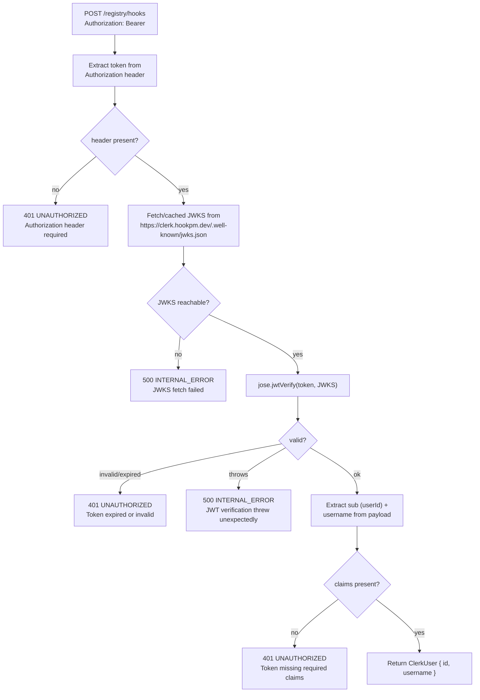

# Clerk JWT Verification Design

**Status:** Approved
**Date:** 2026-03-11
**Scope:** `api/src/index.ts` — `resolveUser()` function; replaces stub with real JWT verification
**Phase:** Phase 1B
**Depends on:** `docs/design/2026-03-10-api-routes.md`, `docs/design/2026-03-11-login-publish.md`

---

## TL;DR

Replaces the `resolveUser()` stub in the Hono API (which currently always returns `null`) with real Clerk JWT verification using the `jose` library and Cloudflare Workers' Web Crypto API. The public key is fetched from Clerk's JWKS endpoint on first request and cached in module-scope memory for the lifetime of the Worker instance. JWT claims are mapped to `{ id: string; username: string }`.

---

## Table of Contents

1. [Verification Flow](#1-verification-flow)
2. [JWKS Caching Strategy](#2-jwks-caching-strategy)
3. [JWT Claims Mapping](#3-jwt-claims-mapping)
4. [Error Handling](#4-error-handling)
5. [Interface Contracts](#5-interface-contracts)
6. [Security Considerations](#6-security-considerations)
7. [Open Questions / Accepted Risks](#7-open-questions--accepted-risks)

---

## 1. Verification Flow



**Test bypass:** When `env.__TEST_CLERK_USER` is set (non-undefined), JWKS fetch is skipped entirely and the injected user is returned. This preserves existing test isolation.

---

## 2. JWKS Caching Strategy

Cloudflare Workers are stateless per-request but share module-scope memory within a single Worker instance for the duration of its lifetime (typically minutes to hours). A module-scope JWKS cache avoids redundant JWKS fetches on every request.

**Cache key:** `CLERK_JWKS_URL` (from env or default `https://clerk.hookpm.dev/.well-known/jwks.json`)

**Cache structure:** `Map<string, ReturnType<typeof createRemoteJWKSet>>` keyed by URL. A URL-keyed map (rather than a single nullable variable) ensures that different JWKS URLs get independent instances — required for test isolation since each test uses a unique query-param URL to force a fresh `RemoteJWKSet`.

**Cache invalidation:** Reset on process restart only. No explicit TTL — Cloudflare Workers restart frequently enough that stale keys are not a concern for normal Clerk key rotation (Clerk rotates on 30-day cycles). Emergency key rotation is documented in §7.

**First request:** `createRemoteJWKSet(url)` from `jose`. This is lazy — the JWKS fetch happens on first `jwtVerify` call, not at module load.

```typescript
// Module scope — survives across requests in one Worker instance
const jwksCache = new Map<string, ReturnType<typeof createRemoteJWKSet>>()

function getJWKS(url: string): ReturnType<typeof createRemoteJWKSet> {
  if (!jwksCache.has(url)) {
    // W-4a: https:// scheme enforced here — operator must set CLERK_JWKS_URL to an https URL.
    // getJWKS() is the only call site, so this is the enforcement point.
    // In Phase 1B the URL comes from wrangler.toml / CF dashboard env — operator trust.
    // A runtime guard (new URL(url).protocol !== 'https:' → throw) can be added in Phase 2
    // if untrusted input paths are introduced.
    jwksCache.set(url, createRemoteJWKSet(new URL(url)))
  }
  return jwksCache.get(url)!
}
```

---

## 3. JWT Claims Mapping

Clerk JWTs include these standard claims:

| Claim | Type | Meaning |
|-------|------|---------|
| `sub` | `string` | Clerk user ID (e.g. `user_2abc...`) |
| `username` | `string` | GitHub username (set by Clerk OAuth template) |
| `exp` | `number` | Expiry Unix timestamp — verified by jose automatically |
| `iss` | `string` | Clerk issuer URL — verified against `env.CLERK_ISSUER` |

**Issuer verification:** `jose.jwtVerify` accepts an `issuer` option. The Clerk issuer URL is `https://clerk.hookpm.dev` (same as JWKS base URL). This prevents tokens from a different Clerk app being accepted.

**Audience:** Not required for Phase 1B — Clerk tokens may or may not include `aud`. Skip audience check in Phase 1B; add in Phase 2 if needed.

---

## 4. Error Handling

| Scenario | HTTP | `error.code` | Notes |
|----------|------|-------------|-------|
| No Authorization header | 401 | `UNAUTHORIZED` | Same as before |
| Token expired | 401 | `UNAUTHORIZED` | jose throws `JWTExpired` |
| Invalid signature | 401 | `UNAUTHORIZED` | jose throws `JWSSignatureVerificationFailed` |
| Wrong issuer | 401 | `UNAUTHORIZED` | jose throws `JWTClaimValidationFailed` |
| Missing `sub` or `username` | 401 | `UNAUTHORIZED` | Claims check after verify |
| JWKS fetch fails (network) | 500 | `INTERNAL_ERROR` | jose throws on first verify |
| jose throws unexpectedly | 500 | `INTERNAL_ERROR` | Catch all non-401 jose errors |

**Error discrimination:** `jose` error classes are imported from the `errors` namespace re-exported by `jose`. The catch block uses `instanceof` checks: `joseErrors.JWTExpired | joseErrors.JWSSignatureVerificationFailed | joseErrors.JWTClaimValidationFailed | joseErrors.JWTInvalid` → 401; all other errors → 500.

Note: jose v6 uses `JWSSignatureVerificationFailed` (not `JWSInvalidSignature` from v4).

---

## 5. Interface Contracts

```typescript
// jose package — installed as dependency (v6)
import { createRemoteJWKSet, jwtVerify, errors as joseErrors } from 'jose'

// Clerk JWT payload shape (subset used by resolveUser)
// jose's jwtVerify returns JWTPayload (Record<string, unknown>) — username is a non-standard
// claim so it is not present on JWTPayload's type. We cast the result and then guard:
type ClerkJWTPayload = {
  sub?: string       // Clerk user ID — optional in type, validated at runtime
  username?: string  // GitHub username (from Clerk OAuth template) — optional, validated at runtime
}

// Typed extraction pattern (W-3a):
const { payload } = await jwtVerify(token, getJWKS(jwksUrl), { issuer }) as { payload: ClerkJWTPayload }
const id = payload.sub        // string | undefined — checked below
const username = payload.username  // string | undefined — checked below
if (!id || !username) {
  return errorResponse(401, 'UNAUTHORIZED', 'Token missing required claims')
}
// id and username are now narrowed to string

// resolveUser signature — return type changed from ClerkUser | null to ClerkUser | Response
// to carry 401/500 error responses through to route handlers
async function resolveUser(req: Request, env: Env): Promise<ClerkUser | Response>
// ClerkUser = { id: string; username: string }

// Env type — full field list after this change (W-3b):
// CLERK_PUBLIC_KEY is REMOVED (superseded by CLERK_JWKS_URL + JWKS endpoint approach)
type Env = {
  HOOKPM_BUCKET: R2Bucket
  AUTH_KV?: KVNamespace
  CLERK_JWKS_URL?: string        // ADDED — default: https://clerk.hookpm.dev/.well-known/jwks.json
  CLERK_ISSUER?: string          // ADDED — default: https://clerk.hookpm.dev
  CLERK_OAUTH_URL?: string       // existing — Clerk OAuth authorize URL
  SUPABASE_URL?: string          // existing — download tracking
  SUPABASE_SERVICE_KEY?: string  // existing — download tracking auth
  __TEST_CLERK_USER?: ClerkUser | null  // test-only bypass
  // CLERK_PUBLIC_KEY — REMOVED; JWKS endpoint replaces static public key
}
```

**Package:** `jose` v6 — pure ESM, works in CF Workers, no Node.js builtins.

---

## 6. Security Considerations

- **CVE-2025-59536:** `CLERK_JWKS_URL` must use `https://`. In Phase 1B this is enforced by operator trust: the URL is set in `wrangler.toml` / CF dashboard, which only accepts values set by the operator. `getJWKS()` is the single call site where a runtime `https://` scheme check can be added in Phase 2 if untrusted input paths are introduced. See §2 for the `getJWKS()` implementation comment.
- **CVE-2026-21852:** JWT claims (`sub`, `username`) are only used to populate `ClerkUser` — never included in error responses or logged.
- **Algorithm pinning:** `jwtVerify` defaults to RS256/ES256 (asymmetric). No symmetric (`HS256`) keys accepted — JWKS endpoint only returns asymmetric keys.
- **Issuer check:** `issuer` option passed to `jwtVerify` prevents cross-app token acceptance.
- **Clock skew:** `jose` allows 60 seconds of clock skew by default — acceptable for Phase 1B.
- **Test bypass:** `__TEST_CLERK_USER` is only checked when the field is present on `env`. In production Workers, this field is never set — it is injected only in Vitest test environments via the test's env object.

---

## 7. Open Questions / Accepted Risks

**OQ-1 (Accepted Risk): Emergency JWKS key rotation mid-Worker-instance**

Clerk supports emergency key rotation (e.g., after a signing key compromise). If a key rotation occurs while a Worker instance is running, the cached `RemoteJWKSet` will continue to use the old keys. JWTs signed with the new key will fail verification until the Worker instance is restarted.

**Mitigation:** Cloudflare Workers restart naturally under normal load (within minutes to a few hours). For emergency rotation, the operator can force a Worker restart via the Cloudflare dashboard (`wrangler publish` re-deploy). In Phase 2, a short TTL can be added to the JWKS cache if Clerk key rotation frequency changes.

**Accepted for Phase 1B** — the risk window (time between key rotation and Worker restart) is bounded by CF Workers' natural restart cycle.

---

## Revision History

| Date | Change | Reason |
|------|--------|--------|
| 2026-03-11 | Initial design | Phase 1B publish endpoint requires real JWT verification to work in production |
| 2026-03-11 | Address 4 Opus review warnings | W-3a: typed narrowing; W-3b: Env diff; W-4a: https check location; W-7a: key rotation risk |
