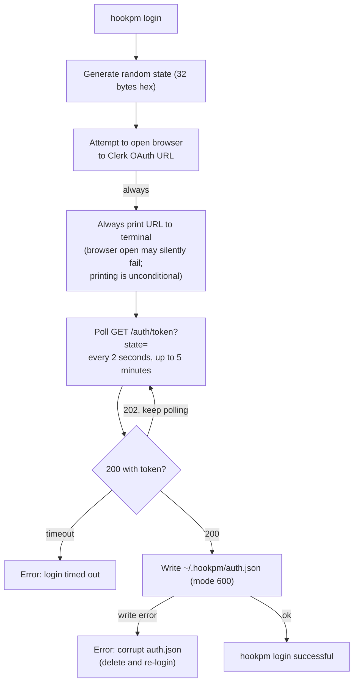
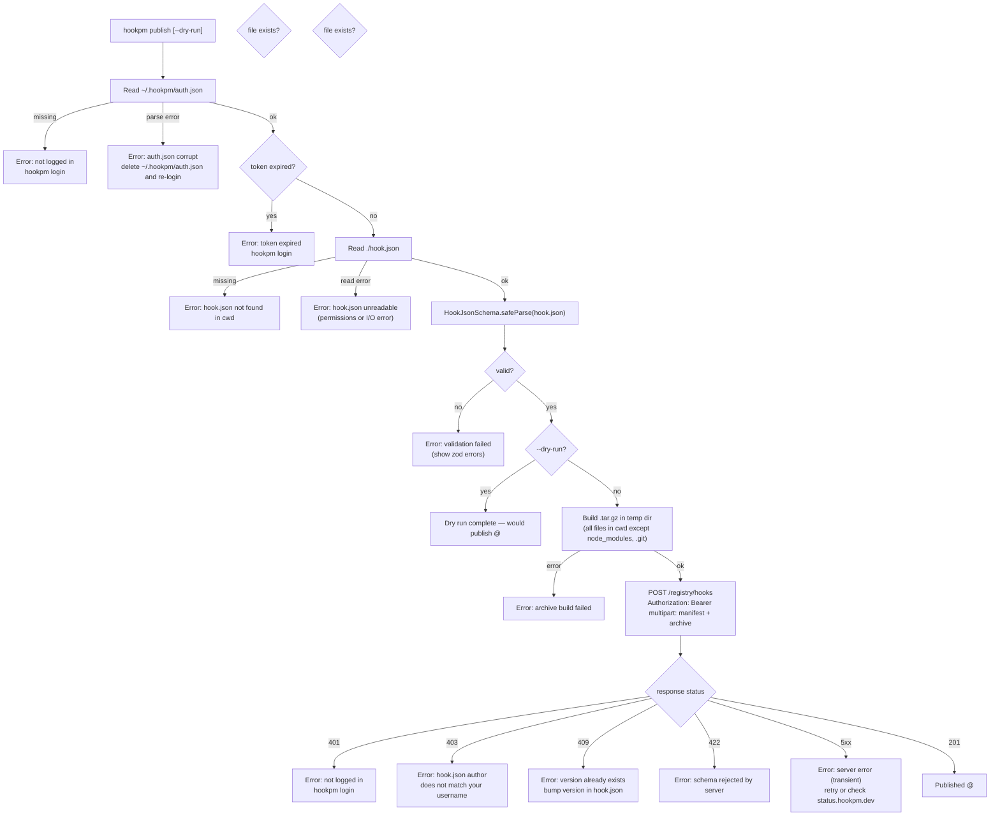

# hookpm login / logout / publish (Phase 1B) Design

**Status:** Approved
**Date:** 2026-03-11
**Scope:** `packages/cli/` — `login`, `logout`, and upgraded `publish` commands
**Phase:** Phase 1B
**Depends on:** `docs/design/2026-03-10-api-routes.md`

---

## TL;DR

Adds `hookpm login` (GitHub OAuth via Clerk, browser + polling), `hookpm logout` (token deletion), and upgrades `hookpm publish` from a browser-redirect stub to a real multipart POST to `POST /registry/hooks`. Auth tokens are stored in `~/.hookpm/auth.json` (mode 600). The publish command reads `hook.json` from cwd, builds a `.tar.gz` archive in a temp directory, verifies schema, and sends both files as multipart/form-data with the Clerk JWT.

---

## Table of Contents

1. [Auth Flow (login)](#1-auth-flow-login)
2. [Token Storage](#2-token-storage)
3. [publish Command](#3-publish-command)
4. [Archive Building](#4-archive-building)
5. [Error Handling](#5-error-handling)
6. [Interface Contracts](#6-interface-contracts)
7. [Security Considerations](#7-security-considerations)
8. [Open Questions Resolved](#8-open-questions-resolved)

---

## 1. Auth Flow (login)

**Resolution of OQ#3:** The CLI uses the **browser + polling** pattern (same as GitHub Device Flow spirit, but using Clerk's hosted OAuth). This avoids requiring a running local server (no port conflicts) and works in SSH/remote environments by printing the URL.



**Clerk OAuth redirect:** `https://hookpm.dev/auth/callback` stores the JWT keyed by `state` in a short-lived KV entry (TTL 10 minutes). The polling endpoint reads and deletes the KV entry on first retrieval. The CLI polls at 2-second intervals; status codes: `200` (token ready), `202` (pending), `400` (bad state param).

**`hookpm logout`:** Deletes `~/.hookpm/auth.json`. No server call — Clerk JWTs are short-lived (1 hour); logout just removes the local credential.

---

## 2. Token Storage

```
~/.hookpm/auth.json   (mode 600 — owner read/write only)
```

```typescript
type AuthFile = {
  clerk_token: string   // Clerk JWT
  expires_at: string    // ISO 8601 — CLI checks before use, prompts re-login if expired
  username: string      // GitHub username — cached to avoid API call on publish
}
```

**Expiry check:** If `expires_at` is in the past, `hookpm publish` exits 1 with `Session expired. Run: hookpm login`. Automatic refresh is out of scope for Phase 1B.

**Missing token:** If `auth.json` does not exist and the user runs `hookpm publish`, the command prints `Not logged in. Run: hookpm login` and exits 1.

---

## 3. publish Command



**Archive filename:** `<name>-<version>.tar.gz` (e.g. `bash-danger-guard-1.0.0.tar.gz`). Built into a temp dir, cleaned up after upload (success or failure).

**Author field pre-check:** Before building the archive, compare `hook.json.author` against the cached `username` in `auth.json`. If they differ, fail early with a clear error (same check the server will do anyway, but avoids the slow archive build + upload round-trip).

---

## 4. Archive Building

**Files included:** Everything in cwd except:
- `node_modules/`
- `.git/`
- Files matching `.gitignore` (if present) — best-effort, not guaranteed

**Implementation:** Reuse the BSD-tar-compatible staging approach from `registry/scripts/build-archives.ts`:
1. Create temp dir `<os.tmpdir()>/hookpm-publish-<timestamp>/<name>-<version>/`
2. Copy included files (flat; subdirectories copied as-is) into the staging dir
3. Run `tar -czf <tmpdir>/<name>-<version>.tar.gz -C <tmpdir>/<timestamp> <name>-<version>`
4. Return the archive path; caller is responsible for cleanup

**Size limit:** Warn if archive > 5 MB (the server rejects > 10 MB, but warn early at 5 MB so authors can investigate before the upload fails).

---

## 5. Error Handling

| Scenario | Exit code | Message |
|----------|-----------|---------|
| `auth.json` missing | 1 | `Not logged in. Run: hookpm login` |
| `auth.json` parse error | 1 | `auth.json corrupt — delete and run: hookpm login` |
| Token expired | 1 | `Session expired. Run: hookpm login` |
| `hook.json` missing | 1 | `hook.json not found in current directory` |
| `hook.json` unreadable | 1 | `Failed to read hook.json: <os error message>` |
| Schema invalid | 1 | Zod error summary (≤5 issues) |
| Author mismatch (local) | 1 | `hook.json author '<X>' does not match your username '<Y>'` |
| Archive build fail | 1 | `Failed to build archive: <reason>` |
| API 401 | 1 | `Authentication failed. Run: hookpm login` |
| API 403 | 1 | `Not authorized to publish as '<author>'` |
| API 409 | 1 | `<name>@<version> already published. Bump the version.` |
| API 422 | 1 | `Server rejected hook.json: <response.error.message>` |
| API 5xx | 1 | `Server error (${status} ${response.error.code}). Try again or check status.hookpm.dev` |
| Non-JSON API error | 1 | `Server error (${status}): unexpected response format` |
| Timeout (login polling) | 1 | `Login timed out. Try again.` |

**API error extraction:** All API error messages are extracted from `response.error.message` (the `ErrorBody` envelope from `api-routes.md`). If the response is not valid JSON, the CLI falls back to `unexpected response format`.

---

## 6. Interface Contracts

```typescript
// ~/.hookpm/auth.json
type AuthFile = {
  clerk_token: string
  expires_at: string  // ISO 8601
  username: string
}

// GET /auth/token?state=<state> response codes:
//   200 — token ready (body: TokenPollResponse)
//   202 — pending (empty body, keep polling)
//   400 — missing/invalid state param (body: ErrorBody)

type TokenPollResponse = {
  token: string       // Clerk JWT
  expires_at: string  // ISO 8601
  username: string    // GitHub username
}

// publish command options
type PublishOptions = {
  dryRun?: boolean  // if true: validate + build archive, skip upload, exit 0
}

// Internal: readAuth() — reads and parses ~/.hookpm/auth.json
// Returns null if file missing; throws on parse error
function readAuth(authPath: string): AuthFile | null

// Internal: saveAuth() — writes auth.json atomically (mode 600)
function saveAuth(authPath: string, data: AuthFile): void

// Internal: buildArchive() — returns archive path; caller must clean up
// Throws on tar failure or I/O error
function buildArchive(hookDir: string, name: string, version: string): string

// Internal: result shape returned by publish pipeline (not exported)
type ArchiveResult =
  | { ok: true; archivePath: string; sizeBytes: number }
  | { ok: false; error: Error }
```

**API endpoint reuse:** `POST /registry/hooks` from `docs/design/2026-03-10-api-routes.md` — multipart `manifest` (hook.json) + `archive` (.tar.gz), `Authorization: Bearer <token>`.

---

## 7. Security Considerations

- **CVE-2025-59536:** `apiUrl` sourced exclusively from `config.ts` (Zod-validated, must use `https://`). `hookpm publish` never follows redirects from 201 responses to a different host.
- **CVE-2026-21852:** `auth.json` token is sent only to `config.apiUrl` — never logged, never included in error messages, never sent to the registry URL (separate from API URL).
- **Token file permissions:** `auth.json` written with `fs.writeFileSync(path, data, { mode: 0o600 })`. Parent dir `~/.hookpm/` created with `0o700` if absent.
- **State parameter:** Login flow generates 32 bytes of CSPRNG state to prevent CSRF on the OAuth callback.
- **No token in CLI output:** `hookpm login` never prints the JWT to stdout/stderr. Only the Clerk OAuth URL and success message are shown.

---

## 8. Open Questions Resolved / Acknowledged

| OQ | Resolution |
|----|------------|
| OQ#3 (login flow) | Browser + polling pattern. CLI opens browser, polls `/auth/token?state=` every 2 seconds for up to 5 minutes. URL always printed to terminal (browser open may silently fail). |
| OQ#4 (SHA-256 in 201 response) | **Out of scope for Phase 1B.** The `PublishResponse` from `api-routes.md` does not include `sha256`. The CLI success output shows only `name@version`. If OQ#4 resolves to "yes" in a future design, the `PublishResponse` shape and CLI output table will need updating. |

---

## Revision History

| Date | Change | Reason |
|------|--------|--------|
| 2026-03-11 | Initial design | Resolves OQ#3 from api-routes.md; defines Phase 1B login/publish CLI flow |
| 2026-03-11 | Resolve 8 warnings from design review | W-1: OpenBrowser→PrintURL always edge labelled; W-2: ReadAuth/ReadHookJson error exits added to publish flowchart; W-3: buildArchive() signature added; W-4: readAuth()/saveAuth() signatures added; W-5: GET /auth/token 202 typing clarified; W-6: dry-run added to flowchart; W-7: API error extraction note added to Section 5; W-8: OQ#4 acknowledged as out of scope |
