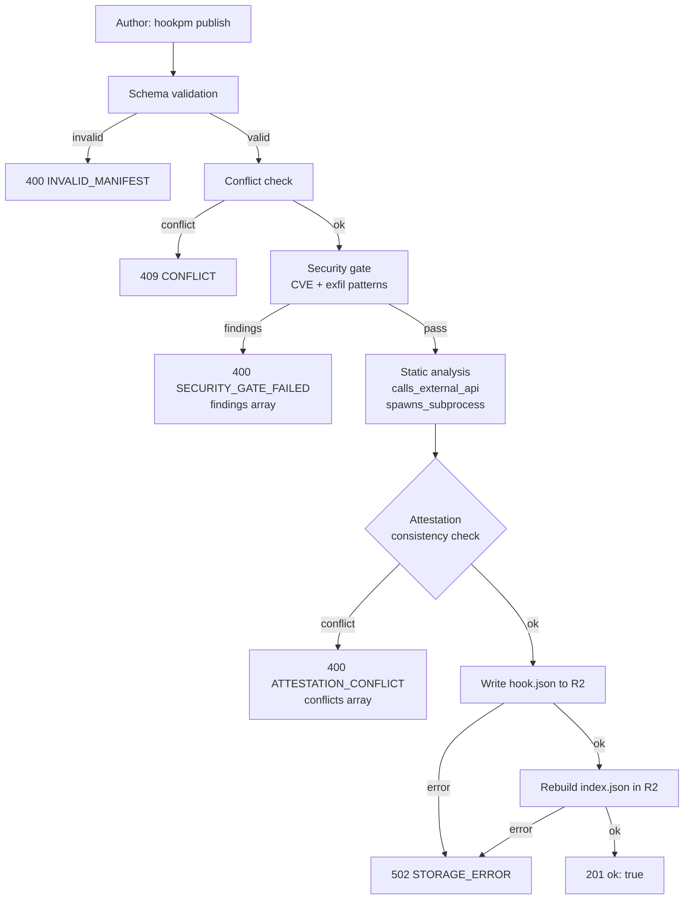
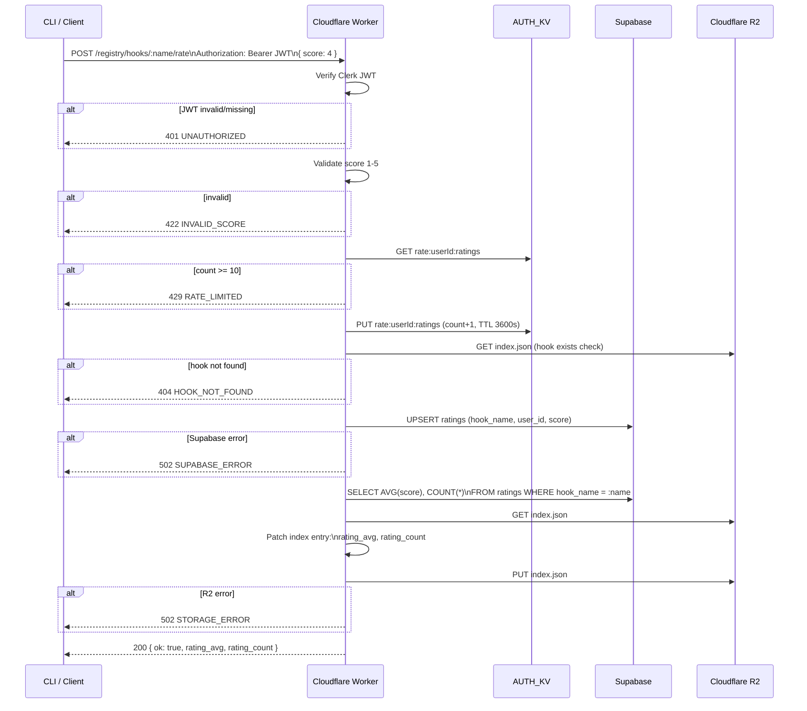

# Hook Trust Signals — Revised Review System

**TL;DR:** Replace the single `reviewed` boolean with a 4-signal trust model: (1) automated security gate with structured rejection output, (2) a binary API-cost flag derived from static analysis, (3) author attestations replacing the planned expert-review layer, and (4) a star-rating system gated on a minimum of 5 ratings before display. All signals are surfaced in a single composite "hook health" indicator in search results and a detailed breakdown on the hook detail page. Layer 2 (code heaviness) is explicitly deferred until real runtime telemetry is available.

**Phase:** 1B (current)
**Status:** Draft — revised after design review

---

## Revision History

- 2026-03-15 — Initial design. Based on deepthink review of the original 5-layer proposal.
- 2026-03-15 — Rev 1. Fixed: attestations field placement outside SecuritySchema; rate endpoint error shapes; rate limiter strategy; R2 race acknowledgement; HttpHandler unconditional detection; no-subprocess consistency check scope; TRUSTED threshold as named constant; added Mermaid diagrams.

---

## Background

The registry currently exposes one trust signal: a `reviewed` boolean set by admin. This is binary, opaque to users, and provides no actionable information about what "reviewed" means or what risks remain for unreviewed hooks. The original 5-layer proposal was evaluated and reduced to a viable 4-signal model.

**Dropped:** Code heaviness metric — no reliable static proxy exists; deferred until runtime telemetry is in place.
**Replaced:** Expert/moderator review layer → author attestations (eliminates volunteer supply problem and platform liability).

---

## Goals

- Give users enough signal to make an informed install decision
- Eliminate the `reviewed` boolean as the only trust indicator
- Surface API cost risk before install (not just on detail page)
- Add star ratings with a minimum threshold to prevent misleading sparse scores
- Improve Layer 1 rejection feedback so authors know exactly what to fix
- Avoid creating new operational burden (no new moderation queue)

---

## The 4 Trust Signals

### Signal 1 — Security (automated gate, always runs)

**What it is:** Static analysis run on every `hookpm publish`. Blocks submission on failure.

**Changes from current:**
- Rejection response changes from HTTP 400 with a generic message to a structured JSON body:

```ts
type RejectionBody = {
  ok: false
  error: 'SECURITY_GATE_FAILED'
  findings: Array<{
    rule: string        // e.g. 'CVE-2025-59536', 'api-token-exfil', 'env-secret-write'
    file: string        // which file triggered it
    line?: number
    severity: 'critical' | 'high'
    message: string     // human-readable explanation
    fix?: string        // optional remediation hint
  }>
}
```

- The `sandbox_level` enum (`none | static-analysis | verified | certified`) is retained as-is.

**No schema changes for Signal 1.** Only the API rejection response format changes.

---

### Signal 2 — API Cost Flag

**What it is:** A boolean indicating whether the hook makes external HTTP/API calls. Derived from static analysis at publish time — platform-determined, not author-declared.

**Why static analysis (not author-declared):** An author could lie; the flag should be authoritative for the one thing it claims to detect.

**Detection rules — two stages:**

**Stage A — Handler type check (applied first):**
- If `handler.type === 'http'`: unconditionally set `calls_external_api: true`. No source file scan needed — the execution model *is* an external call.

**Stage B — Source file scan (applied when handler is not `http`):**
- Patterns: `fetch(`, `axios.`, `https.request`, `http.request`, `curl `, `wget ` — any match in any implementation file sets `calls_external_api: true`
- Detection is conservative (false positives are acceptable; false negatives are not)

**Schema placement — inside `SecuritySchema`** (`packages/schema/src/schema.ts`):
```ts
// Inside SecuritySchema (platform-determined field, added alongside reviewed/signed):
calls_external_api: z.boolean().default(false)
```

`calls_external_api` belongs in `SecuritySchema` because it is platform-determined (set by the API, not by the author) — consistent with `reviewed`, `signed`, and `sandbox_level`. It is **not** the same category as `attestations`, which are author-supplied.

**Rendering:** In search results, a `$` badge appears next to hooks where `calls_external_api: true`. In `hookDetail()`, a line shows either `· no external API calls` or `⚠ makes external API calls (may incur cost or latency)`.

---

### Signal 3 — Author Attestations

**What it is:** Author-declared claims about hook behavior, stored as an array of string keys. These are shown explicitly as "author-declared" — not platform endorsements. The schema field is deliberately separate from `SecuritySchema` to make the author vs. platform boundary unambiguous.

**Attestation vocabulary (closed enum):**
```
'no-network'          // hook makes no network calls
'read-only'           // hook never writes files
'no-env-access'       // hook does not read environment variables
'no-subprocess'       // hook does not spawn child processes
'idempotent'          // running hook multiple times has same effect as once
'local-only'          // all processing stays on local machine
```

**Author provides in `hook.json`:**
```json
{
  "attestations": ["no-network", "read-only", "local-only"]
}
```

**Schema placement — top-level on `HookJsonSchema`, outside `SecuritySchema`:**
```ts
const AttestationKey = z.enum([
  'no-network', 'read-only', 'no-env-access',
  'no-subprocess', 'idempotent', 'local-only'
])

// Direct field on HookJsonSchema and HookJsonRegistrySchema,
// NOT inside SecuritySchema — author-supplied, not platform-certified:
attestations: z.array(AttestationKey).default([])
```

This placement makes the author/platform boundary explicit in the type system. `security.*` fields are always platform-written. `attestations` is always author-written.

**Consistency checks at publish (Phase 1B):**

Two attestations are cross-checked against static analysis. The others are taken on author trust in Phase 1B.

| Attestation | Static check | Detection patterns |
|---|---|---|
| `no-network` | `calls_external_api` from Signal 2 detection | `fetch(`, `curl`, `http.request`, etc.; `handler.type === 'http'` |
| `no-subprocess` | New platform flag `spawns_subprocess` (see below) | `exec(`, `spawn(`, `child_process`, `subprocess.run`, `os.system`, `$()` in shell |

If an attestation conflicts with the platform-determined flag, publish is rejected:

```ts
type ConsistencyError = {
  ok: false
  error: 'ATTESTATION_CONFLICT'
  conflicts: Array<{
    attestation: string
    reason: string   // e.g. 'fetch() call detected in handler.sh line 12'
  }>
}
```

**`spawns_subprocess` platform flag:** A second platform-determined boolean, added to `SecuritySchema` alongside `calls_external_api`:
```ts
spawns_subprocess: z.boolean().default(false)
```

Detected by scanning implementation files for: `exec(`, `execSync(`, `spawn(`, `spawnSync(`, `child_process`, `subprocess.run`, `subprocess.Popen`, `os.system`, `os.popen`, and unquoted `$()` in shell scripts.

**Rendering:** In `hookDetail()`, show attestations as a labeled list with an explicit `(author-declared)` qualifier. In search results, show an attestation count only (e.g., `3 attestations`).

---

### Signal 4 — Star Ratings

**What it is:** 1–5 star ratings from users who have the hook installed in their `settings.json`.

**Minimum display threshold:** No aggregate score is shown until the hook has ≥ 5 ratings. Below threshold, show `N ratings` with no stars. This prevents misleading signals from sparse data.

**Rating submission:** `POST /registry/hooks/:name/rate` with a Clerk JWT (must be authenticated). Rate: 1–5 integer. One rating per GitHub user per hook (upsert on re-rate).

**Storage:** Supabase `ratings` table:
```sql
CREATE TABLE ratings (
  hook_name   TEXT NOT NULL,
  user_id     TEXT NOT NULL,           -- Clerk user_id
  score       INTEGER CHECK (score BETWEEN 1 AND 5),
  created_at  TIMESTAMPTZ DEFAULT NOW(),
  PRIMARY KEY (hook_name, user_id)
);
```

**Index denormalization and R2 race acknowledgement:**

`rating_count` and `rating_avg` are denormalized into `index.json` in R2 on each rating write, computed fresh from a Supabase aggregate query at write time. This pattern is identical to how publish updates the index.

**Known limitation:** Concurrent rating requests for the same hook can race on the R2 read-modify-write — two concurrent writes both reading the same prior index, then writing diverging results. The last write wins and produces an incorrect aggregate. This is accepted as a known Phase 1B limitation given low expected volume. Mitigation: `rating_avg` is always recomputed from Supabase (not incremented in-place), so the aggregate self-corrects on the next rating request or publish. A full correctness fix (Supabase as authoritative source, R2 patched asynchronously) is deferred to Phase 2.

**Schema addition** (`packages/schema/src/schema.ts`):
```ts
// Inside HookIndexEntrySchema only (not in hook.json itself):
rating_count: z.number().int().nonnegative().default(0)
rating_avg:   z.number().min(0).max(5).default(0)
// attestations flows from HookJsonSchema into the index entry verbatim:
attestations: z.array(AttestationKey).default([])
```

**Rendering:**
- Search: show `★ 4.2 (12)` when ≥ 5 ratings; `(4)` with no stars when < 5
- Detail: full breakdown with count and threshold explanation when < 5

**Abuse prevention:**
- Clerk JWT required — anonymous ratings blocked
- One rating per user per hook (upsert)
- Rate limit: implemented via Cloudflare KV counter keyed by JWT `sub` claim. Key: `rate:${userId}:ratings`, TTL: 3600s, max: 10 requests per TTL window. Uses the existing `AUTH_KV` namespace (no new binding required). The existing IP-based `RATE_LIMITER` binding is not used for this endpoint — JWT sub is the correct identity unit for rating abuse.
- **Known limitation — KV counter race:** Cloudflare KV has no native atomic INCR. The counter is implemented as GET → increment → PUT in application code. Concurrent requests from the same user can race and undercount, allowing slightly more than 10 requests through. This is accepted as a Phase 1B limitation — the rate limit is a soft guardrail against bulk abuse, not a hard cryptographic control. A Durable Object counter would eliminate the race; deferred to Phase 2.

---

## Composite "Hook Health" Indicator

Users should not parse four separate signals. Search results expose a single composite indicator. Detail page breaks it down.

**Health tier logic — internal, implemented as a named constant set in `api/src/trust.ts`:**

```ts
// api/src/trust.ts — thresholds as named constants, not magic literals
export const TRUST_THRESHOLDS = {
  MIN_RATINGS_FOR_SCORE: 5,
  MIN_AVG_FOR_TRUSTED: 4.0,
  MIN_ATTESTATIONS_FOR_TRUSTED: 1,
} as const

export type HealthTier = 'trusted' | 'safe' | 'passing' | 'unverified'

export function computeHealthTier(entry: HookIndexEntry): HealthTier {
  const passing =
    entry.security.sandbox_level !== 'none' // security gate has run

  if (!passing) return 'unverified'

  const safe =
    passing &&
    (!entry.security.calls_external_api ||
      entry.attestations.includes('no-network'))

  const trusted =
    safe &&
    entry.attestations.length >= TRUST_THRESHOLDS.MIN_ATTESTATIONS_FOR_TRUSTED &&
    entry.rating_count >= TRUST_THRESHOLDS.MIN_RATINGS_FOR_SCORE &&
    entry.rating_avg >= TRUST_THRESHOLDS.MIN_AVG_FOR_TRUSTED

  if (trusted) return 'trusted'
  if (safe) return 'safe'
  return 'passing'
}
```

**Search column:** Replace the current `status` column with a `health` column:
- `✓ trusted` — TRUSTED tier
- `✓ safe` — SAFE tier
- `· passing` — PASSING tier
- `⚠ unverified` — fallback (should not appear for newly published hooks)

---

## API Changes

### Modified: `POST /registry/hooks`

Gate sequence (in order — first failure wins):
1. Schema validation → `400 INVALID_MANIFEST`
2. Conflict check (name already exists, different author) → `409 CONFLICT`
3. Security gate (CVE patterns, exfiltration) → `400 SECURITY_GATE_FAILED` with `findings[]`
4. `calls_external_api` detection (handler type + source scan)
5. `spawns_subprocess` detection (source scan)
6. Attestation consistency check → `400 ATTESTATION_CONFLICT` with `conflicts[]`
7. Write to R2 + update index

```ts
// Full response types for POST /registry/hooks
type PublishSuccess = { ok: true; name: string; version: string }
type PublishError =
  | { ok: false; error: 'INVALID_MANIFEST'; details: ZodError }
  | { ok: false; error: 'CONFLICT'; message: string }
  | { ok: false; error: 'SECURITY_GATE_FAILED'; findings: SecurityFinding[] }
  | { ok: false; error: 'ATTESTATION_CONFLICT'; conflicts: AttestationConflict[] }
  | { ok: false; error: 'STORAGE_ERROR'; message: string }
```

### New: `POST /registry/hooks/:name/rate`

- **Auth:** Clerk JWT required (401 if missing/invalid)
- **Body:** `{ score: number }` — validated 1–5 integer
- **Rate limit:** KV counter on JWT `sub`, 10/hour

```ts
// Success
type RateSuccess = { ok: true; rating_avg: number; rating_count: number }

// Error shapes (matching existing errorResponse envelope)
type RateError =
  | { error: { code: 'HOOK_NOT_FOUND';     message: string } }  // 404
  | { error: { code: 'INVALID_SCORE';      message: string } }  // 422
  | { error: { code: 'UNAUTHORIZED';       message: string } }  // 401
  | { error: { code: 'RATE_LIMITED';       message: string } }  // 429
  | { error: { code: 'SUPABASE_ERROR';     message: string } }  // 502
  | { error: { code: 'STORAGE_ERROR';      message: string } }  // 502
```

Supabase unavailability returns 502 — the rating is lost, not queued. Acceptable for Phase 1B.

### No change: `POST /registry/hooks/:name/review`

The existing admin review endpoint is retained as-is. It sets `reviewed: true` and updates `sandbox_level`. This is additive to the signals above.

---

## Data Flow Diagrams

### Modified Publish Flow (`POST /registry/hooks`)



### Rating Write Flow (`POST /registry/hooks/:name/rate`)



---

## CLI Changes

### `output.ts` — `hookDetail()`

Add rendering for (in order after existing fields):
- `calls_external_api` — `⚠ makes external API calls` or `· no external API calls`
- `spawns_subprocess` — `⚠ spawns subprocesses` or omit if false
- `attestations` — `(author-declared)` list, omit if empty
- `rating_count` / `rating_avg` — stars if ≥ 5 ratings, count-only otherwise

### `search.ts` — `runSearch()`

Replace `status` column with `health`. Add `rating` column.

### `install.ts` — `runInstall()`

After fetching hook manifest, if `calls_external_api: true`, print a warning before proceeding (same pattern as existing dangerous-capability warning, same `confirm()` flow).

---

## Schema Migration

- Existing hooks in `registry/hooks/` do not have `attestations`, `calls_external_api`, or `spawns_subprocess`.
- All new fields default to `[]` / `false` / `0` — backward-compatible.
- No migration script needed; existing index entries remain valid under the new schema.
- `build-index.ts` must be updated to include `calls_external_api`, `spawns_subprocess`, `attestations`, `rating_count`, `rating_avg` when regenerating from hook directories. For existing hooks: `calls_external_api` and `spawns_subprocess` will be re-derived by running detection on their source files; `attestations` defaults to `[]`.

---

## What Is NOT Changing

- `sandbox_level` enum — unchanged
- `reviewed` boolean — retained (still set by admin review endpoint)
- `signed` / `signed_by` / `signature` — unchanged (still not rendered in CLI, deferred)
- Report endpoint — unchanged
- Layer 2 (code heaviness) — explicitly deferred, no placeholder added

---

## Security Considerations

- `calls_external_api` and `spawns_subprocess` are platform-determined — authors cannot suppress them
- `attestations` field is author-supplied and explicitly labeled as such in UI — no platform warranty implied
- Rating endpoint requires Clerk JWT — anonymous abuse blocked
- KV-based rate limiting on JWT `sub` prevents bulk rating from a single account
- Upsert semantics (one rating per user per hook) prevent vote-stuffing

---

## Open Questions

1. **OQ#1 — Static analysis false positive rate:** Commented-out `fetch()` still triggers `calls_external_api: true`. Conservative is safer. Revisit if author complaints accumulate.

2. **OQ#2 — R2 race on concurrent ratings:** Accepted as a known Phase 1B limitation. `rating_avg` self-corrects on next request since it is always recomputed from Supabase. Full fix deferred to Phase 2.

3. **OQ#3 — Rating for versioned hooks:** Ratings are per hook name, not per version. Acceptable for Phase 1B; revisit when versioned ratings matter.


