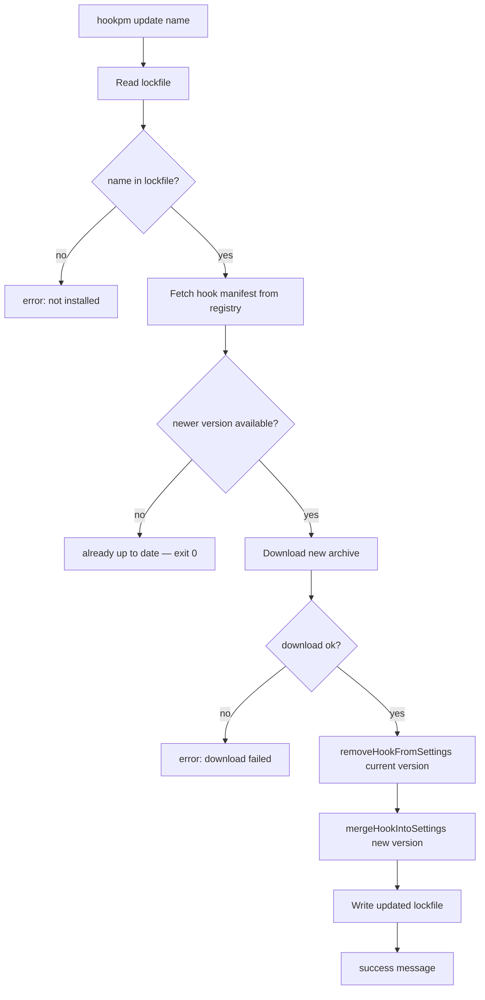
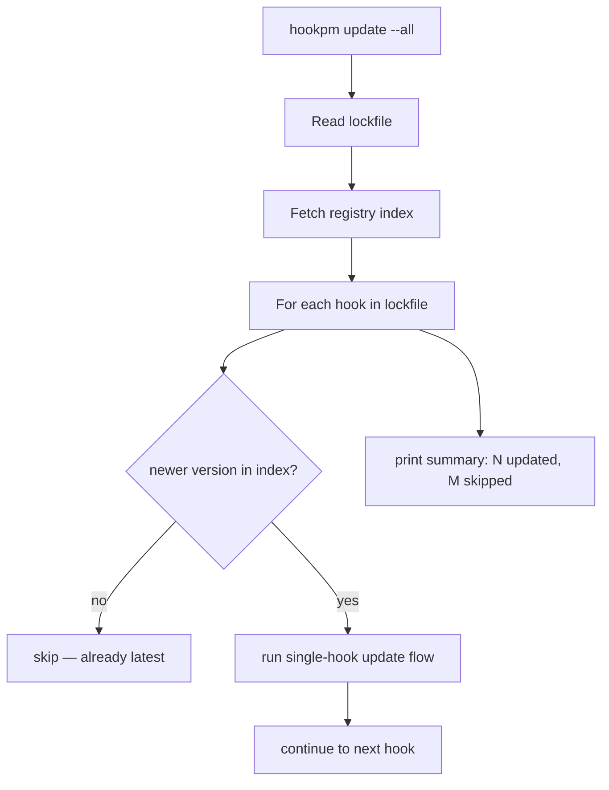

# hookpm update — Design Doc

**TL;DR:** `hookpm update [name]` fetches the latest version of an installed hook from the registry, replaces the entry in `settings.json`, and updates `hookpm.lock`. `--all` updates every hook in the lockfile. The update is atomic: remove-then-re-add using the existing merge machinery.

---

## Purpose and Scope

A package manager without an update path is incomplete. Users need to receive security patches and new hook versions without reinstalling manually. This is Phase 1B — CLI layer only, no server changes required.

---

## CLI Interface

```bash
hookpm update <name>        # update one hook to latest
hookpm update --all         # update all installed hooks
hookpm update <name> --version 1.2.0   # update to specific version
```

Exit codes follow the existing convention: `0` success, `1` error.

---

## Data Flow



### --all flow



---

## Component Breakdown

### `packages/cli/src/commands/update.ts`

New file. Exports `runUpdate(name?: string, options: UpdateOptions)`.

```typescript
export interface UpdateOptions {
  version?: string   // pin to specific version instead of latest
  all?: boolean      // update all installed hooks
}
```

Logic:
1. Read lockfile → get current version for the named hook (or all hooks)
2. Fetch the hook manifest from registry (`fetchHook(name)`) — returns latest if no version specified
3. Compare versions using `semver.gt(latest, current)` (Node.js built-in `node:util` + manual semver, or just string compare for `x.y.z`)
4. If up to date: print "already at latest" and return
5. Download new archive (`downloadArchive`)
6. `removeHookFromSettings(name, paths)` — removes old entry
7. `mergeHookIntoSettings(hook, paths, opts)` — adds new entry (preserves prepend position via `settings_index` from lockfile)
8. Update lockfile entry for the hook

### Semver comparison

No external semver library — use a simple three-part integer comparison:

```typescript
function isNewer(candidate: string, current: string): boolean {
  const parse = (v: string) => v.split('.').map(Number)
  const [ca, cb, cc] = parse(candidate)
  const [ua, ub, uc] = parse(current)
  if (ca !== ua) return ca > ua
  if (cb !== ub) return cb > ub
  return cc > uc
}
```

### Prepend preservation

The lockfile stores `settings_index` for each hook. When re-adding after an update, we check if `settings_index === 0` to re-apply the prepend behavior. This is an approximation — if the user had multiple hooks and the index shifted, the reinstall will append. This is acceptable for v1.

---

## Interface Contracts

### Input (lockfile)
```typescript
type LockEntry = {
  version: string        // current installed version
  settings_index: number // position in settings.json array
  event: string          // PreToolUse | PostToolUse | Stop
  // ...
}
```

### Output
- Updated `settings.json` with new hook command path
- Updated `hookpm.lock` with new version and integrity

---

## Security Considerations

- Same security path as install: archive checksum verified, same capability checks
- If download fails, the old hook entry has already been removed from settings.json → rollback by re-running `mergeHookIntoSettings` with old lockfile data. This rollback is best-effort.

---

## Open Questions

1. **Rollback on partial failure**: If `removeHookFromSettings` succeeds but `downloadArchive` fails, the hook is temporarily uninstalled. Best-effort rollback by re-adding old hook. Full transactional update is deferred.
2. **Pinned versions**: If `hookpm.lock` has `range: "1.0.0"` (exact pin), `hookpm update` should still update to latest unless `--version` is specified. The `range` field is informational only in v1.

---

## Revision History

- 2026-03-25: Initial design
